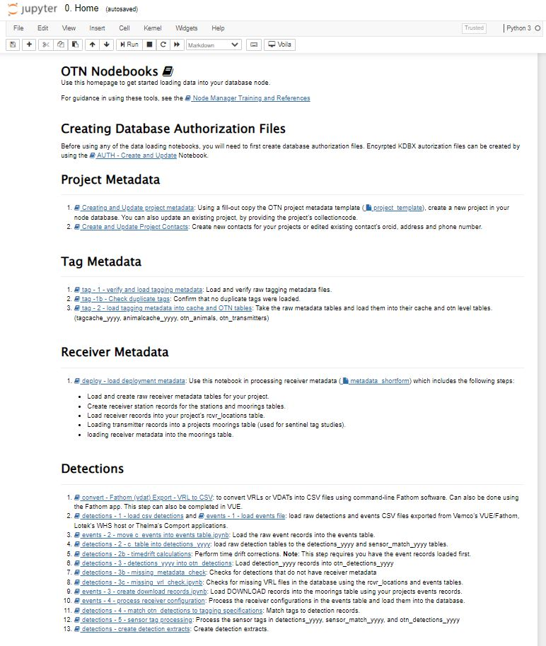

### The NodeBook environment and supporting software
In order to work efficiently as a Node Manager, the following programs are necessary.

To standardize the verification and quality control process that all contributing data is subjected to, OTN has built custom quality control workflows and tools for Node Managers, often referred to as the OTN Nodebooks. The underlying functions are written in Python and workflows that rely on them can be undertaken through the use of Jupyter Notebooks. In order to use these tools, and interact with your database, you will need to install a Python environment and the software packages that support the workflows. Updates to these tools, as well as up-to-date installation instructions are always available on the [OTN GitLab](https://gitlab.oceantrack.org/otn-partner-nodes/ipython-utilities/-/wikis/home). 

This lesson will give attendees a chance to install all the relevant software, under the supervision of OTN staff.

# Python/Mamba

Python is a general-purpose programming language that has become the most popular language on GitHub and in many of the computational sciences. It is the main language used by OTN to standardize our data processing pipeline.

Mamba is a fast, cross-platform Python distribution and package manager. When you install Mamba (through Miniforge) you get a self-contained version of the Python interpreter (which enables your computer to run Python code), and many of the core Python libraries. Managing your Python installation with Mamba allows you to install and keep updated all the supporting packages needed for the Nodebooks with one command rather than having to install each one individually. 

 **Miniforge Windows** - [https://conda-forge.org/miniforge/](https://conda-forge.org/miniforge/)
  - Select the option install for Just Me (recommended).
  - Check the option to **Add Miniforge3 to my PATH environment** variable.

 **Miniforge Mac** - 
   - Setup homebrew by running the command: `/bin/bash -c "$(curl -fsSL https://raw.githubusercontent.com/Homebrew/install/HEAD/install.sh)"` - **Note:** this operation requires elevated privileges (sudo)
   - Use the commands provided by brew's installation output to add brew to your system path
   - Use brew to install miniforge: `brew install miniforge`
   - Add miniforge to your zsh environment by typing conda init zsh. Restart the terminal

**Miniforge Linux (Debian)**
   - Download the Shell script (.sh) file from [https://conda-forge.org/miniforge/](https://conda-forge.org/miniforge/)
      - Recommended: Choose Python 64-bit Linux Installer
   - Change the run permissions for the miniforge installer script. ie `chmod +x Miniforge3-[version]-Linux-x86_64.sh`
   - Run `./Miniforge3-[version]-Linux-x86_64.sh` in the Linux terminal to activate the installer.
   - Add this conda installation to your terminal environment by running `conda init`. Restart the terminal to see the changes reflected.

# Git

Git is a version-control system for text, it helps people to work on code collaboratively, and maintains a complete history of all changes made to the files in a project. We use Git at OTN to track and disseminate changes to the Nodebooks that are made by our developer team, and occasionally you will need to use Git to update your Nodebooks and receive those changes.

**Install Git** 

- **Windows**- [https://git-scm.com/download/win](https://git-scm.com/download/win)

- **Mac**- [https://git-scm.com/download](https://git-scm.com/download)

- **Linux (Debian)** - run the command: `sudo apt install git`

# Nodebooks - iPython Utilities 
The `ipython-utilities` project contains the collection of Jupyter notebooks used to load data into the OTN data system.

**Create an Account**

First, you will need a GitLab account. Please fill out this [signup form for an account on GitLab](https://gitlab.oceantrack.org/users/sign_up).

Then, OTN staff will give you access to the OTN-Partner-Nodes group, which hosts all of the relevant Projects for Node Managers.

**Install iPython Utilities** 

1. Determine the folder in which you wish to keep the iPython Utilities Nodebooks.
1. Open your terminal or command prompt. 
   * Type `cd` followed by a space. 
   * You then need to get the filepath to the folder in which you wish to keep the iPython Utilities Nodebooks. You can either drag the folder into the terminal/command prompt OR right-click on the folder, select 'Copy as Path' from the dropdown menu, and paste the result into the terminal/command prompt.
   * You should have a command that looks like `cd /path/to/desired/folder`.
   * Press Enter, and your terminal/command prompt will navigate to the folder you provided. 
1. Create and activate the "nodebook" python enviornment. The creation process will only need to happen once.
   * In your terminal, run the command `conda create -n nodebook python=3.9`
   * Activate the nodebook environment by running `conda activate nodebook`
1. Next, run: `git clone https://gitlab.oceantrack.org/otn-partner-nodes/ipython-utilities.git`. This will get the latest version iPython Utilities from our GitLab.
1. Navigate to the newly-created ipython-utilities subdirectory by running `cd ipython-utilities`.
1. Switch to the `integration` branch (which contains the most up-to-date code) by running `git checkout integration`. 
1. Now to install all required python packages by running the following: `mamba env update -n nodebook -f environment.yml`

**To open and use the OTN Nodebooks:**
- **MAC/WINDOWS/LINUX**: Open your terminal and navigate to your ipython-utilities directory by running `cd /path/to/ipython-utilities`. Then, run the commands: 
   * `conda activate nodebook` to activate the nodebook python environment
   * `jupyter notebook --config="nb_config.py" "0. Home.ipynb"` to open the Nodebooks in a browser window.
- **DO NOT CLOSE** your terminal/CMD instance! This will need to remain open in the background in order for the Nodebooks to be operational.

More operating system-specific instructions and troubleshooting tips can be found at: [https://gitlab.oceantrack.org/otn-partner-nodes/ipython-utilities/-/wikis/New-Install-of-Ipython-Utilities](https://gitlab.oceantrack.org/otn-partner-nodes/ipython-utilities/-/wikis/New-Install-of-Ipython-Utilities)

# Database Console Viewer

There are database administration applications to assist with interacting directly with your database. There are many options available but `DBeaver` and `DataGrip` are the most popular options at OTN. 

* [https://dbeaver.io/](https://dbeaver.io/) (free and open access - **recommended**)
* [https://www.jetbrains.com/datagrip](https://www.jetbrains.com/datagrip) (free institutional/student access options - another option)

In the next lesson we will practice using our database console viewer and connecting to our `node_training` database.

# More Useful Programs

In order to work efficiently as a Node Manager, the following programs are necessary and/or useful.

## Cross-Platform 
<!-- Do we want to update with Positron also?  MG to PERSON Y/N -->
**Visual Studio Code** - An advanced code editing integrated development environment (IDE). Also contains extensions that can run JuPyTeR notebooks, open CSV files in a visually appealing way, as well as handle updating your Git repositories.
* [https://code.visualstudio.com/](https://code.visualstudio.com/)

## For WINDOWS users

**Path Copy Copy** - For copying path links from your file browser. Since many of the notebooks require you to provide the path to the file you wish to load, being able to copy and paste the entire path at once can save a lot of time. 
* [https://pathcopycopy.github.io/](https://pathcopycopy.github.io/)

**Notepad++** - For reading and editing code, csv files etc. without altering the formatting. Opening CSV files in Excel can change the formatting of the data in the file (this is a common problem with dates). Notepad++ will allow you to edit CSV files (and code, if necessary) without imposing additional formatting on data.
* [https://notepad-plus-plus.org/downloads/](https://notepad-plus-plus.org/downloads/)

**Tortoise Git** - For managing git, avoiding command line. Depending on what new features have been recently added, you may be asked to use a different branch of the notebook repository than the `main` one (i.e. `integration`). Although using git through the command line is supported, you may prefer to manage your Nodebooks via a graphical user interface (GUI). Tortoise Git can provide that. 
* [https://tortoisegit.org/download/](https://tortoisegit.org/download/)

## For MAC users

**Source Tree** - For managing git, avoiding command line.
* [https://www.sourcetreeapp.com](https://www.sourcetreeapp.com)

# Node Training Datasets

We have created test datasets to use for this workshop. Each attendee has their own files, available at this link: [http://129.173.48.161/data/repository/node_training/node-training-files-1](http://129.173.48.161/data/repository/node_training/node-training-files-1)

Please find the folder with your name and download. Save these somewhere on your computer, and **UNZIP** all files.

