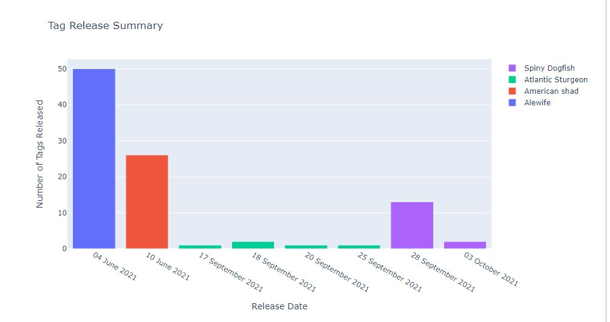

Once a project has been registered, the next step (for `Tracker` and `Data` project types) is to quality control and load the tagging metadata into the database. Tagging metadata should be reported to the Node in the template provided [here](https://members.oceantrack.org/data/data-collection). This file will contain information about the deployment of tags (acoustic, PIT, satellite, floy etc.) in or on animals for the purposes of tracking their movements using either listening stations or via mark/recapture. Any biological metrics that were measured at tagging time, i.e. length, weight, population, are recorded for future analysis.

Remembering a previous lesson, there are multiple levels of data-tables in the database for tagging records: `raw tables`, `cache tables` and `otn tables`. The process for loading tagging metadata reflects this, as does the Gitlab task list.

# Completed Metadata

Immediately, upon receipt of the metadata, a new Gitlab Issue should be created. Please use the `Tag Metadata` Issue checklist template.

Here is the Issue checklist, for reference:

```markdown
Tag Meta Data
- [ ] - NAME add label *'loading records'*
- [ ] - NAME load raw tag metadata (`tag-1` notebook) **put_table_name_in_ticket**
- [ ] - NAME confirm no duplicates in raw table, review and remove (`tag-1b` notebook)
- [ ] - NAME verify raw table (`tag-2` notebook)
- [ ] - NAME post updated metadata to project folder (OTN members.oceantrack.org, FACT RW etc) if needed
- [ ] - NAME build cache tables (`tag-2` notebook)
- [ ] - NAME verify cache tables (`tag-2` notebook)
- [ ] - NAME load otn tables (`tag-2` notebook)
- [ ] - NAME verify otn tables (`tag-2` notebook)
- [ ] - NAME verify tags are not part of another collection (`tag-2` notebook)
- [ ] - NAME label issue with *'Verify'*
- [ ] - NAME pass issue to analyst for final verification
- [ ] - NAME check for double reporting (verification_scripts/`tag_3_otn_verification`.sql)
```

### Visual Inspection

Once the completed file is received from a researcher, the Data Manager should first complete a visual check for formatting and accuracy.

In general, Tagging Metadata has 3 sections:
1. information about the tag
1. information about the animal 
1. information about the tag deployment

Information about the `tag` is obtained from Tag Specifications and is mandatory. Information about the `animal` is limited to the sampling conducted. The minimum requirement here is simply the common/scientific names. All other columns for biological parameters are optional. Information about the `tag deployment` includes location and dates and is mandatory to complete.

Things to visually check in the metadata:

1. Is there any information missing from the **essential** columns? These are:
	* tag_type
	* tag_manufacturer
	* tag_model
	* tag_serial_number (if not completed, `unknown` can be entered **ONLY IF** animal_id is also completed with unique values)
	* tag_id_code
	* tag_code_space
	* tag_implant_type
	* est_tag_life
	* common_name_e
	* scientific_name
	* release_location
	* release_latitude
	* release_longitude
	* utc_release_date_time
1. If any of the above mandatory fields are blank, follow-up with the researcher will be required if:
	* you cannot discern the values yourself
	* you do not have access to the Tag Specifications from the manufacturer (relevant for the columns containing `tag` information).
1. Are the `tag_id_code` and `tag_code_space` values formatted correctly?
1. Is the `UTC_release_date_time` column formatted correctly?

In general, most commonly formatting errors occur in the information about the `tag` section. Pay close attention here.

The metadata template [available here](https://members.oceantrack.org/data/data-collection) has a `Sample Data Row` as an example of properly-formatted metadata, along with the `Data Dictionary` sheet which contains detailed expectations for each column. Refer back to these often.  We have also included some recommendations on our [FAQ page](https://members.oceantrack.org/faq). Here are some guidelines:

- Animals with >1 associated tag (sensors, or double-tagging): add one line PER `TRANSMITTER ID` into the Tag Metadata form. The `ANIMAL_ID` column, or the `TAG_SERIAL_NUMBER` column **must** be the same between the rows in order to link those two (or more) records together.
- Animals with ONLY a floy tag: ensure the `TAG_TYPE` column = `FLOY`. You may leave the following columns empty - `tag_manufacturer`, `tag_model`, `tag_id_code`, `tag_code_space` and `est_tag_life`.
- Animals with satellite tags: ensure the `TAG_TYPE` column = `SATELLITE`. You may leave the following columns empty - `tag_id_code` and `tag_code_space`.


# Quality Control - Tag-1 Notebook

Each step in the Issue checklist will be discussed here, along with other important notes required to use the Nodebook.

### Imports cell

This section will be common for most Nodebooks: it is a cell at the top of the notebook where you will import any required packages and functions to use throughout the notebook. It must be run first, every time. 

There are **no** values here which need to be edited.

### Path to File

In this cell, you need to paste a filepath to the relevant Tagging Metadata file. The filepath will be added between the provided quotation marks.

Correct formatting looks something like this:

```markdown
# Path to your tagging metadata file - Formats Accepted: (csv, xls or xlsx)
filepath = r"C:/Users/path/to/tag_metadata.xlsx"
```

Once you have added your filepath, you can run the cell.

### Verification of File Contents - formatting

First, you must choose which *sheet* you would like to quality control. Generally, it will be names `Tag Metadata` but is often customized by researchers. Once you have selected the sheet name, **do not** re-run the cell to save the output - simply ensure the correct sheet is highlighted and move onto the next cell.

This cell will now complete the first round of Quality Control checks.

The output will have useful information:
- Is the sheet formatted correctly? Correct column names, datatypes in each column etc.
- Are either the `animal_id` or `tag_serial_number` columns completed?
- Are there any `harvest_date` values in the metadata? Are they all after the `utc_release_date_time`?
- Are the information about the `animal` formatted according to the Data Dictionary?
- Are there any tags which are used twice in the same sheet?
- Are there potential transcription errors in the `tag_code_space`? Ex: drag-and-drop errors from Excel
- Are the scientific and common names used accepted by WoRMS? **If there are errors flagged here which state `Vernacular records not found for Aphia ID: 12345` please make a note, but continue on. This will be fixed at a later stage**

The notebook will indicate the sheet had passed quality control by adding a ✔️**green checkmark** beside each section. There should also be an interactive plot generated, summarizing the tags released over time, by species, for you to explore.

If there is information which is not passing quality control, you should fix the source-file (potentially speaking to the researcher) and try again.



### Connection to Database

You will have to edit **two** sections: 

1. `schema = 'collectioncode'`
	* please edit to include the relevant project code, in lowercase, between the quotes.
1. `engine = get_engine()` 
	* Within the open brackets you need to open quotations and paste the path to your database `.kdbx` file which contains your login credentials.
	* On MacOS computers, you can usually find and copy the path to your database `.kdbx` file by right-clicking on the file and holding down the "option" key. On Windows, we recommend using the installed software Path Copy Copy, so you can copy a unix-style path by right-clicking.
	* The path should look like `engine = get_engine(‘C:/Users/username/Desktop/Auth files/database_conn_string.kdbx’)`. 

Once you have added your information, you can run the cell. Successful login is indicated with the following output:

```markdown 
Auth password:········
Connection Notes: None
Database connection established
Connection Type:postgresql Host:db.load.oceantrack.org Database:otnunit User:admin Node:OTN
```

### Bounding Box Check

The following cell will map the locations of all the `tag deployments`, compared to the Bounding Box of the project. This is used to confirm the following:
1. the tag release locations are in the part of the world expected based on the project abstract. Ex: lat/long have correct +/- signs
1. the project bounding box is correct

If it appears the tag release locations have incorrect signs, you can fix it in the source file and re-run the cell.

If it appears there are tag release locations which are on land, you may want to reach out to the researcher for corrected coordinates.

If the bounding box needs to be expanded to include the tags, you can use the `Square Draw Tool` to re-draw the bounding box until you are happy with it. Once all tags are drawn inside the bounding box, press the `Adjust Bounding Box` button to save the results.


### Verification of File Contents - against database

This cell will now complete the second round of Quality Control checks.

The output will have useful information:
1. Have these tags been used on **other projects** in the database? Check the dates to ensure they don't overlap, and *double-reporting* is not taking place.
1. Do we have the Tag Specifications from the manufacturer? Do the `tag_id_code`, `tag_code_space` and `est_tag_life` match the specifications for each provided serial number? Are there typos or errors that require clarification from the researcher?
1. Is the information about the `animal` formatted according to the Data Dictionary?
	* Are all the life stages in the `obis.lifestage_codes` table? If not, the reported life stage should be compared to the values in the `obis.lifestage_code table`, and adjusted if possible. Otherwise, use the `add_lifestage_codes` notebook
	* Are all length types in the `obis.length_type_codes` table? If not, the reported length type code should be compared to the values in the `obis.length_type_codes` table, and adjusted if possible. Otherwise, use the `add_lengthtype_codes` notebook
	* Are all the age units in the `obis.control_units` table? If not, the reported age units should be compared to the values in the `obis.control_units` table, and adjusted if possible. Otherwise, use the  `add_control_units` notebook
1. Are there  any tags in this sheet which have been previously reported on **this project** in the metadata? ex: duplicates.
1. Do the scientific and common names match the records which are previously added to `obis.scientificnames` for this schema? If not, please check the records in the `obis.scientificnames` and the source file to confirm there are no typos. If this is a new species tagged by this project, follow the link to the `scientific_name_check` notebook to add the new species. 
1. Are all the provided `tag_model` values present in the `obis.instrument_models` table? If not, please check the records in the `obis.instrument_models` and the source file to confirm there are no typos. If this is a new model which has never been used before, follow the link to the `add instrument_models` notebook to add the new tag model. 
1. Are there any tags in this sheet which have been previously reported on **this project** in the metadata, but with different deployment dates? ex: overlapping/missing harvest dates
1. Are there any tags being flagged as overlapping tag deployments, but not as duplicate tags? There may be an error with the tag's serial number. Check if the tag's ID exists in the otn_transmitters table of the schema or in the `vendor.c_vemco_tags` table, and compare it to the tag in the tagging metadata sheet. Fix the tag in the tagging metadata sheet if any errors are found.
1. Are there any release dates in the future?

The notebook will indicate the sheet had passed quality control by adding a ✔️**green checkmark** beside each section.

If there is information which is not passing quality control, you should fix the source-file (potentially speaking to the researcher) and try again.

### Loading the Raw Table

**ONLY** once the source file has successfully passed ALL quality control checks can you load the raw table to the database.

In this cell, you will have to edit one section in order to name the raw table. Between the quotes, please add your custom table suffix. We recommend using `year_month` or similar, to indicate the most-recently tagged animal in the metadata sheet.

```markdown
table_suffix = "YYYY_mm"
```
The notebook will indicate the success of the table-creation with the following message:

```markdown
Reading file: otn_metadata_tagging.xlsx.
Tag Metadata sheet found, reading file... OK
Loading 'otn_metadata_tagging.xlsx' file into collectioncode.c_tag_meta_YYYY_mm... OK
Loaded 37 records into table collectioncode.c_tag_meta_YYYY_mm
True
```


#### Task list checkpoint

In Gitlab, this task can be completed at this stage:

`- [ ] - NAME load raw tag metadata ('tag-1' notebook) **put_table_name_in_ticket**`

Ensure you paste the table name (ex: c_tag_meta_YYYY_mm) into the section indicated, before you check the box.

# Quality Control - Tag-1b Notebook

Once the raw table is successfully loaded, the next step is to ensure any previously-loaded tags are not re-added to the database (causing duplication errors).

### Imports cell

This section will be common for most Nodebooks: it is a cell at the top of the notebook where you will import any required packages and functions to use throughout the notebook. It must be run first, every time. 

There are **no** values here which need to be edited.

### Table Name and Database Connection


You will have to edit **three** sections: 

1. `engine = get_engine()` 
	* Within the open brackets you need to open quotations and paste the path to your database `.kdbx` file which contains your login credentials.
	* On MacOS computers, you can usually find and copy the path to your database `.kdbx` file by right-clicking on the file and holding down the "option" key. On Windows, we recommend using the installed software Path Copy Copy, so you can copy a unix-style path by right-clicking.
	* The path should look like `engine = get_engine(‘C:/Users/username/Desktop/Auth files/database_conn_string.kdbx’)`. 
1. `schema = 'collectioncode'`
	* please edit to include the relevant project code, in lowercase, between the quotes.
1. `table_name = 'c_tag_meta_YYYY_mm'`
	* Within the quotes, please add the name of the raw table.

Once you have added your information, you can run the cell. Successful login is indicated with the following output:

```markdown 
Auth password:········
Connection Notes: None
Database connection established
Connection Type:postgresql Host:db.load.oceantrack.org Database:otnunit User:admin Node:OTN
```

### Checking for Duplicates
This cell, once run, may print out that there are `No Duplicates Found`. If so, you can move on.

If there is output identifying duplicates, some review is necessary.

Immediately, the notebook will create a new table, named `schema.c_tag_meta_YYYY_mm_no_dup` which is an exact copy of your raw table. There will be a print-out saying the following (under a table):

```markdown
Building schema.c_tag_meta_YYYY_mm_no_dup table:
The following SQL queries will display the differences/similarities between the raw table (schema.c_tag_meta_YYYY_mm_no_dup) record and the otn_animals or otn_transmitters table record.
```
Then, there will be **two** interactive tables provided, which can be used to identify and delete any duplicate records from the `no_dup` table. 

1. Comparison to otn_animals
2. Comparison to otn_transmitters

All text should be `black`, and you should scroll through the entire table, row-by-row, to review any values where the cell is `highlighted/flashing RED`. These are highlighting differences between the values in the `raw` table vs values in the `otn` table, for this animal record.

If there are **no** highlighted/flashing red cells in a row, you can delete the record from the `no_dup` table by using the `delete` button on the left-side of the table. You can also use the `Select All` button if appropriate.

If there **are** highlighted/flashing red cells in a row, you must compare the highlighted values. These cannot be deleted without previous review since they are not exact duplicates, and could indicate an update to the database records is needed. 

Ex: `life_stage` from the raw table might = `SMOLT` while `lifestage` from otn_animals might = `ADULT`. This will cause the column `lifestage_equal?` to read `FALSE` and the cells to flash red. In this example, it could indicate that the researcher was correcting an error in the previously-submitted record (this animal was actually a smolt, not adult) and therefore we need to update the record in our database. In this case, you would need to email the researcher to confirm, pause processing this Issue, and create a new `DB_fix` Issue with the information which needs updating.

If you review all the flashing red cells and find they are only rounding errors, or similar non-significant data changes, you can determine that they are indeed duplicate records. You can now use the `delete` button on the left-side of the table. You can also use the `Select All` button, if all records are true duplicates.

Once you have selected a row to be deleted, the text will turn `red` to help you visualize your selection.

### Deleting Duplicates

Once you have identified all the true duplicate records, this next cell will remove them from the `no_dup` table. Success will be indicated with this message, and a table:

```markdown
Compiling list of deletions to the schema.c_tag_meta_YYYY_mm_no_dup table.
Delete the following XXX records from schema.c_tag_meta_YYYY_mm_no_dup?
```
You will be able to press the button to confirm, and the notebook will remove all the records.


#### Task list checkpoint

In Gitlab, this task can be completed at this stage:

`- [ ] - NAME confirm no duplicates in raw table, review and remove ("tag-1b" notebook)`

Ensure you paste the `no_dup` table name(ex: c_tag_meta_2021_09_no_dup), if relevant, into the Issue before you check the box. This is now the raw table that will be used for the result of the data-loading process.

# Quality Control - Tag-2 Notebook

Now that the raw table is free from duplicates, we can begin to move the records into the higher-level `cache` and `otn` tables, where they will be matched to detections.

### Imports cell

This section will be common for most Nodebooks: it is a cell at the top of the notebook where you will import any required packages and functions to use throughout the notebook. It must be run first, every time. 

There are **no** values here which need to be edited.

### Database Connection

You will have to edit **one** section: 

1. `engine = get_engine()` 
	* Within the open brackets you need to open quotations and paste the path to your database `.kdbx` file which contains your login credentials.
	* On MacOS computers, you can usually find and copy the path to your database `.kdbx` file by right-clicking on the file and holding down the "option" key. On Windows, we recommend using the installed software Path Copy Copy, so you can copy a unix-style path by right-clicking.
	* The path should look like `engine = get_engine(‘C:/Users/username/Desktop/Auth files/database_conn_string.kdbx’)`. 

Once you have added your information, you can run the cell. Successful login is indicated with the following output:

```markdown 
Auth password:········
Connection Notes: None
Database connection established
Connection Type:postgresql Host:db.load.oceantrack.org Database:otnunit User:admin Node:OTN
```
### Table Name

You will have to edit **two** sections: 

1. `table_name = 'c_tag_meta_YYYY_mm'`
	* Within the quotes, please add the name of the raw table. Might be the `no_dup` table if relevant.
1. `schema = 'collectioncode'`
	* please edit to include the relevant project code, in lowercase, between the quotes.

### Verification of File Contents - against database

This cell will now complete the final round of Quality Control checks. These are **exactly** the same as the checks at the end of the `tag-1` notebook.

The output will have useful information:

1. Have these tags been used on **other projects** in the database? Check the dates to ensure they don't overlap, and *double-reporting* is not taking place.
1. Do we have the Tag Specifications from the manufacturer? Do the `tag_id_code`, `tag_code_space` and `est_tag_life` match the specifications for each provided serial number? Are there typos or errors that require clarification from the researcher?
1. Is the information about the `animal` formatted according to the Data Dictionary?
	* Are all the life stages in the `obis.lifestage_codes` table? If not, the reported life stage should be compared to the values in the `obis.lifestage_code table`, and adjusted if possible. Otherwise, use the `add_lifestage_codes` notebook
	* Are all length types in the `obis.length_type_codes` table? If not, the reported length type code should be compared to the values in the `obis.length_type_codes` table, and adjusted if possible. Otherwise, use the `add_lengthtype_codes` notebook
	* Are all the age units in the `obis.control_units` table? If not, the reported age units should be compared to the values in the `obis.control_units` table, and adjusted if possible. Otherwise, use the  `add_control_units` notebook
1. Are there  any tags in this sheet which have been previously reported on **this project** in the metadata? ex: duplicates.
1. Do the scientific and common names match the records which are previously added to `obis.scientificnames` for this schema? If not, please check the records in the `obis.scientificnames` and the source file to confirm there are no typos. If this is a new species tagged by this project, follow the link to the `scientific_name_check` notebook to add the new species. 
1. Are all the provided `tag_model` values present in the `obis.instrument_models` table? If not, please check the records in the `obis.instrument_models` and the source file to confirm there are no typos. If this is a new model which has never been used before, follow the link to the `add instrument_models` notebook to add the new tag model. 
1. Are there any tags in this sheet which have been previously reported on **this project** in the metadata, but with different deployment dates? ex: overlapping/missing harvest dates
1. Are there any tags being flagged as overlapping tag deployments, but not as duplicate tags? There may be an error with the tag's serial number. Check if the tag's ID exists in the otn_transmitters table of the schema or in the `vendor.c_vemco_tags` table, and compare it to the tag in the tagging metadata sheet. Fix the tag in the tagging metadata sheet if any errors are found.
1. Are there any release dates in the future?

The notebook will indicate the sheet had passed quality control by adding a ✔️**green checkmark** beside each section.

If there is information which is not passing quality control, you should fix the source-file (potentially speaking to the researcher), delete or edit the raw table, and try again.


#### Task list checkpoint

In Gitlab, this task can be completed at this stage:

`- [ ] - NAME verify raw table ("tag-2" notebook)`

### Loading to Cache Tables

The first cell will create the cache tables, with the following success messaging:

```markdown
Creating table schema.tagcache_YYYY_mm
Creating table schema.animalcache_YYYY_mm
Table creation finished.
```

The next step will populate the `tag_cache` and `animal_cache` tables, but splitting apart the information about the `tag` and the information about the `animal`, joining the records by a unique `catalognumber` based on the `tag deployment` information.

Running this cell will provide the following success message:

```markdown
Added XX records to the schema.animalcache_YYYY_mm table
Added XX records to the schema.tagcache_YYYY_mm table
```

You need to pay special attention to the number of records loaded to the animal and tag caches. If this number doesn't match you may need to investigate why there are more tags than animals or vice versa. Possible reasons the values may not match:

- There are some animals with only FLOY tags, no acoustic tags (no record added to `tag_cache`).
- There are some animals with >1 tag attached, or a tag with >1 pinger ID (multiple records added to `tag_cache`)

If the values are acceptable, you can move on.


#### Task list checkpoint

In Gitlab, this task can be completed at this stage:

`- [ ] - NAME build cache tables ("tag-2" notebook)`


### Verifying Cache Tables

This cell will now complete the Quality Control checks of the cache tables.

The output will have useful information:

- Are there more animals than tags?
- Were all records loaded from raw to cache successfully?
- Do all animals have tag records, and all tags have animal records?
- Are there blank strings that need to be set to NULL? If so, press the `Set to NULL` button.
- Is the species information and location information formatted correctly?
- Are the sex, age, common name and instrument model records present in the `obis` table controlled vocabulary?
- Visually confirm that the length/weight values make sense for that species/lifestage, and if not, change in the `animal_cache` table.
- Confirm there are no overlapping tags remaining
- Confirm there are Tag Specifications available, and they match the records. Be mindful that harvested tags will have a different tag life than is stated in the Specifications.

The notebook will indicate the sheet had passed quality control by adding a ✔️**green checkmark** beside each section.

If there are any errors go into database and fix the cache tables themselves, and re-run


#### Task list checkpoint

In Gitlab, this task can be completed at this stage:

`- [ ] - NAME verify cache tables ("tag-2" notebook)`

### Loading to OTN Tables

**STOP** - confirm there is no Push currently ongoing. If a Push is ongoing, you must wait for it to be completed before processing beyond this point

This cell will populate the `otn_animals` and `otn_transmitters` master-tables, with the following success messaging:

```markdown
Added XX records to schema.otn_animals table from animalcache_YYYY_mm
Added XX records to schema.otn_transmitters table from tagcache_YYYY_mm
```
The number of records added should match the number from the `cache` table loading step.


#### Task list checkpoint

In Gitlab, these tasks can be completed at this stage:

`- [ ] - NAME load otn tables ("tag-2" notebook)`

### Verifying OTN Tables

This cell will now complete the Quality Control checks of the tag and animal records contained in the entire schema. We are no longer checking our newly-loaded records only, but also each previously-loaded record.

The output will have useful information:

- Are there more animals than tags?
- Do all animals have tag records, and all tags have animal records? Do their SNs/Datetimes match?
- Are there overlapping tags **within** the schema?
- Are there tags outside of the project bounding box?
- Are the values formatted properly for `the_geom`, `lenthtype`, `length2type`, `ageunits`, `sex`
- Are there blank strings that need to be set to NULL? If so, press the `Set to NULL` button in that cell.
- Are there extra spaces that need to be clipped? If so, press the `Remove extra spaces` button.
- Visually confirm that the length/weight values make sense for that species/lifestage, and if not, change in the `otn_animals` table, or contact researcher.
- Are the date-fields formatted correctly?
- Confirm there are Tag Specifications available, and they match the records provided. Be mindful that harvested tags will have a different tag life than is stated in the Specifications.
- Have these tags been used on **other projects** in the database? Check the dates to ensure they don't overlap, and *double-reporting* is not taking place.

The notebook will indicate the sheet had passed quality control by adding a ✔️**green checkmark** beside each section.

If there are any errors, go into the database and fix the `otn` tables themselves, or contact the researcher, and re-run.


#### Task list checkpoint

In Gitlab, these tasks can be completed at this stage:

```markdown
- [ ] - NAME verify otn tables ("tag-2" notebook)
- [ ] - NAME verify tags are not part of another collection (`tag-2` notebook)
```
# Final Steps

The remaining steps in the Gitlab Checklist are completed outside the notebooks.

First: you should access the Repository folder in your browser and add the cleaned Tag Metadata `.xlsx` file into the "Data and Metadata" folder.

Finally, the Issue can be passed off to an OTN-analyst for final verification in the database.


