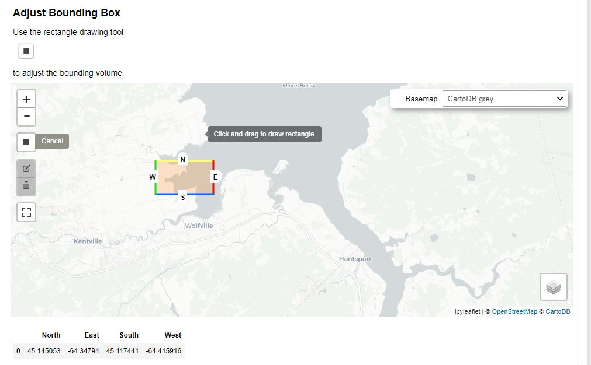

## Process workflow
<!-- Check flowchart text 'Create Gitlab Work item' looks good MG to PERSON Y/N -->
The process workflow for project metadata is as follows:
<pre class="mermaid">
flowchart LR
    proj_start(( )) --> get_meta(Receive  project metadata  from researchers)
    style proj_start fill:#00FF00,stroke:#00FF00,stroke-width:4px
    get_meta --> gitlab(Create  Gitlab  Work item)
    gitlab --> inspect(Visually  inspect)
    inspect --> nodebook(QC with  nodebooks)
    nodebook --> plone(Verify repository  folder  is correct)
    plone --> email(Email project  contacts  onboarding information)
    email --> otn(Pass to  OTN)
    otn --> end2(( ))
    style end2 fill:#FF0000,stroke:#FF0000
</pre>

The **first** step when you are contacted by a researcher who wants to register their project with the database is to request Project Metadata. For most Nodes, this is in the form of a plaintext `.txt` file, using the template provided [here](https://members.oceantrack.org/data/data-collection). This file allows the researcher to provide information on the core attributes of the project, including the scientific abstract, associated investigators, geospatial details, temporal and taxonomic range.

## Completed Metadata

Immediately upon receipt of the metadata, you must create a new Gitlab Ticket (aka Work Item). Please use the `Project Metadata` work item checklist template found in the drop down menu under the 'Description'.

Here is the Work item checklist, for reference:
<!-- Line 42 to line 62 Review if same as most current template selection MG to PERSON Y/N -->
~~~
Project Metadata
- [ ] - NAME add label *'loading records'*
- [ ] - NAME define type of project  **select one: Data, Deployment, Tracker**
- [ ] - NAME create schema and project records (`Creating and Updating project metadata` notebook)
- [ ] - NAME add project contact information (`Creating and Updating project metadata` notebook)
- [ ] - NAME add scientificnames (`Creating and Updating project metadata` notebook)
- [ ] - NAME [OTN only] manually identify if this is a loan, if so add record to obis.loan_tracking (`Creating and Updating project metadata` notebook)
- [ ] - NAME verify all of above (`Creating and Updating project metadata` notebook)
- [ ] - NAME [OTN only] create new project repo users (`Create Plone Folders and Add Users` notebook)
- [ ] - NAME [OTN only] create project repo folder (`Create Plone Folders and Add Users` notebook)
- [ ] - NAME [OTN only] add project repo users to folder (`Create Plone Folders and Add Users` notebook)
- [ ] - NAME [OTN only] access project repo double-check project repository creation and user access - **post repository URL HERE**
- [ ] - NAME add project metadata file to project folder (OTN members.oceantrack.org, FACT RW etc)
- [ ] - NAME email notification of updated metadata file to PI and individual who submitted
- [ ] - NAME send onboarding email to PIs using https://gitlab.oceantrack.org/otndc/otn-data-acquisition/-/snippets/203
- [ ] - NAME [OTN only] if this is a loan, update links for PMO
- [ ] - NAME [OTN only] check inbox for any email asking for an embargo on this project

_If there is an embargo request:_
- [ ] - NAME if there is an embargo request: create a new ticket using the correct task list (either 'Embargo_request_two_year' or 'Embargo_request_extended') and then skip down to the **Verification** steps. **Paste link to new ticket here**

_If there is **no** embargo request:_
- [ ] - NAME update the 'Publication of Tag Data' section with the embargo date as current date and select the *PI Approval* box (`Publication Control Table Update` notebook)
- [ ] - NAME update the 'Publication of Detection Data' section with the embargo date as current date and select the *PI Approval* box (`Publication Control Table Update` notebook)
- [ ] - NAME select **yes** for publish to OBIS, unless otherwise specified (`Publication Control Table Update` notebook)
- [ ] - NAME select **yes** for publish to ERDDAP, unless otherwise specified (`Publication Control Table Update` notebook)
- [ ] - NAME add signed data policy to the Background folder of the project folder **Paste link to file**
- [ ] - NAME email PIs about making the Plone repo public as well _(do not need to wait on a response, pass ticket on to verification once email has been sent)_

**Verification**
- [ ] - NAME label work item with *'Verify'*
- [ ] - NAME reassign work item to OTN data analyst for final verification
- [ ] - NAME verify project in database
- [ ] - NAME verify obis.publication_control updates

**project metadata txt file**
~~~
{: .language-plaintext .example}

### Visual Inspection

Once the researcher provides the completed file, the Data Manager should complete a visual check for formatting and accuracy.

Please make sure of the following:

1. Is the PI-provided collection code unique/appropriate? Do you need to create one yourself? Existing schemas/collection codes can be seen and checked for prexistence in the database.
1. Are there typos in the title or abstract?
1. Are the contacts formatted correctly?
1. Are the species formatted correctly?
1. Does the location make sense based on the abstract, and is it formatted correctly (one per line)?

Often, the `Contacts` section has been improperly formatted. Pay close attention here.

Below is an example of a properly completed metadata form, for your reference.

~~~
===FORM START===
0. Intended/preferred project code, if known? (May be altered by OTNDC)
format: XXXX (3-6 uppercase letters that do not already have a representation in the OTN DB. Will be assigned if left blank)

NSBS

1. Title-style description of the project?
format:  < 70 words in 'paper title' form

OTN NS Blue Shark Tracking

2. Brief abstract of the project?
format: < 500 words in 'abstract' form

In the Northwest Atlantic, the Ocean Tracking Network (OTN), in collaboration with Dalhousie University, is using an acoustic telemetry infrastructure to monitor the habitat use, movements, and survival of juvenile blue sharks (Prionace glauca). This infrastructure includes state-of-the-art acoustic receivers and oceanographic monitoring equipment, and autonomous marine vehicles carrying oceanographic sensors and mobile acoustic receivers. Long-life acoustic tags (n=40) implanted in the experimental animals will provide long-term spatial resolution of shark movements and distribution, trans-boundary migrations, site fidelity, and the species’ response to a changing ocean. This study will facilitate interspecific comparisons, documentation of intra- and interspecific interactions, and permit long-term monitoring of this understudied predator in the Northwest Atlantic. The study will also provide basic and necessary information to better inform fisheries managers and policy makers. This is pertinent given the recent formulation of the Canadian Plan of Action for Shark Conservation.

3. Names, affiliations, email addresses, and ORCID (if available) of researchers involved in the project and their role.

The accepted Project Roles are defined as:
Principal Investigator: PI or Co-PI. The person(s) responsible for the overall planning, direction and management of the project.
Technician: Person(s) responsible for preparation, operation and/or maintenance of shipboard, laboratory or deployed scientific instrumentation, but has no invested interest in the data returned by that instrumentation.
Researcher: Person(s) who may use/analyse the data to answer research questions, but is not the project lead. Can be a student if their involvement spans past the completion of an academic degree.
Student: Person(s) researching as part of a project as part of their work towards an academic degree.
Collaborator: A provider of input/support to a project without formal involvement in the project.

Please add 'Point of Contact' to the contact(s) who will be responsible for communicating with OTN.

format: Firstname Lastname, Employer OR Affiliation, Project Role (choose from above list), email.address@url.com, point of contact (if relevant), ORCID

Fred Whoriskey, OTN, principal investigator, fwhoriskey@dal.ca, 0000-0001-7024-3284
Sara Iverson, OTN, principal investigator, sara.iverson@dal.ca
Caitlin Bate, Dal, researcher, caitlin.bate@dal.ca, point of contact

4. Project URL - can be left blank
format: http[s]://yoursite.com

https://members.oceantrack.org/

5. Species being studied?  
format: Common name (scientific name)

blue shark (Prionace glauca)
sunfish (Mola mola)

6. Location of the project?
format: (city, state/province OR nearby landmark OR lat/long points in decimal degree), one per line

Halifax, NS
44.19939/-63.24085

7. Start and end dates of the project, if known?
format: YYYY-MM-DD to YYYY-MM-DD ('ongoing' is an acceptable end date)

2013-08-21 to ongoing

8. Citation to use when referencing this project:
format: Lastname, I., Lastname, I. YYYY. [Title from question 1 or suitable alternative] Will be assigned if left blank.

===FORM END===
~~~
{: .language-example}

## Quality Control - Create and Update Projects

Each step in the Work item checklist will be discussed here, along with other important notes required to use the Nodebooks.

### Imports Cell

This section will be common for most Nodebooks: it is a cell at the top of the notebook where you will import any required packages and functions to use throughout the notebook. It must be run first, every time.

You will have to edit one section: `engine = get_engine()`
- Within the open brackets you need to paste the path to your database `.kdbx` file which contains your login credentials. Ensure that the path is enclosed in quotation marks. 
- On MacOS computers, you can usually find and copy the path to your database `.kdbx` file by right-clicking on the file and holding down the "option" key. On Windows, we recommend using the installed software Path Copy Copy, so you can copy a unix-style path by right-clicking.
- The path should look like `engine = get_engine('C:/Users/username/Desktop/Auth files/database_connection.kdbx')`.

### Project Metadata Parser 

This cell is where you input the information contained in the Project Metadata `.txt` file. There are two ways to do this:

1. You can paste in the filepath to the saved `.txt`. You should ensure the formatting follows this example: `project_template_path = '/path/to/project_metadata.txt'`
1. You can paste the entire contents of the file, from `===FORM START=== to ===FORM END===` inclusive, into the provided triple quotation marks.

Note that each of the above options is contained in its own cell in the notebook, and **you only need to do one of the two.**

Once either option is selected, you can run the cell to complete the quality control checks.

The output will have useful information:
- Are there strange characters in the collection code, project title, or abstract?
- Were the names and affiliations of each contact successfully parsed? Are there any affiliated institutions which are not found? Are there any contacts which were not found that you expected to be?
- Is the project URL formatted correctly?
- Are all the species studied found in WoRMS? Are any of them non-accepted taxonomy (entries with accepted taxonomies will have a success message of the format `INFO: Genus species is an accepted taxon, and has Aphia ID XXXXXX.`, followed by a URL)? Which ones have common names that do **not** match the WoRMS records (look at bottom of each species record for success: `OK: Animal name is an acceptable vernacular name for Genus species`)? **NOTE: any mismatches with common name can be fixed at a later stage, make a note in the Ticket for your records**
- Is the suggested Bounding Box appropriate based on the abstract? **NOTE: any issues with the scale of the bounding box can be fixed at a later stage, make a note in the Ticket for your records**
- Are the start and end dates formatted correctly?

Generally, most of the error messages arise from the **Contacts** and **Species** sections.

If any information does not parse correctly, you should fix it in the source file and re-run the cell until you are happy with the output.

### Manual Fields - Dropdown Menu

There are some fields which need to be set up by the Data Manager,  rather than the researcher. These are in the next cell.

Run the cell to generate a fillable form with these fields:

1. Node: select your node
1. Collaboration Type: make an assessment based on the abstract, are they deploying only tags (`Tracker` project), only receivers (`Deployment` project) or both tags and receivers (`Data` project)?
1. Ocean: choose the most appropriate ocean region based on the abstract.
1. Shortname: usually a summarised version of the project title, which will be used as the name of the Data Portal folder. ex: `OTN Blue Sharks`.
1. Longname: use the Title provided by the researcher, or something else, which is in "scientific-paper" style. ex: `Understanding the movements of Blue sharks through Nova Scotia waters, using acoustic telemetry.`
1. Series Code: this will generally be the name of your node. Compare to values found in the database `obis.otn_resources` if you’re unsure.
1. Institution Code: The main institution responsible for maintaining the project. Compare to values found in the database `obis.institution_codes` and `obis.otn_resources` if you’re unsure. **If this is a new Institution, please make a note in the Ticket, so you can add it later on**
1. Country: based upon the abstract. Multiple countries can be listed as such: `CANADA, USA, EGYPT` etc.
1. State: based upon the abstract. Multiple states can be listed as such: `NOVA SCOTIA, NEWFOUNDLAND` etc.
1. Local Area: based upon the abstract. Location information. ex: `Halifax`
1. Locality: based upon the abstract. Finest-scale of location. ex: `Shubenacadie River`
1. Status: is the project completed, ongoing or something else?

To save and parse your inputted values **DO NOT** re-run the cell - this will clear all your input. Instead, the next cell is the one which needs to be run to parse the information.

Verify the output from the parser cell, looking for several things:
1. Are all the fields marked with a green `OK`?
1. Is the following feedback included in the institution code section: `Found institution record for XXX in your database:` followed by a small, embedded table?

If anything is wrong, please begin again from the Manual Field input cell.

If the institution code **IS NOT** found - compare to values found in the database `obis.institution_codes` and `obis.otn_resources`. **If this is a new Institution, please make a note in the Ticket, so you can add it later on**

#### Task List Checkpoint

In Gitlab, this task can be completed at this stage:

`- [ ] - NAME define type of project  **select here one of Data, Deployment, Tracker**`

Please edit to include the selected project type, in harmony with the selected field in the Nodebook.

### Verifying Correct Information

At this stage, we have parsed all the information that we need in order to register the project in the database. There is now a cell that will print out every saved value for your review.

You are looking for:
- Typos
- Strange characters
- Correct information based on abstract

If this information is satisfactory, you can proceed.

#### Adjust Bounding Box

The cell titled `Verify the new project details before writing to the DB` is the final step for verification before the values are written to the database. At this stage, a map will appear with the proposed Bounding Box for the project.

Based on the abstract, you can use the `Square Draw Tool` to re-draw the bounding box until you are happy with it.

Once you are happy, you can run the *next* cell in order to save your bounding adjustments. The success output should be formatted like this:

~~~
--- Midpoint ---
Latitude:
Longitude:
~~~
{: .lanaguage-example}

### Create New Institution

**STOP** - confirm there is no Push currently ongoing. If a Push is ongoing, you must wait for it to be completed before processing beyond this point.

Remember above, where we noted whether the provided institution was new or existed on `obis.institution_codes`? This cell is our opportunity to add any new institutions. If all institutions (for each contact, plus for the project as a whole) exist, then you can skip this cell.

To run the cell, you will need to complete:
1. Institution Code: a short-code for the institution (ex: DAL)
1. Institution Name: the full institution name (ex: Dalhousie University)
1. Institution Website: the institution's website (ex: https://www.dal.ca/). You can confirm the URL is valid with the `Check URL` button.
1. Organization ID: Press the `Search Org ID` button. A list of potential WikiData, GRID, ROR, EDMO and NERC results for the institution will appear. Choose the best match, and paste that URL into the blank Organization ID cell.
1. Institution Country: the country where the institution is headquartered
1. Institution State: the state where the institution is headquartered
1. Institution Sector: one of Unknown, Government/Other Public, University/College/Research Hospital, Private, or Non-profit.

Once all values are completed, press `Create Institution` and confirm the following output:

~~~
Institution record 'DAL' created.
~~~
{: .language-plaintext .example}

You can re-run this cell as many times as you need, to add each missing institution.

### Write Project to the Database

**STOP** - confirm there is no Push currently ongoing. If a Push is ongoing, you must wait for it to be completed before processing beyond this point.

Finally, it is time to write the project records to the database and create the new project!

First, you should run this cell with `printSQL = True`. This will run the code, but print the SQL query instead of running it against the database. This enables you to do a dry run and make sure everything is in order before you register your project. If there are no errors, you can edit the cell to read `printSQL = False` and run again. This will register the project!

You will see some output - confirm each line is accompanied by a green `OK`.

#### Task List Checkpoint

In Gitlab, this task can be completed at this stage:

`- [ ] - NAME create schema and project records ("Creating and Updating project metadata" notebook)`

### Save Contact Information

At this stage, the next step is to add contact information for all identified collaborators.

This cell will gather and print out all contacts and their information. Review for errors. If none exist, move to the next cell.

The next cell writes to the database: **STOP** - confirm there is no Push currently ongoing. This cell will add each contact to the database, into the `obis.contacts` and `obis.contacts_projects` tables, as needed.

Valid output will be of this format:

~~~
Valid contact:  Fred Whoriskey OTN principalInvestigator fwhoriskey@dal.ca
Created contact Fred Whoriskey
~~~
{: .language-example}

#### Task List Checkpoint

In Gitlab, this task can be completed at this stage:

`- [ ] - NAME add project contact information ("Creating and Updating project metadata" notebook)`

### Add Species Information

The following section will allow you to add the required information into the `obis.scientific_names` table.

The first cell imports the required function.

The second cell, when run, will create an editable input form for each animal.

You should review to confirm the following:
1. the scientific name matches an accepted WoRMS taxon. There should be a URL provided and no error messages.
1. the common name is acceptable. If it is not, you can choose a value from the dropdown menu (taken directly from WoRMS' `vernacular` list) **OR** you can enter a custom value to match the common name provided by the researcher.

Once you are sure that both the scientific and common names are correct, based on the information provided by both the project and the notebook, you may click the `Add to project` button for each animal record you'd like to insert.

There will be a confirmation display in the notebook to demonstrate if the insertion was successful.

#### Task List Checkpoint

In Gitlab, this task can be completed at this stage:

`- [ ] - NAME add scientificnames ("Creating and Updating project metadata" notebook)`

>### OPTIONAL: Add Project Loan Information
>

>The following section is used by OTN staff to track projects which are recipients of OTN-equipment loans. This section is not within the scope of this Node Manager Training, because it requires a login file for the `otnunit` database.

### Skip to Verification

Once you scroll past the `Project Loan Information` section, you will see a yellow star and the words **Skip to the new project Verification**. You should click the button provided, which will help you scroll to the bottom of the notebook, where the `Verify` section is located.

This is a chance to visually review all the fields you just entered. You should run these cells and review all output to ensure the database values align with the intended insertions.

#### Task List Checkpoint

In Gitlab, this task can be completed at this stage:

`- [ ] - NAME verify all of above ("Creating and Updating project metadata" notebook)`

### Other Features of this Notebook

There are more features in the `Create and Update Projects` Nodebook than those covered above.

#### Schema Extension

This section is to be used when you have a project which is either `Tracker` or `Deployment` and is expanding to become a `Data` project. Ex: a project which was only tagging has begun deploying receivers.

You can use this Nodebook to create the missing tables for the schema. Ex: if a tagging project begins deploying receivers, the schema would now need `stations`, `rcvr_locations`, and `moorings` tables created.

#### Schema Updating

This section is to be used to change the values contained in `obis.otn_resources`. The first cell will open an editable form with the existing database values. You can change the required fields (ex: abstract).

To save and parse your inputted values **DO NOT** re-run the cell - this will clear all your input. Instead, the next cell is the one which needs to be run to parse the information.

Review the output of the parser cell and check for typos.

The next cell will show the changes that will be made to the project data. You can copy this output and paste it into the relevant Gitlab Issue for tracking.

The final cell will make the desired changes in the database. Ensure `printSQL = False` if you want the cell to execute directly.

Successful output will be of this format:

~~~
'Resource record for HFX has been updated.'
~~~
{: .language-example}

**The following highlighted section is relevant only to Nodes who use `Plone` for their document management system**

> ### Quality Control - Create Plone Users and Access
>
> If you are part of a Node that uses Plone as your document repository, then the following will be relevant for you.
>
> ### Imports Cell
>
> This section will be common for most Nodebooks: it is a cell at the top of the notebook where you will import any required packages and functions to use throughout the notebook. It must be run first, every time.
>
> You will have to edit one section: `engine = get_engine()`
> - Within the open brackets you need to open quotations and paste the path to your database `.kdbx` file which contains your login credentials.
> - On MacOS computers, you can usually find and copy the path to your database `.kdbx` file by right-clicking on the file and holding down the "option" key. On Windows, we recommend using the installed software Path Copy Copy, so you can copy a unix-style path by right-clicking.
> - The path should look like `engine = get_engine(‘C:/Users/username/Desktop/Auth files/database_connection.kdbx’)`.
>
> ### Plone Login
>
> The first cell is another import step.
>
> The second cell requires input:
>
> - Proper Plone log-in information must be written in the `plone_auth = get_plone_auth('./plonetools/plone_auth.json')` file. 
> - In order to do this, click on the `Jupyter` icon in the top left corner of the page.
> - This will bring you to a list of folders and notebooks. Select the `plonetools` folder. From there, select the `plone_auth.json` file and input your Plone base URL, username, and password. **Please ensure** the base_url in your json file ends in a slash, like `https://members.oceantrack.org/`!
> - You can now successfully log into Plone.
>
> Now, when you run the cell, you should get the following output:
>
> ~~~
> Auth Loaded:
> ------------------------------------------------------------------------------
> base_url: https://members.oceantrack.org/
> user_name: user
> verify ssl: False
> ~~~
> {: .language-plaintext .example}
>
> Finally, the third cell in this section will allow you to login. You should see this message:
>
> ~~~
> Login Successful!
> ~~~
> {: .language-plaintext .example}
>
> ### Access Project Information
>
> Some information is needed in order to create the project Plone folders.
>
> There are three ways to enter this information:
>
> 1. Access Project Information from Database
> 2. Manual Project Information Form - Parse Contacts
> 3. Manual Project Information Form - Insert Contacts into Textfields
>
> The first option is generally the easiest, if the project has already been successfully written to the database using the `Create and Update Projects` Nodebook. To do this, you enter the `collectioncode` of your project, and run the cell. If there are no errors, you can click the `SKIP` button which will take you down the Nodebook to the next section.
>
>
> ### Create Missing Users
>
> This section will use the registered project contacts and compare against existing Plone users. It will compare by email, fullname, and lastname.
>
> If a user is found, you will **not** need to create a new account for them.
>
> If a user is not found, you **will** have to create an account for them. To do this, you can use the editable form in the next cell.
>
> The editable cell will allow you to choose each contact that you'd like to register, and will autofill the information (including a suggested username). **The password should be left blank**. Once you are happy with the form, click `Add User`. An email will be sent to the new user, prompting them to set a password. Then you can repeat by selecting the next contact, etc.
>
> Once all contacts have Plone accounts (new or otherwise) you are finished.
>
>
> #### Task List Checkpoint
>
> In Gitlab, this task can be completed at this stage:
>
> `- [ ] - NAME create new project repository users ("Create Plone Folders and Add Users" notebook)`
>
> ### Create Project Repository
>
> To create the project folder you must first enter the relevant Node information:
> - otnunit: `node = None`
> - safnode, migramar, nepunit:`node = "node"` - lowercase with quotation marks, fill in the value based on the path in Plone.
> - all other nodes (not hosted by OTN): `node = None`
>
> Running this cell will print out an example of the URL, for your confirmation. Ensure the `collectioncode` and `Node` are correct.
>
> The expected format:
>
> `https://members.oceantrack.org/data/repository/node_name/collectioncode` (node name is for SAF, MigraMar, and NEP only)
>
> If you are confident the folder path is correct, you can run the next cell and confirm the following success message:
>
> ~~~
> Creating collection folder 'collectioncode'. Done!
> https://members.oceantrack.org/data/repository/node_name/collectioncode
> ~~~
> {: .language-plaintext .example}
>
>
> #### Task List Checkpoint
>
> In Gitlab, this task can be completed at this stage:
>
> `- [ ] - NAME create project repository folder ("Create Plone Folders and Add Users" notebook)`
>
> ### Add Users to Repository
>
> Now that the users AND folder have been created, the users must be given access to the new folder.
>
> Using the final cell in the `Plone repository folder creation` section, you will be provided with an editable search-bar.
>
> Type in the Plone username of each contact (new and existing). Search results will appear:
> 1. Select the User who you would like to add
> 1. Choose their permissions
> 1. Click "Change repo permissions" to add them to the folder.
>
> Review for the following success message:
>
> ~~~
> Changed https://members.oceantrack.org/data/repository/node_name/collectioncode sharing for username:
> 	Contributor=True Reviewer=True Editor=True Reader=True
> ~~~
> {: .language-plaintext .example}
>
> Then you may choose `Add another user` and begin again.
><!-- Requires rewrite for clarity in what this means for what a researcher can and can't do in Plone repo terms MG to PERSON Y/N -->
Upon creation of a project or in cases of adding a new person to your project, you are asked to specify their role on the project. This role relates to the level of authority they have with regards to the repository itself and the data contained therein. 

The actions a person can perform in the data repository are as follows: 

Can add: A user can access the repository and share data files to be uploaded to the repository. 
Can edit: A user can access the repository and can add files, edit files, remove files and make folders. 
Can view: A user can access the repository and view files. 
Can Review: A user can access the repository and has final say on data sharing. 

The acceptable folder permissions may vary depending on the project role of the contact. Here are some guidelines:
•	Principal Investigator: all permissions
•	Researcher: all permissions except Reviewer
•	Student: all permissions except Reviewer
•	Technician: only Contributor and Reader
•	Collaborator: only Contributor and Reader

Roles and abilities in the OTN Data repository:
Reader: Can view but cannot make changes. 
Contributor: Can view the repository, can edit and can add.
Reviewer:  Can do all of above and also has role of authority on what happens to the data in respect to sharing. 

>
> This is very fluid and can be edited at any time. These are guidelines only!
>
>
> #### Task List Checkpoint
>
> In Gitlab, this task can be completed at this stage:
>
> `- [ ] - NAME add project repository users to folder ("Create Plone Folders and Add Users" notebook)`
>
> ### OPTIONAL: Add Project Loan Information
>
> The following section is used by OTN staff to track projects which are recipients of OTN-equipment loans. This section is not within the scope of this Node Manager Training, because it requires a login-file for the `otnunit` database.
>

# Final Steps

The remaining steps in the Gitlab Checklist are completed outside the Nodebooks.

First: you should access the created Repository folder in your browser and confirm if the title and sharing information is correct. If so, add the project metadata `.txt` file into the "Data and Metadata" folder to archive.

Next, you should send an email to the project contacts letting them know their project code and other onboarding information. Please note that OTN has a template we use for our onboarding emails. It is recommended that you create a template for your Node which includes relevant reporting instructions.

Finally, the GitLab ticket can be assigned to an OTN analyst for final verification in the database.


