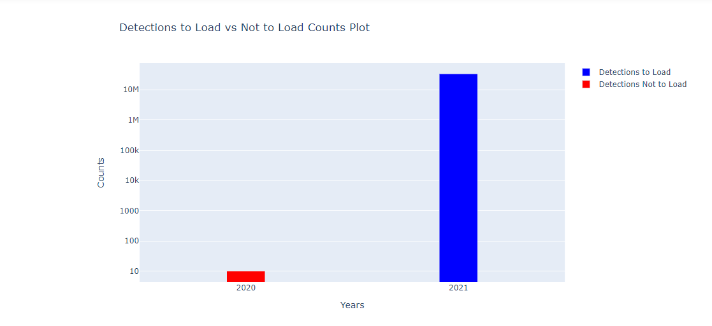

Once `deployment metadata` has been processed for a project, the related detections may now be processed. Detection data should be reported to the Node as a collection of raw, **unedited** files. These can be in the form of a zipped folder of `.VRLs`, a database from Thelma Biotel or any other raw data product from any manufacturer. The files contain only transmitter numbers and the datetimes at which they were recorded at a specific receiver. The `tag metadata` and `deployment metadata` will provide the associated geographic and biological context to this data.

# Submitted Records

Immediately, upon receipt of the data files, a new GitLab Issue should be created. Please use the `Detections` Issue checklist template.

Here is the Issue checklist, for reference:

~~~
Detections
- [ ] - NAME load raw detections and events `(detections-1` notebook and `events-1` notebook **OR** `Batch Fathom Export` notebook and `detections-1` notebook) **(put table names here)**
- [ ] - NAME upload raw detections to project folder (OTN members.oceantrack.org, FACT RW etc) if needed
- [ ] - NAME verify raw detections table (`detections-1` notebook)
- [ ] - NAME load raw events to events table (`events-2` notebook)
- [ ] - NAME load to detections_yyyy (`detections-2` notebook)
- [ ] - NAME comment in issue what detection years were loaded (output from `detections-2`)
- [ ] - NAME verify detections_yyyy (looking for duplicates) (`detections-2` notebook)
- [ ] - NAME load to sensor_match_yyyy (`detections-2` notebook)
- [ ] - NAME comment in issue what sensor years were loaded (output from `detections-2`)
- [ ] - NAME timedrift correction for affected detection and sensor years (`detections-2b` notebook)
- [ ] - NAME verify timedrift corrections (`detections-2b` notebook)
- [ ] - NAME manually check for open, unverified receiver metadata, **STOP** if it exists! (**put Gitlab issue number here**)
-----
- [ ] - NAME load to otn_detections_yyyy (`detections-3` notebook)
- [ ] - NAME verify otn_detections_yyyy (`detections-3` notebook)
- [ ] - NAME load sentinel records (`detections-3` notebook)
- [ ] - NAME check for missing receiver metadata (`detections-3b` notebook)
- [ ] - NAME check for missing data records (`detections-3c` notebook)
- [ ] - NAME load download records (`events-3` notebook)
- [ ] - NAME verify download records (`events-3` notebook)
- [ ] - NAME process receiver configuration (`events-4` notebook)
- [ ] - NAME label issue with *'Verify'*
- [ ] - NAME pass issue to OTN analyst for final steps
- [ ] - NAME check for double reporting (`detections verification script`)
- [ ] - NAME match tags to animals (`detections-4` notebook)
- [ ] - NAME do sensor tag processing (only done if vendor specifications are available)
- [ ] - NAME update detection extract table

**detections files/path:**
~~~
{: .language-plaintext .example}

### Visual Inspection

Once the files are received from a researcher, the Data Manager should first complete a visual check for formatting and accuracy.

Things to visually check:

- Do the files appear edited? Look for `_edited` in file name.
- Is the file format the same as expected for that manufacturer? Ex. `.vrl` for Innovasea - not `.csv` or `rld` formats.
- Is there data for each of the instrument recoveries that was reported in the `deployment metadata`?

# Convert to CSV

Once the raw files are obtained, the data must be converted to `csv` format. There are several ways this can be done, depending on the manufacturer.

For Innovasea
- VUE
    - Open a new `database`
    - Import all the `VRL` files
    - Select `export detections` and choose the location you want to save the files
    - Select `export events` and choose the location you want to save the files
- Fathom App
    - choose "export data"
    - select the relevant files and import into the Fathom Desktop application
    - export all data types, and choose the location you want to save the files
- `convert - Fathom (vdat) Export - VRL to CSV` Nodebook
    - this will use the `vdat.exe` executable to export from VRL/VDAT to CSV
    - select the folder containing the relevant files and the location you'd like the CSVs saved
    - run the cells to `convert`

For Thelma Biotel
- use the `ComPort` software to open the `.tbdb` file and export as CSV

For Lotek
- exporting to CSV is more complicated, please reach out to OTN for specific steps

Other manufacturers: contact OTN staff.

# detections - 1 - load csv detections

Detections 1 loads CSV detections files into a new database table. If detections were exported using `Fathom` or the `convert - Fathom (vdat) Export - VRL to CSV` notebook, the `events` records will also be loaded at this stage. This is because these tools combine the detections and events data in one CSV file.

### Import cells and Database Connections

As in all notebooks run the import cell to get the packages and functions needed throughout the notebook. This cell can be run without any edits.

The second cell will set your database connection. You will have to edit one section: `engine = get_engine()`
- Within the open brackets you need to open quotations and paste the path to your database `.kdbx` file which contains your login credentials.
- On MacOS computers, you can usually find and copy the path to your database `.kdbx` file by right-clicking on the file and holding down the "option" key. On Windows, we recommend using the installed software Path Copy Copy, so you can copy a unix-style path by right-clicking.
- The path should look like `engine = get_engine('C:/Users/username/Desktop/Auth files/database_conn_string.kdbx')`.

Once you have added your information, you can run the cell. Successful login is indicated with the following output:

~~~
Auth password:········
Connection Notes: None
Database connection established
Connection Type:postgresql Host:db.for.your.org Database:your_db_name User:your_node_admin Node:Node
~~~
{: .language-plaintext .example}

### User Input

Cell three requires input from you. This information will be used to get the raw detections CSV and to be able to create a new raw table in the database.

1. `file_or_folder_path = r'C:/Users/path/to/detections_CSVs'`
    * paste a filepath to the relevant CSV file(s). The filepath will be added between the provided quotation marks.
    * this can be a path to a single CSV file, or a folder of multiple CSVs.
1. `table_suffix = 'YYYY_mm'`
	  * Within the quotes, please add your custom table suffix. We recommend using `year_month` or similar, to indicate the most-recently downloaded instrument.
1. `schema = 'collectioncode'`
	  * please edit to include the relevant project code, in lowercase, between the quotes.

There are also some optional inputs:
- `load_detections`: a true or false value using the table suffix you supplied
- `stacked`: this is for Fathom exports only and is a way to know how to parse them

Once you have added your information, you can run the cell.

### Verify Detection File and Load to Raw Table

Next, the notebook will review and verify the detection file(s) format, and report any error. Upon successful verification, you can then run the cell below which will attempt to load the detections into a new raw table.

The notebook will indicate the success of the table-creation with a message such as this:

~~~
Reading fathom files...
Loading Files...
7/7
~~~
{: .language-plaintext .example}

#### Task list checkpoint

In GitLab, this task can be completed at this stage:

`- [ ] - NAME load raw detections and events ('detections-1' notebook and 'events-1' notebook **OR** 'Batch Fathom Export' notebook and 'detections-1' notebook) **(put table names here)**`

Ensure you paste the table name (ex: c_detections_YYYY_mm) into the section indicated, before you check the box.

### Verify Raw Detection Table

This cell will now complete the Quality Control checks of the raw table. This is to ensure the Nodebook loaded the records correctly from the CSVs.

The output will have useful information:
- Are there any duplicates?
- Are the serial numbers formatted correctly?
- Are the models formatted correctly?

The notebook will indicate the sheet had passed quality control by adding a ✔️**green checkmark** beside each section.

If there are any errors, contact OTN for next steps.

#### Task list checkpoint

In GitLab, these tasks can be completed at this stage:

`- [ ] - NAME verify raw detections table ('detections-1' notebook)`

# events - 1 - load events into c_events_yyyy

Events 1 is responsible for loading receiver events files into raw tables. This is only relevant for CSVs that were **NOT** exported using `Fathom` or the `convert - Fathom (vdat) Export - VRL to CSV` notebook.

### Import cell

As in all notebooks run the import cell to get the packages and functions needed throughout the notebook. This cell can be run without any edits.

### User Inputs

Cell two requires input from you. This information will be used to get the raw events CSV and to be able to create a new raw table in the database.

1. `filepath = r'C:/Users/path/to/events.csv'`
    * paste a filepath to the relevant CSV file. The filepath will be added between the provided quotation marks.
1. `table_name = 'c_events_YYYY_mm'`
	  * Within the quotes, please add your custom table suffix. We recommend using `year_month` or similar, to indicate the most-recently downloaded instrument.
1. `schema = 'collectioncode'`
	  * please edit to include the relevant project code, in lowercase, between the quotes.

There are also some optional inputs:
- `file_encoding`: The file_encoding: ISO-8859-1 in the event export. The  default encoding used in VUE's event export

Once you have added your information, you can run the cell.

### Verifying the events file

Before attempting to load the event files to a raw table the notebook will verify the file to make sure there are no major issues. This will be done by running the Verify events file cell. Barring no errors, you will be able to continue.

The notebook will indicate the success of the file verification with a message such as this:

~~~
Reading file 'events.csv' as CSV.
Verifying the file.
Format: VUE 2.6+
Mandatory Columns: OK
date_and_time datetime:OK
Initialization(s): XX
Data Upload(s): XX
Reset(s): XX
~~~
{: .language-plaintext .example}

### Database Connection

You will have to edit one section: `engine = get_engine()`
- Within the open brackets you need to open quotations and paste the path to your database `.kdbx` file which contains your login credentials.
- On MacOS computers, you can usually find and copy the path to your database `.kdbx` file by right-clicking on the file and holding down the "option" key. On Windows, we recommend using the installed software Path Copy Copy, so you can copy a unix-style path by right-clicking.
- The path should look like `engine = get_engine('C:/Users/username/Desktop/Auth files/database_conn_string.kdbx')`.

Once you have added your information, you can run the cell. Successful login is indicated with the following output:

~~~
Auth password:········
Connection Notes: None
Database connection established
Connection Type:postgresql Host:db.for.your.org Database:your_db_name User:your_node_admin Node:Node
~~~
{: .language-plaintext .example}

### Load the events file into the c_events_yyyy table

The second last cell loads the events file into a raw table. It depends on successful verification from the last step. Upon successful loading and can dispose of the engine then move on to the next notebook.

The notebook will indicate the success of the table-creation with the following message:

~~~
File loaded with XXXXX records.
100%
~~~
{: .language-plaintext .example}

#### Task list checkpoint

In GitLab, these tasks can be completed at this stage:

`- [ ] - NAME load raw detections and events ('detections-1' notebook and 'events-1' notebook **OR** 'Batch Fathom Export' notebook and 'detections-1' notebook) **(put table names here)**`

Ensure you paste the table name (ex: c_events_YYYY_mm) into the section indicated, before you check the box.

# events - 2 - move c_events into events table

This notebook will move the `raw` events records in the `intermediate` events table.

### Import cell

As in all notebooks run the import cell to get the packages and functions needed throughout the notebook. This cell can be run without any edits.

### User input

This cell requires input from you. This information will be used to get the raw events CSV and to be able to create a new raw table in the database.

1. `c_events_table = 'c_events_YYYY_mm'`
	  * Within the quotes, please add your custom table suffix, which you have just loaded in either `detections-1` or `events-1`.
1. `schema = 'collectioncode'`
	  * please edit to include the relevant project code, in lowercase, between the quotes.

### Database Connection

You will have to edit one section: `engine = get_engine()`
- Within the open brackets you need to open quotations and paste the path to your database `.kdbx` file which contains your login credentials.
- On MacOS computers, you can usually find and copy the path to your database `.kdbx` file by right-clicking on the file and holding down the "option" key. On Windows, we recommend using the installed software Path Copy Copy, so you can copy a unix-style path by right-clicking.
- The path should look like `engine = get_engine('C:/Users/username/Desktop/Auth files/database_conn_string.kdbx')`.

Once you have added your information, you can run the cell. Successful login is indicated with the following output:

~~~
Auth password:········
Connection Notes: None
Database connection established
Connection Type:postgresql Host:db.for.your.org Database:your_db_name User:your_node_admin Node:Node
~~~
{: .language-plaintext .example}

### Verify table format

You will then verify that the c_events events table you put in exists and then verify that it meets the required format specifications.

The notebook will indicate the success of the table verification with a message such as this:

~~~
Checking table name format... OK
Checking if schema collectioncode exists... OK!
Checking collectioncode schema for c_events_YYYY_mm table... OK!
collectioncode.c_events_YYYY_mm table found.
~~~
{: .language-plaintext .example}

If there are any errors in this section, please contact OTN.

### Load to Events table

Pending nothing comes up in the verification cells, you run the `loading` cell.

The notebook will indicate the success of the processing with a message such as this:

~~~
Checking for the collectioncode.events table... OK!
Loading events... OK!
Loaded XX rows into collectioncode.events table.
~~~
{: .language-plaintext .example}

#### Task list checkpoint

In GitLab, these tasks can be completed at this stage:

`- [ ] - NAME load raw events to events table ("events-2" notebook)`

# detections - 2 - c_table into detections_yyyy

This notebook takes the `raw` detection data from detections-1 and moves it into the `intermediate` detections_yyyy tables (split out by year).

### Import cells and Database Connections

As in all notebooks run the import cell to get the packages and functions needed throughout the notebook. This cell can be run without any edits.

The second cell will set your database connection. You will have to edit one section: `engine = get_engine()`
- Within the open brackets you need to open quotations and paste the path to your database `.kdbx` file which contains your login credentials.
- On MacOS computers, you can usually find and copy the path to your database `.kdbx` file by right-clicking on the file and holding down the "option" key. On Windows, we recommend using the installed software Path Copy Copy, so you can copy a unix-style path by right-clicking.
- The path should look like `engine = get_engine('C:/Users/username/Desktop/Auth files/database_conn_string.kdbx')`.

Once you have added your information, you can run the cell. Successful login is indicated with the following output:

~~~
Auth password:········
Connection Notes: None
Database connection established
Connection Type:postgresql Host:db.for.your.org Database:your_db_name User:your_node_admin Node:Node
~~~
{: .language-plaintext .example}

### User Inputs

To load the to the detections_yyyy tables the notebook will require information about the schema you are working in and the raw table that you created in `detections-1`.

1. `c_table = 'c_detections_YYYY_mm'`
	  * Within the quotes, please add your custom table suffix, which you have just loaded in `detections-1`
1. `schema = 'collectioncode'`
	  * please edit to include the relevant project code, in lowercase, between the quotes.

The notebook will indicate success with the following message:

~~~
Checking table name format... OK
Checking if schema collectioncode exists... OK!
Checking collectioncode schema for c_detections_yyyy_mm table... OK!
collectioncode.c_detections_yyyy_mm table found.
~~~
{: .language-plaintext .example}

### Create Missing Tables

Detections tables are only created on an as-needed basis. These cells will detect any tables you are missing and create them as needed, based on the years covered in the raw detection table (c_table). This will check all tables such as `detections_yyyy`, `sensor_match_yyyy` and `otn_detections_yyyy`.

First the notebook with gather and print the missing tables. If there are none missing, the notebook will report that as well.

~~~
vemco: Match
You are missing the following tables:
[collectioncode.detections_YYYY, v2lbeiar.otn_detections_YYYY, v2lbeiar.sensor_match_YYYY]
Create these tables by passing the missing_tables variable into the create_detection_tables function.
~~~
{: .language-plaintext .example}

If you proceed in the notebook, there is a `creation` cell which will add these tables to the project schema in the database. Success will be indicated with the following message:

~~~
Creating table collectioncode.detections_YYYY... OK
Creating table collectioncode.otn_detections_YYYY... OK
Creating table collectioncode.sensor_match_YYYY... OK
~~~
{: .language-plaintext .example}

### Create Detection Sequence

Before loading detections, a detection sequence is created. The sequence is used to populate the `det_key` column. The `det_key` value is an unique ID for that detection to help ensure there are no duplicates. If a sequence is required, you will see this output:

~~~
creating sequence v2lbeiar.detections_seq... OK
~~~
{: .language-plaintext .example}

No further action is needed.

### Load to Detections_YYYY

Duplicate detections are then checked for and will not be inserted into the detections_yyyy tables.

If no duplicates are found you will see:

`No duplicates found. All of the detections will be loaded into the detections_yyyy table(s).`

If duplicates are found you will see:
- a bar chart showing the number of detections per year which
    * have already been loaded
    * are new, and will be loaded this time
- you may want to investigate if the results are not what you expected.

After all this, the `raw` detection records are ready to be loaded into the `detections_yyyy` tables. The notebook will indicate success with the following message:

~~~
Inserting records from collectioncode.c_detections_YYYY_mm into collectioncode.detections_2018... OK
Added XXXXX rows.
Inserting records from collectioncode.c_detections_YYYY_mm into collectioncode.detections_2019... OK
Added XXXXX rows.
Inserting records from collectioncode.c_detections_YYYY_mm into collectioncode.detections_2020... OK
Added XXXXX rows.
Inserting records from collectioncode.c_detections_YYYY_mm into collectioncode.detections_2021... OK
Added XXXXX rows.
~~~
{: .language-plaintext .example}

**You must note which years have been loaded!** In the example above, this would be 2018, 2019, 2020, and 2021.

#### Task list checkpoint

In GitLab, these tasks can be completed at this stage:

~~~
- [ ] - NAME load to detections_yyyy (`detections-2` notebook)
- [ ] - NAME comment in issue what detection years were loaded (output from `detections-2`)
~~~
{: .language-plaintext .example}

Ensure you paste the affected tables (ex: 2019, 2020) into the section indicated, before you check the box.

### Verify Detections YYYY Tables

This cell will now complete the Quality Control checks of the `detections_yyyy` tables. This is to ensure the nodebook loaded the records correctly.

First, you will need to list **all** of the years that were affected by the previous loading step, so the Notebook knows which tables need to be verified.
The format will look like this:

`years = ['YYYY','YYYY','YYYY', 'YYYY']`

Run this cell, then you can verify in the next cell.

The output will have useful information:
- Were all the detections loaded?
- Are the serial numbers formatted correctly?
- Are the models formatted correctly?
- Are there duplicate detections?
- What sensors will need to be loaded?

The notebook will indicate the sheet had passed quality control by adding a ✔️**green checkmark** beside each section.

If there are any errors contact OTN for next steps.

#### Task list checkpoint

In GitLab, this task can be completed at this stage:

`- [ ] - NAME verify detections_yyyy (looking for duplicates) ("detections-2" notebook)`

###  Load sensors_match Tables by Year

For the last part of this notebook you will need to load the to the `sensor_match_YYYY` tables. This loads detections with sensor information into a project's sensor_match_yyyy tables. Later, these tables will aid in matching vendor specifications to resolve sensor tag values.

Output will appear like this:

~~~
Inserting records from collectioncode.detections_2019 INTO sensor_match_2019... OK
Added XXX rows.
Inserting records from collectioncode.detections_2021 INTO sensor_match_2021... OK
Added XXX rows.
~~~
{: .language-plaintext .example}

**You must note which years have been loaded!** In the example above, this would be 2019 and 2021.

#### Task list checkpoint

In GitLab, these tasks can be completed at this stage:

~~~
- [ ] - NAME load to sensor_match_yyyy (`detections-2` notebook) **(put sensor years that were loaded here)**
- [ ] - NAME comment in issue what sensor years were loaded (output from `detections-2`)
~~~
{: .language-plaintext .example}

Ensure you paste the affected tables (ex: 2019, 2020) into the section indicated, before you check the box. Then, comment these years into the Issue as well.

# detections - 2b - timedrift calculations

This notebook calculates time drift factors and applies the corrections to the `detections_yyyy` tables, in a field called `corrected_time`. OTN's Data Manager toolbox (the Nodebooks) corrects for timedrift between each initialization and offload of a receiver. If a receiver is offloaded several times in one data file, time correction does not occur linearly from start to end, but between each download, to ensure the most accurate correction. If there is only one download in a data file then the time correction in `VUE` software will match the time correction performed by OTN.

### Import cells and Database connections

As in all notebooks run the import cell to get the packages and functions needed throughout the notebook. This cell can be run without any edits.

The second cell will set your database connection. You will have to edit one section: `engine = get_engine()`
- Within the open brackets you need to open quotations and paste the path to your database `.kdbx` file which contains your login credentials.
- On MacOS computers, you can usually find and copy the path to your database `.kdbx` file by right-clicking on the file and holding down the "option" key. On Windows, we recommend using the installed software Path Copy Copy, so you can copy a unix-style path by right-clicking.
- The path should look like `engine = get_engine('C:/Users/username/Desktop/Auth files/database_conn_string.kdbx')`.

Once you have added your information, you can run the cell. Successful login is indicated with the following output:

~~~
Auth password:········
Connection Notes: None
Database connection established
Connection Type:postgresql Host:db.for.your.org Database:your_db_name User:your_node_admin Node:Node
~~~
{: .language-plaintext .example}

### User Inputs

To load the to the detections_yyyy tables the notebook will require information about the schema you are working in. Please edit `schema = 'collectioncode'` to include the relevant project code, in lowercase, between the quotes.

### Calculating Time Drift Factors

`create_tbl_time_drift_factors`. This function will create the `time_drift_factors` table in the schema if it doesn't exist.

The next step is to run `check_time_drifts` which gives a display of the time drift factor values that will be added to the time_drift_factors table given an events table. At this stage, you should review for any erroneous/large timedrifts.

If everything looks good, you may proceed to the next cell which adds new time drift factors to the time_drift_factors table from the events file. A success message will appear:

~~~
Adding XXX records to collectioncode.time_drift_factors table from collectioncode.events... OK!
~~~
{: .language-plaintext .example}

You will then see a cell to create missing views which creates the time drift `views` which the database will use to calculate drift values for both the `detections_yyyy` and `sensor_match_yyyy` tables.

### Correcting Time Drift

Finally,  we are ready to update the times in both the `detections_yyyy` and `sensor_match_yyyy` tables with corrected time values using the vw_time_drift_cor database view.

First, you will need to ensure you run this cell on **all** of the years that were affected by `detections-2` loading steps, so the notebook knows which tables need to be corrected.

The format will look like this:

~~~
year = 2021 # Year as int
~~~
{: .language-plaintext .example}

Once the timedirft calculation is done (indicated by ✔️**green checkmarks**) you then have to **re-run** the cell again, for each affected year.

#### Task list checkpoint

In GitLab, this task can be completed at this stage:

`- [ ] - NAME timedrift correction for affected detection and sensor years ("detections-2b" notebook)`

### Verify Detections After Time Drift Calculations

After running the above cells you will then verify the time drift corrections on the `detections_yyyy` and `sensor_match_yyyy` tables.

The output will have useful information:
- Are there any erroneous timedrift values?
- Did the time correction cause detections to need moving to another `yyyy` table? If so, select the "move detections" button.
- Are the receiver models formatted correctly?

The notebook will indicate the sheet had passed quality control by adding a ✔️**green checkmark** beside each section.

If there are any errors contact OTN for next steps.

#### Task list checkpoint

In GitLab, this task can be completed at this stage:

`- [ ] - NAME verify timedrift corrections ("detections-2b" notebook)`

# detections - 3 - detections_yyyy into otn_detections

The `detections - 3` notebook moves the detections from `detections_yyyy` and `sensor_match_yyyy` tables into the final `otn_detections_yyyy` tables. This will join the detections records to their associated deployment records, providing geographic context to each detection. If there is no metadata for a specific detection (no receiver record to match with) it will not be promoted to `otn_detections_yyyy`.

### Imports and user inputs

### Import cells and Database connections

As in all notebooks run the import cell to get the packages and functions needed throughout the notebook. This cell can be run without any edits.

The second cell will set your database connection. You will have to edit one section: `engine = get_engine()`
- Within the open brackets you need to open quotations and paste the path to your database `.kdbx` file which contains your login credentials.
- On MacOS computers, you can usually find and copy the path to your database `.kdbx` file by right-clicking on the file and holding down the "option" key. On Windows, we recommend using the installed software Path Copy Copy, so you can copy a unix-style path by right-clicking.
- The path should look like `engine = get_engine('C:/Users/username/Desktop/Auth files/database_conn_string.kdbx')`.

Once you have added your information, you can run the cell. Successful login is indicated with the following output:

~~~
Auth password:········
Connection Notes: None
Database connection established
Connection Type:postgresql Host:db.load.oceantrack.org Database:otnunit User:admin Node:OTN
~~~
{: .language-plaintext .example}

### User Inputs

To load the to the detections_yyyy tables the notebook will require information about the schema you are working in. Please edit `schema = 'collectioncode'` to include the relevant project code, in lowercase, between the quotes.

Before moving on from this you will need to confirm 2 things:

1) Confirm that **NO Push** is currently ongoing

2) confirm `rcvr_locations` for this schema have been verified.

If a Push is ongoing, or if verification has not yet occurred, you **must** wait for it to be completed before processing beyond this point.

#### Task list checkpoint

In GitLab, this task can be completed at this stage:

`- [ ] - NAME manually check for open, unverified receiver metadata, **STOP** if it exists! **(put GitLab issue number here)**`

### Creating detection views and loading to otn_detections

Once you are clear to continue loading you can run `create_detection_views`. This function as its name implies will create database views for detection data.

Output will look like:

~~~
Creating view collectioncode.vw_detections_2020... OK
Creating view collectioncode.vw_sentinel_2020... OK
Creating view collectioncode.vw_detections_2021... OK
~~~
{: .language-plaintext .example}

These are then used to run the function in the next cell `load_into_otn_detections_new`, which loads the detections from those views into otn_detections. You will be asked to select all relevant tables here, with a dropdown menu and checkboxes.

You must select **all** years that were impacted by `detections_yyyy` or `sensor_match_yyyy` loading steps. Then click the `Load Detections` button to being loading. There will be a status bar indicating your progress.

#### Task list checkpoint

In GitLab, this task can be completed at this stage:

`- [ ] - NAME load to otn_detections_yyyy ("detections-3" notebook)`

###  OPTIONAL: Syncing Corrected Times

The next two cells are used **only** if you have loaded detections through to the `otn_detections_yyyy` tables **without** first running the `detections - 2b - timedrift` calculations. You will need to provide the date of the current push and the link of the issue you are loading. You will then be able to correct the times and if  a node's detection times are updated the node's `obis.detection_extract` list will also be updated.

### Verify OTN Detections

After running your needed cells you will then verify `otn_detections_yyyy` detections.

The output will have useful information:
- Are there any `sentinel` detections identified? If so, select the `Load Sentinel Detections for YYYY` button.
- Are all the sensors loaded to the `sensor_match` tables? Compare the counts between `detections_yyyy` and `sensor_match_yyyy` provided.
- Are all the detections loaded from `detections_yyyy` to `otn_detections_yyyy`? Compare the counts provided. If there is a mismatch, we will get more details in the `detections-3b` notebook
- Is the formatting for the dates correct?
- Is the formatting for the_geom correct?
- Are there detections without receivers? If so, we will get more details in the `detections-3b` notebook
- Are there receivers without detections? If so, we will get more details in the `detections-3c` notebook

The notebook will indicate the sheet had passed quality control by adding a ✔️**green checkmark** beside each section.

If there are any errors contact OTN for next steps.

#### Task list checkpoint

In GitLab, these tasks can be completed at this stage:

~~~
- [ ] - NAME verify otn_detections_yyyy (`detections-3` notebook)
- [ ] - NAME load sentinel records (`detections-3` notebook)
~~~
{: .language-plaintext .example}

# detections - 3b - missing_metadata_check

This notebook is for checking for detections that have not been inserted into `otn_detections_yyyy`, which will indicate missing receiver metadata.

The user will be able to set a threshold for the minimum number of detections to look at (default is 100). It will also separate animal detections from transceiver detections in a graph.At the end, it will show a SQL command to run so that the missing metadata can be seen in table format.

### Import cells and Database connections

As in all notebooks run the import cell to get the packages and functions needed throughout the notebook. This cell can be run without any edits.

The second cell will set your database connection. You will have to edit one section: `engine = get_engine()`
- Within the open brackets you need to open quotations and paste the path to your database `.kdbx` file which contains your login credentials.
- On MacOS computers, you can usually find and copy the path to your database `.kdbx` file by right-clicking on the file and holding down the "option" key. On Windows, we recommend using the installed software Path Copy Copy, so you can copy a unix-style path by right-clicking.
- The path should look like `engine = get_engine('C:/Users/username/Desktop/Auth files/database_conn_string.kdbx')`.

Once you have added your information, you can run the cell. Successful login is indicated with the following output:

~~~
Auth password:········
Connection Notes: None
Database connection established
Connection Type:postgresql Host:db.for.your.org Database:your_db_name User:your_node_admin Node:Node
~~~
{: .language-plaintext .example}

### User Inputs

Information regarding the tables we want to check against is required.

1. `schema = 'collectioncode'`
    * edit to include the relevant project code, in lowercase, between the quotes.
1. `years = []`
    * A comma-separated list of detection table years for detections_yyyy, should be in form `[yyyy]` or a list such as `[yyyy,yyyy,'early']`

Once you have edited these values, you can run the cell. You should see the following success message:

~~~
All tables exist!
~~~
{: .language-plaintext .example}

###  Check for Missing Metadata in Detections_yyyy

This step will perform the check for missing metadata in `detections_yyyy` and display results for each record where the number of excluded detections is greater than the specified threshold.

First: enter your threshold. Formatted like: `threshold = 100`. Then you may run the cell.

The output will include useful information:
- Which receiver is missing detections from `otn_detections_yyyy?
- How many are missing?
- What type of detections are missing? Transceiver, animal tags, or test tags.
- What are the date-ranges of these missing detections? These dates can be used to determine the period for which we are missing metadata.
- Other notes: is this date range before known deployments? After know deployments? Between known deployments?

There will be a visualization of the missing metadata for each instance where the number of missing detections is over the threshold.

Any instance with missing detections (greater than the threshold) should be identified, and the results pasted into a **new GitLab Issue**. The format will look like:

~~~
VR2W-123456
	missing XX detections (0 transceiver tags, XX animal tags, 0 test tags) (before deployments) (YYYY-MM-DD HH:MM:SS to YYYY-MM-DD HH:MM:SS)

VR2W-567891
	missing XX detections (0 transceiver tags, XX animal tags, 0 test tags) (before deployments) (YYYY-MM-DD HH:MM:SS to YYYY-MM-DD HH:MM:SS)
~~~
{: .language-plaintext .example}

There are also two cells at the end that allow you create reports for researchers in CSV or HTML format.

#### Task list checkpoint

In GitLab, this task can be completed at this stage:

`- [ ] - NAME check for missing receiver metadata ("detections-3b" notebook)`

# detections - 3c - missing_vrl_check

This notebook will check for missing data files in the database by comparing the `rcvr_locations` and `events` tables. For any receiver deployments that are missing events, it will check if there are `detections` during that time period for that receiver.

### Import cells and Database connections

As in all notebooks run the import cell to get the packages and functions needed throughout the notebook. This cell can be run without any edits.

The second cell will set your database connection. You will have to edit one section: `engine = get_engine()`
- Within the open brackets you need to open quotations and paste the path to your database `.kdbx` file which contains your login credentials.
- On MacOS computers, you can usually find and copy the path to your database `.kdbx` file by right-clicking on the file and holding down the "option" key. On Windows, we recommend using the installed software Path Copy Copy, so you can copy a unix-style path by right-clicking.
- The path should look like `engine = get_engine('C:/Users/username/Desktop/Auth files/database_conn_string.kdbx')`.

Once you have added your information, you can run the cell. Successful login is indicated with the following output:

~~~
Auth password:········
Connection Notes: None
Database connection established
Connection Type:postgresql Host:db.for.your.org Database:your_db_name User:your_node_admin Node:Node
~~~
{: .language-plaintext .example}

### User Inputs

Information regarding the tables we want to check against is required. Please complete `schema = 'collectioncode'`, edited to include the relevant project code, in lowercase, between the quotes.

There are also optional fields:
- `start_year = YYYY`: The user will be to select a time range (in years) to limit the receivers to only ones that where active at some point during the time range.
- `end_year = YYYY`: The user will be to select a time range (in years) to limit the receivers to only ones that where active at some point during the time range.
- `skip_events = False`: By changing to True, this will skip the events check and go right to checking if there are detections for each period. Only skip the events check if you know there won't be any events, the detections check takes longer than the event check.

Once you have edited the values, you can run the cell. You should see the following success message:

~~~
Checking if collectioncode schema exists...
OK
~~~
{: .language-plaintext .example}

### Checking For Missing Data Files

The next cell will begin scanning the project's schema to identify if there are any missing data files.
If there are no missing files, you will see this output:

~~~
Checking if all deployment periods have events...
X/X
Checking if deployment periods missing events have detections...
⭐ All deployment periods had events! Skipping detection check. ⭐
~~~
{: .language-plaintext .example}

If the notebook has detection missing file, you will see this output:

~~~
Checking if all deployment periods have events...
XXX/XXX
Checking if deployment periods missing events have detections...
XX/XX
~~~
{: .language-plaintext .example}

### Displaying Missing  Data Files

Now the notebook will begin plotting a Gantt chart, displaying the periods of deployment for which the database is missing data files. There are some optional customizations you can try:

- `split_plots = False`: you can set to True if you would like multiple, smaller plots created
- `rcvrs_per_split = 20`: if you are splitting the plots, how many receiver deployments should be depicted on each plot?

Running the cell will safe your configuration options. And the next cell creates the chart(s).

The plot will have useful information:
- the receiver (x axis)
- the date range (y axis)
- the state of the data for that date-range
    * all detections and events present
    * missing events, detections present
    * missing some events
    * missing ALL events
- hovering over a deployment period with give details regarding the date range

### Exporting Results

After investigating the Gantt chart, a `CSV` export can be created to send to the researcher.

First, you must select which types of records you'd like to export from this list:
- all detections and events present
- missing events, detections present
- missing some events (**recommended**)
- missing ALL events (**recommended**)

Then, the next cell will print the relevant dataframe, with an option below to `Save Dataframe`. Simply type the intended filename and filetype into the `File or Dataframe Name` box (ex. missing_vrls_collectioncode.csv) and press `Save Dataframe`. The file should now be available in your `ipython-utilities` folder for dissemination.

#### Task list checkpoint

In GitLab, this task can be completed at this stage:

`- [ ] - NAME check for missing data records ("detections-3c" notebook)`

# events - 3 - create download records

This notebook will promote the events records from the intermediate `events` table to the final `moorings` records. Only use this notebook after adding the receiver records to the moorings table as this process is dependant on receiver records.

### Import cells and Database connections

As in all notebooks run the import cell to get the packages and functions needed throughout the notebook. This cell can be run without any edits.

The second cell will set your database connection. You will have to edit one section: `engine = get_engine()`
- Within the open brackets you need to open quotations and paste the path to your database `.kdbx` file which contains your login credentials.
- On MacOS computers, you can usually find and copy the path to your database `.kdbx` file by right-clicking on the file and holding down the "option" key. On Windows, we recommend using the installed software Path Copy Copy, so you can copy a unix-style path by right-clicking.
- The path should look like `engine = get_engine('C:/Users/username/Desktop/Auth files/database_conn_string.kdbx')`.

Once you have added your information, you can run the cell. Successful login is indicated with the following output:

~~~
Auth password:········
Connection Notes: None
Database connection established
Connection Type:postgresql Host:db.for.your.org Database:your_db_name User:your_node_admin Node:Node
~~~
{: .language-plaintext .example}

### User Inputs

Information regarding the tables we want to check against is required. Please complete `schema = 'collectioncode'`, edited to include the relevant project code, in lowercase, between the quotes.

Once you have edited the value, you can run the cell.

### Detecting Download Records

The next cell will scan the `events` table looking for data download events, and attempt to match them to their corresponding receiver deployment.

You should see output like this:

~~~
Found XXX download records to add to the moorings table
~~~
{: .language-plaintext .example}

The next cell will print out all the identified download records, in a dataframe for you to view.

### Loading Download Records

Before moving on from this you will need to confirm 2 things:

1) Confirm that **NO Push** is currently ongoing

2) confirm `rcvr_locations` for this schema have been verified.

If a Push is ongoing, or if verification has not yet occurred, you **must** wait for it to be completed before processing beyond this point.

If everything is OK, you can run the cell. The notebook will indicate success with a message like:

~~~
Added XXX records to the moorings table
~~~
{: .language-plaintext .example}

#### Task list checkpoint

In GitLab, this task can be completed at this stage:

`- [ ] - NAME load download records ("events-3" notebook)`

### Verify Download Records

This cell will have useful information:
- Are the instrument models formatted correctly?
- Are receiver serial numbers formatting correctly?
- Are there any other outstanding download records which haven't been loaded?

The notebook will indicate the table has passed verification by the presence of ✔️**green checkmarks**.

If there are any errors, contact OTN for next steps.

#### Task list checkpoint

In GitLab, this task can be completed at this stage:

`- [ ] - NAME verify download records ("events-3" notebook)`

# events-4 - process receiver configuration

This notebook will process the receiver configurations (such as MAP code) from the events table and load them into the database's `receiver_config` table. This is a new initiative by OTN to document and store this information, to provide better feedback to researchers regarding the detectability of their tag-programming through time and space.

### Import cells and Database connections

As in all notebooks run the import cell to get the packages and functions needed throughout the notebook. This cell can be run without any edits.

The second cell will set your database connection. You will have to edit one section: `engine = get_engine()`
- Within the open brackets you need to open quotations and paste the path to your database `.kdbx` file which contains your login credentials.
- On MacOS computers, you can usually find and copy the path to your database `.kdbx` file by right-clicking on the file and holding down the "option" key. On Windows, we recommend using the installed software Path Copy Copy, so you can copy a unix-style path by right-clicking.
- The path should look like `engine = get_engine('C:/Users/username/Desktop/Auth files/database_conn_string.kdbx')`.

Once you have added your information, you can run the cell. Successful login is indicated with the following output:

~~~
Auth password:········
Connection Notes: None
Database connection established
Connection Type:postgresql Host:db.for.your.org Database:your_db_name User:your_node_admin Node:Node
~~~
{: .language-plaintext .example}

### User Inputs

Information regarding the tables we want to check against is required. Please complete `schema = 'collectioncode'`, edited to include the relevant project code, in lowercase, between the quotes.

Once you have edited the value, you can run the cell.

### Get Receiver Configuration

Using the receiver deployment records, and the information found in the `events` table, this cell will identify and important configuration information for each deployment. A dataframe will be displayed.

The following cell will extrapolate further to populate all the required columns from the `receiver_config` table. A dataframe will be displayed.

### Load Configuration to Database

Finally, the notebook will insert the identified records into the `receiver_config` table. You should see the following success message, followed by a dataframe:

~~~
The following XX receiver configurations are new and have been inserted:
~~~
{: .language-plaintext .example}

#### Task list checkpoint

In GitLab, this task can be completed at this stage:

`- [ ] - NAME process receiver configuration ("events-4" notebook)`

# Final Steps

The remaining steps in the GitLab Checklist are completed outside the notebooks.

First: you should access the Repository folder in your browser and ensure the raw detections are posted in the `Data and Metadata` folder.

Finally, the Issue can be passed off to an OTN-analyst for final verification in the database.
