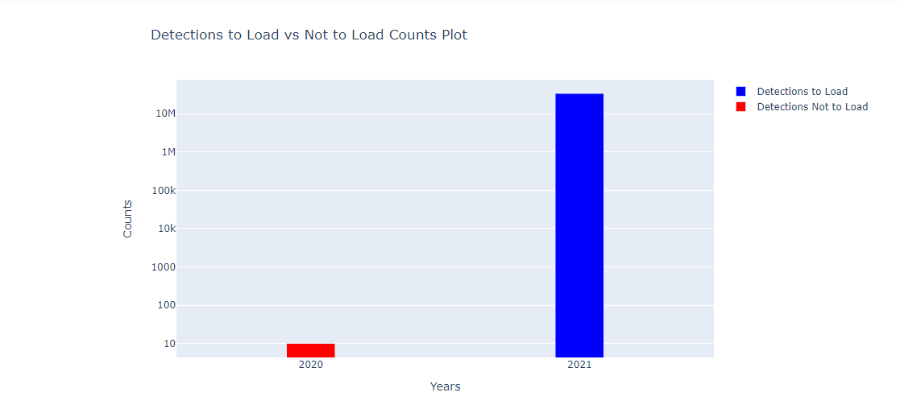

## Process workflow
The process workflow for detection data is as follows:
<pre class="mermaid">
flowchart LR
    tag_start(( )) --> get_meta(Receive <br />detection data <br />from researchers)
    style tag_start fill:#00FF00,stroke:#00FF00,stroke-width:4px
    get_meta --> gitlab(Create <br />Gitlab <br />issue)
    gitlab --> inspect(Visually <br />inspect)
    inspect --> convert(Convert to <br />CSVs)
    convert --> nodebook(Process and verify <br />with nodebooks)
    nodebook --> plone(Add data <br />to repository folder)
    plone --> otn(Pass to <br />OTN)
    otn --> end2(( ))
    style end2 fill:#FF0000,stroke:#FF0000
</pre>

Once `deployment metadata` has been processed for a project, the related detections may now be processed. Detection data should be reported to the Node as a collection of raw, **unedited** files. These can be in the form of a zipped folder of `.VRLs`, a database from Thelma Biotel or any other raw data product from any manufacturer. The files contain only transmitter numbers and the datetimes at which they were recorded at a specific receiver. The `tag metadata` and `deployment metadata` will provide the associated geographic and biological context to this data.

## Submitted Records

Immediately upon receipt of the data files, you must create a new GitLab issue. Please use the `Detections` Issue checklist template.

Here is the Issue checklist, for reference:

~~~
Detections
- [ ] - NAME add label *'loading records'*
- [ ] - NAME load raw detections and events `(detections-1` notebook and `events-1` notebook **OR** `Convert - Fathom Export` notebook and `detections-1` notebook) **(put table names here)**
- [ ] - NAME upload raw detections to project folder (OTN members.oceantrack.org, FACT RW etc) if needed
- [ ] - NAME verify raw detections table (`detections-1` notebook)
- [ ] - NAME load raw events to events table (`events-2` notebook)
- [ ] - NAME load to detections_yyyy (`detections-2` notebook) **(put detection years that were loaded here)**
- [ ] - NAME verify detections_yyyy (looking for duplicates) (`detections-2` notebook)
- [ ] - NAME load to sensor_match_yyyy (`detections-2` notebook) **(put sensor years that were loaded here)**
- [ ] - NAME timedrift correction for affected detection and sensor years (`detections-2b` notebook)
- [ ] - NAME verify timedrift corrections (`detections-2b` notebook)
- [ ] - NAME manually check for open, unverified receiver metadata, **STOP** if it exists! (**put Gitlab issue number here**)
-----
- [ ] - NAME load to otn_detections_yyyy (`detections-3` notebook) **(put affected years here)**
- [ ] - NAME verify otn_detections_yyyy (`detections-3` notebook)
- [ ] - NAME load sentinel records (`detections-3` notebook)
- [ ] - NAME check for missing receiver metadata (`detections-3b` notebook)
- [ ] - NAME check for missing data records (`detections-3c` notebook)
- [ ] - NAME load download records (`events-3` notebook)
- [ ] - NAME verify download records (`events-3` notebook)
- [ ] - NAME process receiver configuration (`events-4` notebook)
- [ ] - NAME label issue with *'Verify'*
- [ ] - NAME pass issue to OTN analyst for final steps
- [ ] - NAME check for double reporting (verification_notebooks/`Detection Verification` notebook)
- [ ] - NAME match tags to animals (`detections-4` notebook)
- [ ] - NAME overwrite sentinel tags with animal tags (`detections-4b` notebook)
- [ ] - NAME do sensor tag processing (`detections-5` notebook) - only done if vendor specifications are available
- [ ] - NAME update detection extract table

**detections files/path:**
~~~
{: .language-plaintext .example}


### Visual Inspection

Once the researcher provides the files, the Data Manager should first complete a visual check for formatting and accuracy.

Look for the following in the detection data:

- Do the files appear edited? Look for `_edited` in file name.
- Is the file format the same as expected for that manufacturer? Ex. `.vrl` or `.vdat` for Innovasea - not `.csv` or `.rld` formats.
- Is there data for each of the instrument recoveries that was reported in the `deployment metadata`?

## Convert to CSV

Once the raw files are obtained, the data must often be converted to `.csv` format by the Node Manager. There are several ways this can be done, depending on the manufacturer.

**For Innovasea**

- `convert - Fathom (vdat) Export - VRL to CSV` Nodebook <a name="convertToCSV"></a>
    - This will use the `vdat.exe` executable to export from VRL/VDAT to CSV. **Please consult the OTN Data Centre for the latest and OS specific `vdat` executable version.**
    - Instructions for this Nodebook are below

- Fathom Connect App
    - Choose "export data"
    - Select the relevant files and import into the Fathom Connect application
    - Export **all data types**, and choose the location you want to save the files

- VUE (**WARNING**: As of September 2025, VUE has been deprecated by Fathom and Fathom Connect. The only remaining exception is VMT/VR2/VR3 downloads, which still require VUE. Please send any VRL files that failed to convert to support.team@innovasea.com for further analysis.)
    - Open a new `database`
    - Import all the `VRL` files provided
      - Note: when prompted with setting Time Zone, set to UTC.
    - Select `export detections` and choose the location you want to save the file
      - Note: on `Data Export` tab must select `Raw sensor values` 


    - Select `export events` and choose the location you want to save the file
    
**For Thelma Biotel**
- Use the `ComPort` software to open the `.tbdb` file and export as CSV

**For Lotek**
- Exporting to CSV is more complicated, please reach out to OTN for specific steps for a given instrument model

For **all other manufacturers**, contact the OTN Data Centre to get specifics on the detection data loading workflow.

## convert - Fathom (vdat) Export - VRL to CSV Nodebook
This will use the `vdat.exe` executable to export from VRL/VDAT to CSV.

**IMPORTANT NOTE:** newer versions of `vdat.exe` are only being supported on Windows. Mac users will not be able to use this Nodebook. For instructions on using a program like Wine to run windows programs on other operating systems, contact the OTN Data Centre.

Before you begin, you will need to ensure you have access to a Fathom vdat executable. This executable ships with Fathom Connect for desktop computers as `vdat.exe`

- Access the Vemco (Innovasea) website to download `Fathom Connect` - [https://support.fishtracking.innovasea.com/s/downloads](https://support.fishtracking.innovasea.com/s/downloads)
- Agree to the Licence 
- The app will install on your computer, along with the newest version of `vdat.exe`
- Locate your ProgramFiles on your computer. Locate the `InnovaSea` subfolder, and the `Fathom` folder within.
- Copy the full filepath to your `vdat.exe` file for use in the Nodebook - this will look like `C:/Program Files/Innovasea/Fathom/vdat.exe`

NOTE: Older versions of VDAT may have unintended consequences when converting newer files (like Open Protocol-enabled Innovasea receivers), and should not be used. Versions newer than `vdat-9.3.0-20240207-74ad8e-release` are safe to process Open Protocol data.  **NOT RECOMMENDED BY OTN:** If you are desperate for an older version of `vdat.exe` you can find them [here](https://gitlab.oceantrack.org/otndc/vdat-working-group/-/tree/master/releases?ref_type=heads) 

- **MAC Users Only** 
    - Locate the vdat executable in your terminal by navigating with the command `cd /path/to/vdat/file`
    - Enable execution by running `chmod +x vdat`
    
### Imports cell

This section will be common for most Nodebooks: it is a cell at the top of the notebook where you will import any required packages and functions to use throughout the notebook. It must be run first, every time.

### User Input

You will have to edit 3 sections
- vdat_path: Within quotation marks, paste the filepath to the fathom executable (`vdat.exe`)
- vrl_dir: Within quotation marks, paste the path to a folder containing the VRLs or VDATs you would like to convert. Example: `vrl_dir = r"/path/to/vrl_files/"`
- export_path: Within quotation marks, paste the path to the folder to which you would like the CSV exported. Example: `export_path = r"/path/to/csv_export/"`

Run this cell. There is no output.

### Check vdat exists

The Nodebook will indicate the file had passed quality control by adding a ✔️**green checkmark** and printing the vdat version.

**NOTE:** Older versions of VDAT may have unintended consequences when converting newer files (like Open Protocol-enabled Innovasea receivers), and should not be used. Versions > vdat-9.3.0-20240207-74ad8e-release are safe to process Open Protocol data.


### Get List of Files

Run this cell to see a list of the VRLs or VDAT files the Notebook has idenfitied inside your vrl_dir folder.

### Process Files 

Run this cell to begin converting your files to CSV. They will be saved into the folder you supplied for export_path above.

The Nodebook will indicate each file has been converted by adding a ✔️**green checkmark** beside each section as it progresses.

### Review Partially Converted CSV Files 

Run this cell, open and observe each .csv file that had DATA ERRORS during conversion.

Option 1: Accept current CSV file with DATA ERROR(s) - if not too much data is missing: **No action required**

Option 2: **Remove partially converted CSV(s) and replace with output from alternative vendor software**

Once this step is complete, you may move onto the Detections - 1 Nodebook.


## detections - 1 - load csv detections

Detections-1 loads CSV detections files into a new database table. If detections were exported using `Fathom` or the `convert - Fathom (vdat) Export - VRL to CSV` Nodebook, the receiver events records will also be loaded at this stage. This is because these applications combine the detections and events data in one CSV file.

### Import cells and Database Connections

As in all Nodebooks, run the import cell to get the packages and functions needed throughout the notebook. This cell can be run without any edits.

The second cell will set your database connection. You will have to edit one section: `engine = get_engine()`
- Within the open brackets you need to open quotations and paste the path to your database `.kdbx` file which contains your login credentials.
- On MacOS computers, you can usually find and copy the path to your database `.kdbx` file by right-clicking on the file and holding down the "option" key. On Windows, we recommend using the installed software Path Copy Copy, so you can copy a unix-style path by right-clicking.
- The path should look like `engine = get_engine('C:/Users/username/Desktop/Auth files/database_conn_string.kdbx')`.

Once you have added your information, you can run the cell. Successful login is indicated with the following output:

~~~
Auth password:········
Connection Notes: None
Database connection established
Connection Type:postgresql Host:db.for.your.org Database:your_db_name User:your_node_admin Node:Node
~~~
{: .language-plaintext .example}


### User Input

Cell three requires input from you. This information will be used to get the raw detections CSV and to be able to create a new raw table in the database.

1. `file_or_folder_path = r'C:/Users/path/to/detections_CSVs/'`
    * Paste a filepath to the relevant CSV file(s). The filepath will be added between the provided quotation marks.
    * This can be a path to a single CSV file, or a folder of multiple CSVs.
1. `table_suffix = 'YYYY_mm'`
	  * Within the quotes, please add your custom table suffix. We recommend using the year and month (i.e, `YYYY_MM`) or similar, to indicate the most-recently downloaded instrument.
1. `schema = 'collectioncode'`
	  * Please edit to include the relevant project code, in lowercase, between the quotes.

There are also some optional inputs:
- `load_detections`: A true or false value using the table suffix you supplied.
- `stacked`: This is for Fathom exports only and refers to how they should be parsed.

Once you have added your information, you can run the cell.

**NOTE:** You will receive a warning before loading excessive amount of detections from HR receivers. An option is also available to summarize the detections prior to loading. Contact OTN Data Centre for assitant.

### Verify Detection File and Load to Raw Table

Next, the Nodebook will review and verify the detection file(s) format, and report any error. Upon successful verification, you can then run the cell below which will attempt to load the detections into a new raw table.

Should this cell reports errors—such as invalid dates (e.g., dates falling in the 1970s or future years) or duplicate events—please contact the OTN Data Centre to correct the underlying raw tables.

The Nodebook will indicate the success of the table-creation with a message such as this:

~~~
Reading fathom files...
Loading Files...
X/X
~~~
{: .language-plaintext .example}


#### Task list checkpoint

In GitLab, this task can be completed at this stage:

`- [ ] - NAME load raw detections and events ('detections-1' notebook and 'events-1' notebook **OR** 'Batch Fathom Export' notebook and 'detections-1' notebook) **(put table names here)**`

Ensure you paste the table name (ex: c_detections_YYYY_mm) into the indicated section before you check the box.

### Verify Raw Detection Table

This cell will now complete the Quality Control checks of the raw table. This is to ensure the Nodebook loaded the records correctly from the CSVs.

The output will have useful information:
- Are there any duplicates?
- Are the serial numbers formatted correctly?
- Are the models formatted correctly?

The Nodebook will indicate the sheet had passed quality control by adding a ✔️**green checkmark** beside each section.

If there are any errors, contact OTN for next steps.

#### Task list checkpoint

In GitLab, these tasks can be completed at this stage:

`- [ ] - NAME verify raw detections table ('detections-1' notebook)`

## events - 1 - load events into c_events_yyyy

Events-1 is responsible for loading receiver events files into raw tables. This is only relevant for CSVs that were **NOT** exported using `Fathom` or the `convert - Fathom (vdat) Export - VRL to CSV` Nodebook.

### Import cell

As in all Nodebooks, run the import cell to get the packages and functions needed throughout the notebook. This cell can be run without any edits.

### User Inputs

Cell two requires input from you. This information will be used to get the raw events CSV and to be able to create a new raw table in the database.

1. `filepath = r'C:/Users/path/to/events.csv'`
    * Paste a filepath to the relevant CSV file. The filepath will be added between the provided quotation marks.
1. `table_name = 'c_events_YYYY_mm'`
	* Within the quotes, please add your custom table suffix. We recommend using the year and month (i.e, `YYYY_MM`) or similar, to indicate the most-recently downloaded instrument.
1. `schema = 'collectioncode'`
	* Please edit to include the relevant project code, in lowercase, between the quotes.

There are also some optional inputs:
- `file_encoding`: How the file is encoded. ISO-8859-1 is the default encoding used in VUE's event export.

Once you have added your information, you can run the cell.

### Verifying the events file

Before attempting to load the event files to a raw table the Nodebook will verify the file to make sure there are no major issues. This will be done by running the Verify Events File cell. If there are no errors, you will be able to continue.

The Nodebook will indicate the success of the file verification with a message such as this:

~~~
Reading file 'events.csv' as CSV.
Verifying the file.
Format: VUE 2.6+
Mandatory Columns: OK
date_and_time datetime:OK
Initialization(s): XX
Data Upload(s): XX
Reset(s): XX
~~~
{: .language-plaintext .example}


#### Find Raw Data Table in DB (`schema.c_events_YYYY_MM` & `schema.c_detections_YYYY_MM`)
    - The event table contains some environmental and receiver data for this project at this time, for e.g., temperature, depth, and battery.
    - The detection table contains detection information for this project at this time. Here you can see tags detected by each receiver through different times.

### Database Connection

You will have to edit one section: `engine = get_engine()`
- Within the open brackets you need to open quotations and paste the path to your database `.kdbx` file which contains your login credentials.
- On MacOS computers, you can usually find and copy the path to your database `.kdbx` file by right-clicking on the file and holding down the "option" key. On Windows, we recommend using the installed software Path Copy Copy, so you can copy a unix-style path by right-clicking.
- The path should look like `engine = get_engine('C:/Users/username/Desktop/Auth files/database_conn_string.kdbx')`.

Once you have added your information, you can run the cell. Successful login is indicated with the following output:

~~~
Auth password:········
Connection Notes: None
Database connection established
Connection Type:postgresql Host:db.for.your.org Database:your_db_name User:your_node_admin Node:Node
~~~
{: .language-plaintext .example}


### Load the events file into the c_events_yyyy table

The second last cell loads the events file into a raw table. It depends on successful verification from the last step. Upon successful loading, you can dispose of the engine then move on to the next Nodebook.

The Nodebook will indicate the success of the table-creation with the following message:

~~~
File loaded with XXXXX records.
100%
~~~
{: .language-plaintext .example}


#### Task list checkpoint

In GitLab, these tasks can be completed at this stage:

`- [ ] - NAME load raw detections and events ('detections-1' notebook and 'events-1' notebook **OR** 'Batch Fathom Export' notebook and 'detections-1' notebook) **(put table names here)**`

Ensure you paste the table name (ex: c_events_YYYY_mm) into the indicated section before you check the box.

## events - 2 - move c_events into events table

This Nodebook will move the raw events records into the intermediate events table.

### Import cell

As in all Nodebooks run the import cell to get the packages and functions needed throughout the notebook. This cell can be run without any edits.

### User input

This cell requires input from you. This information will be used to get the raw events CSV and to create a new raw table in the database.

1. `c_events_table = 'c_events_YYYY_mm'`
	  * Within the quotes, please add your custom table suffix, which you have just loaded in either `detections-1` or `events-1`.
1. `schema = 'collectioncode'`
	  * Please edit to include the relevant project code, in lowercase, between the quotes.

### Database Connection

You will have to edit one section: `engine = get_engine()`
- Within the open brackets you need to open quotations and paste the path to your database `.kdbx` file which contains your login credentials.
- On MacOS computers, you can usually find and copy the path to your database `.kdbx` file by right-clicking on the file and holding down the "option" key. On Windows, we recommend using the installed software Path Copy Copy, so you can copy a unix-style path by right-clicking.
- The path should look like `engine = get_engine('C:/Users/username/Desktop/Auth files/database_conn_string.kdbx')`.

Once you have added your information, you can run the cell. Successful login is indicated with the following output:

~~~
Auth password:········
Connection Notes: None
Database connection established
Connection Type:postgresql Host:db.for.your.org Database:your_db_name User:your_node_admin Node:Node
~~~
{: .language-plaintext .example}


### Verify table format

You will then verify that the c_events events table you put in exists and then verify that it meets the required format specifications.

The Nodebook will indicate the success of the table verification with a message such as this:

~~~
Checking table name format... OK
Checking if schema collectioncode exists... OK!
Checking collectioncode schema for c_events_YYYY_mm table... OK!
collectioncode.c_events_YYYY_mm table found.
~~~
{: .language-plaintext .example}

If there are any errors in this section, please contact OTN.

### Load to Events table

If nothing fails verification, you can move to the loading cell. 

The Nodebook will indicate the success of the processing with a message such as this:

~~~
Checking for the collectioncode.events table... OK!
Loading events... OK!
Loaded XX rows into collectioncode.events table.
~~~
{: .language-plaintext .example}


#### Task list checkpoint

In GitLab, these tasks can be completed at this stage:

`- [ ] - NAME load raw events to events table ("events-2" notebook)`

## detections - 2 - c_table into detections_yyyy

This Nodebook takes the raw detection data from detections-1 and moves it into the intermediate `detections_yyyy` tables (separated by year).

### Import cells and Database Connections

As in all Nodebooks run the import cell to get the packages and functions needed throughout the notebook. This cell can be run without any edits.

The second cell will set your database connection. You will have to edit one section: `engine = get_engine()`
- Within the open brackets you need to open quotations and paste the path to your database `.kdbx` file which contains your login credentials.
- On MacOS computers, you can usually find and copy the path to your database `.kdbx` file by right-clicking on the file and holding down the "option" key. On Windows, we recommend using the installed software Path Copy Copy, so you can copy a unix-style path by right-clicking.
- The path should look like `engine = get_engine('C:/Users/username/Desktop/Auth files/database_conn_string.kdbx')`.

Once you have added your information, you can run the cell. Successful login is indicated with the following output:

~~~
Auth password:········
Connection Notes: None
Database connection established
Connection Type:postgresql Host:db.for.your.org Database:your_db_name User:your_node_admin Node:Node
~~~
{: .language-plaintext .example}


### User Inputs

To load the to the `detections_yyyy` tables the Nodebook will require information about the current schema and the raw table that you created in `detections-1`.

1. `c_table = 'c_detections_YYYY_mm'`
	  * Within the quotes, please add your custom table suffix, which you have just loaded in `detections-1`
1. `schema = 'collectioncode'`
	  * Please edit to include the relevant project code, in lowercase, between the quotes.

The notebook will indicate success with the following message:

~~~
Checking table name format... OK
Checking if schema collectioncode exists... OK!
Checking collectioncode schema for c_detections_yyyy_mm table... OK!
collectioncode.c_detections_yyyy_mm table found.
~~~
{: .language-plaintext .example}


### Create Missing Tables

Detections tables are only created on an as-needed basis. These cells will detect any tables you are missing and create them based on the years covered in the raw detection table (c_table). This will check all tables such as `detections_yyyy`, `sensor_match_yyyy` and `otn_detections_yyyy`.

First the Nodebook will gather and print the missing tables. If there are none missing, the Nodebook will report that as well.

~~~
vemco: Match
You are missing the following tables:
[collectioncode.detections_YYYY, v2lbeiar.otn_detections_YYYY, v2lbeiar.sensor_match_YYYY]
Create these tables by passing the missing_tables variable into the create_detection_tables function.
~~~
{: .language-plaintext .example}


If you proceed in the Nodebook, there is a "creation"`" cell which will add these tables to the project schema in the database. Success will be indicated with the following message:

~~~
Creating table collectioncode.detections_YYYY... OK
Creating table collectioncode.otn_detections_YYYY... OK
Creating table collectioncode.sensor_match_YYYY... OK
~~~
{: .language-plaintext .example}


### Create Detection Sequence

Before loading detections, a detection sequence is created. The sequence is used to populate the `det_key` column. The `det_key` value is an unique ID for that detection to help ensure there are no duplicates. If a sequence is required, you will see this output:

~~~
creating sequence v2lbeiar.detections_seq... OK
~~~
{: .language-plaintext .example}


No further action is needed.

### Load to Detections_YYYY

Duplicate detections are then checked for and will not be inserted into the detections_yyyy tables.

If no duplicates are found you will see:

`No duplicates found. All of the detections will be loaded into the detections_yyyy table(s).`

If duplicates are found you will see a bar chart showing the number of detections per year which either have already been loaded, or are new and will be loaded this time. You will have to investigate if the results are not what you expected. 



After all this, the `raw` detection records are ready to be loaded into the `detections_yyyy` tables. The notebook will indicate success with the following message:

~~~
Inserting records from collectioncode.c_detections_YYYY_mm into collectioncode.detections_2018... OK
Added XXXXX rows.
Inserting records from collectioncode.c_detections_YYYY_mm into collectioncode.detections_2019... OK
Added XXXXX rows.
Inserting records from collectioncode.c_detections_YYYY_mm into collectioncode.detections_2020... OK
Added XXXXX rows.
Inserting records from collectioncode.c_detections_YYYY_mm into collectioncode.detections_2021... OK
Added XXXXX rows.
~~~
{: .language-plaintext .example}


**You must note which years have been loaded!** In the example above, this would be 2018, 2019, 2020, and 2021.


#### Task list checkpoint

In GitLab, these tasks can be completed at this stage:

`- [ ] - NAME load to detections_yyyy ("detections-2" notebook) **(put detection years that were loaded here)**`


Ensure you paste the affected tables (ex: 2019, 2020) into the indicated section before you check the box.

### Verify Detections YYYY Tables

This cell will now complete the quality control checks on the `detections_yyyy` tables. This is to ensure the nodebook loaded the records correctly.

First, you will need to list **all** of the years that were affected by the previous loading step, so the Nodebook knows which tables need to be verified.

The format will look like this:

~~~
`years = ['YYYY','YYYY','YYYY', 'YYYY']`
~~~
{: .language-plaintext .example}

If left blank, the Nodebook will check all the years, which may take a long time for some projects.

Run this cell, then you can verify in the next cell.

The output will have useful information:
- Were all the detections loaded?
- Are the serial numbers formatted correctly?
- Are the models formatted correctly?
- Are there duplicate detections?
- What sensors will need to be loaded?

The Nodebook will indicate the sheet had passed quality control by adding a ✔️**green checkmark** beside each section.

If there are any errors contact OTN for next steps.


#### Task list checkpoint

In GitLab, this task can be completed at this stage:

`- [ ] - NAME verify detections_yyyy (looking for duplicates) ("detections-2" notebook)`


###  Load sensors_match Tables by Year

For the last part of this Nodebook you will need to load the to the `sensor_match_YYYY` tables. This loads detections with sensor information into a project's `sensor_match_yyyy` tables. Later, these tables will aid in matching vendor specifications to resolve sensor tag values.

Output will appear like this:

~~~
Inserting records from collectioncode.detections_YYYY INTO sensor_match_YYYY... OK
Added XXX rows.
Inserting records from collectioncode.detections_YYYY INTO sensor_match_YYYY... OK
Added XXX rows.
~~~
{: .language-plaintext .example}


**You must note which years have been loaded!** In the example above, this would be 2019 and 2021.


#### Task list checkpoint

In GitLab, these tasks can be completed at this stage:

`- [ ] - NAME load to sensor_match_yyyy ("detections-2" notebook) **(put sensor years that were loaded here)**`


Ensure you paste the affected tables (ex: 2019, 2020) into the Issue.

## detections - 2b - timedrift calculations

This Nodebook calculates time drift factors and applies the corrections to the `detections_yyyy` tables, in a field called `corrected_time`. OTN's Data Manager toolbox (the Nodebooks) corrects for timedrift between each initialization and offload of a receiver. If a receiver is offloaded several times in one data file, time correction does not occur linearly from start to end, but between each download, to ensure the most accurate correction. If there is only one download in a data file then the time correction in the VUE software will match the time correction performed by OTN.

### Import cells and Database connections

As in all Nodebooks run the import cell to get the packages and functions needed throughout the notebook. This cell can be run without any edits.

The second cell will set your database connection. You will have to edit one section: `engine = get_engine()`
- Within the open brackets you need to open quotations and paste the path to your database `.kdbx` file which contains your login credentials.
- On MacOS computers, you can usually find and copy the path to your database `.kdbx` file by right-clicking on the file and holding down the "option" key. On Windows, we recommend using the installed software Path Copy Copy, so you can copy a unix-style path by right-clicking.
- The path should look like `engine = get_engine('C:/Users/username/Desktop/Auth files/database_conn_string.kdbx')`.

Once you have added your information, you can run the cell. Successful login is indicated with the following output:

~~~
Auth password:········
Connection Notes: None
Database connection established
Connection Type:postgresql Host:db.for.your.org Database:your_db_name User:your_node_admin Node:Node
~~~
{: .language-plaintext .example}


### User Inputs

To load the to the detections_yyyy tables the notebook will require the name of the current schema. Please edit `schema = 'collectioncode'` to include the relevant project code, in lowercase, between the quotes.


### Calculating Time Drift Factors

`create_tbl_time_drift_factors`. This function will create the `time_drift_factors` table in the schema if it doesn't exist.

The next step is to run `check_time_drifts` which gives a display of the time drift factor values that will be added to the time_drift_factors table given an events table. At this stage, you should review for any erroneous/large timedrifts.

If everything looks good, you may proceed to the next cell which adds new time drift factors to the time_drift_factors table from the events file. A success message will appear:

~~~
Adding XXX records to collectioncode.time_drift_factors table from collectioncode.events... OK!
~~~
{: .language-plaintext .example}


You will then see a cell to create missing views. This creates the time drift "views" which the database will use to calculate drift values for both the `detections_yyyy` and `sensor_match_yyyy` tables.

### Correcting Time Drift

Finally, we are ready to update the times in both the `detections_yyyy` and `sensor_match_yyyy` tables with corrected time values using the vw_time_drift_cor database view.

The Nodebook should identify **all** of the years that were affected by `detections-2` loading steps, so the notebook knows which tables need to be corrected.

Once the timedrift calculation is done (indicated by ✔️**green checkmarks**).

#### Task list checkpoint

In GitLab, this task can be completed at this stage:

`- [ ] - NAME timedrift correction for affected detection and sensor years ("detections-2b" notebook)`

### Verify Detections After Time Drift Calculations

After running the above cells you will then verify the time drift corrections on the `detections_yyyy` and `sensor_match_yyyy` tables.

The output will have useful information:
- Are there any erroneous timedrift values?
- Did the time correction cause detections to need moving to another `yyyy` table? If so, select the "move detections" button.
- Are the receiver models formatted correctly?

The Nodebook will indicate the sheet had passed quality control by adding a ✔️**green checkmark** beside each section.

If there are any errors contact OTN for next steps.


#### Task list checkpoint

In GitLab, this task can be completed at this stage:

`- [ ] - NAME verify timedrift corrections ("detections-2b" notebook)`

## detections - 3 - detections_yyyy into otn_detections

The `detections - 3` Nodebook moves the detections from `detections_yyyy` and `sensor_match_yyyy` tables into the final `otn_detections_yyyy` tables. This will join the detections records to their associated deployment records, providing geographic context to each detection. If there is no metadata for a specific detection (that is, no receiver record to match with) it will not be promoted to `otn_detections_yyyy`.

### Import cells and Database connections

As in all Nodebooks run the import cell to get the packages and functions needed throughout the notebook. This cell can be run without any edits.

The second cell will set your database connection. You will have to edit one section: `engine = get_engine()`
- Within the open brackets you need to open quotations and paste the path to your database `.kdbx` file which contains your login credentials.
- On MacOS computers, you can usually find and copy the path to your database `.kdbx` file by right-clicking on the file and holding down the "option" key. On Windows, we recommend using the installed software Path Copy Copy, so you can copy a unix-style path by right-clicking.
- The path should look like `engine = get_engine('C:/Users/username/Desktop/Auth files/database_conn_string.kdbx')`.

Once you have added your information, you can run the cell. Successful login is indicated with the following output:

~~~
Auth password:········
Connection Notes: None
Database connection established
Connection Type:postgresql Host:db.for.your.org Database:your_db_name User:your_node_admin Node:Node
~~~
{: .language-plaintext .example}


### User Inputs

To load the to the detections_yyyy tables the Nodebook will require the current schema name. Please edit `schema = 'collectioncode'` to include the relevant project code, in lowercase, between the quotes.

Before moving on from this you will need to confirm 2 things:

1. Confirm that **NO Push** is currently ongoing
1. confirm `rcvr_locations` for this schema have been verified.

If a Push is ongoing, or if verification has not yet occurred, you **must** wait for it to be completed before processing beyond this point.


#### Task list checkpoint

In GitLab, this task can be completed at this stage:

`- [ ] - NAME manually check for open, unverified receiver metadata, **STOP** if it exists! **(put GitLab issue number here)**`

### Creating detection views and loading to otn_detections

Once you are clear to continue loading you can run `create_detection_views`. This function, as its name implies, will create database views for detection data.

Output will look like:

~~~
Creating view collectioncode.vw_detections_YYYY... OK
Creating view collectioncode.vw_sentinel_YYYY... OK
Creating view collectioncode.vw_detections_YYYY... OK
~~~
{: .language-plaintext .example}


These are then used to run the function in the next cell `load_into_otn_detections_new`, which loads the detections from those views into otn_detections. You will be asked to select all relevant tables here, with a dropdown menu and checkboxes.

You must select **all** years that were impacted by `detections_yyyy` or `sensor_match_yyyy` loading steps. Then click the `Load Detections` button to begin loading. The Nodebook will show a status bar indicating its progress.


#### Task list checkpoint

In GitLab, this task can be completed at this stage:

`- [ ] - NAME load to otn_detections_yyyy ("detections-3" notebook) **(put affected years here)**`


### Verify OTN Detections

After running your needed cells you will then verify `otn_detections_yyyy` detections.

The output will have useful information:
- Are all the sensors loaded to the `sensor_match` tables? Compare the counts between `detections_yyyy` and `sensor_match_yyyy` provided.
- Are all the detections loaded from `detections_yyyy` to `otn_detections_yyyy`? Compare the counts provided. If there is a mismatch, we will get more details in the `detections-3b` Nodebook.
- Is the formatting for the dates correct?
- Is the formatting for the_geom correct?
- Are there detections without receivers? If so, we will get more details in the `detections-3b` Nodebook.
- Are there receivers without detections? If so, we will get more details in the `detections-3c` Nodebook.

The notebook will indicate the sheet had passed quality control by adding a ✔️**green checkmark** beside each section.

If there are any errors contact OTN for next steps.


#### Task list checkpoint

In GitLab, this task can be completed at this stage:

`- [ ] - NAME verify otn_detections_yyyy ("detections-3" notebook)`


### Check and Load Sentinel Records

Are there any `sentinel` detections identified? If so, select the `Load Sentinel Detections for YYYY` button. This will move the detections into their own tables so they do not confuse our animal detection numbers and can be used for Sentinel analysis.

You must select **all** years that were impacted by `detections_yyyy` or `sensor_match_yyyy` loading steps.

#### Task list checkpoint

In GitLab, this task can be completed at this stage:

`- [ ] - NAME load sentinel records ("detections-3" notebook)`


## detections - 3b - missing_metadata_check

This Nodebook checks for detections that have not been inserted into `otn_detections_yyyy`, which will indicate missing receiver metadata.

The user will be able to set a threshold for the minimum number of detections to look at (default is 100). It will also separate animal detections from transceiver detections in a graph. At the end, it will show a SQL command to run to display the missing metadata in table format.

### Import cells and Database connections

As in all Nodebooks run the import cell to get the packages and functions needed throughout the notebook. This cell can be run without any edits.

The second cell will set your database connection. You will have to edit one section: `engine = get_engine()`
- Within the open brackets you need to open quotations and paste the path to your database `.kdbx` file which contains your login credentials.
- On MacOS computers, you can usually find and copy the path to your database `.kdbx` file by right-clicking on the file and holding down the "option" key. On Windows, we recommend using the installed software Path Copy Copy, so you can copy a unix-style path by right-clicking.
- The path should look like `engine = get_engine('C:/Users/username/Desktop/Auth files/database_conn_string.kdbx')`.

Once you have added your information, you can run the cell. Successful login is indicated with the following output:

~~~
Auth password:········
Connection Notes: None
Database connection established
Connection Type:postgresql Host:db.for.your.org Database:your_db_name User:your_node_admin Node:Node
~~~
{: .language-plaintext .example}


### User Inputs

Information regarding the tables we want to check against is required.

1. `schema = 'collectioncode'`
    * Edit to include the relevant project code, in lowercase, between the quotes.
1. `years = []`
    * A comma-separated list of detection table years for detections_yyyy, should be in form `[yyyy]` or a list such as `[yyyy,yyyy,'early']`

Once you have edited these values, you can run the cell. You should see the following success message:

~~~
All tables exist!
~~~
{: .language-plaintext .example}


###  Check for Missing Metadata in Detections_yyyy

This step will perform the check for missing metadata in `detections_yyyy` and display results for each record where the number of excluded detections is greater than the specified threshold.

First: enter your threshold. Formatted like: `threshold = 100`. Then you may run the cell.

The output will include useful information:
- Which receiver is missing detections from `otn_detections_yyyy`?
- How many are missing?
- What type of detections are missing? Transceiver, animal tags, or test tags.
- What are the date-ranges of these missing detections? These dates can be used to determine the period for which we are missing metadata.
- Other notes: is this date range before known deployments? After know deployments? Between known deployments?

There will be a visualization of the missing metadata for each instance where the number of missing detections is over the threshold.

Any instance with missing detections (greater than the threshold) should be identified, and the results pasted into a **new GitLab Issue**. The format will look like:

~~~
VR2W-123456
	missing XX detections (0 transceiver tags, XX animal tags, 0 test tags) (before deployments) (YYYY-MM-DD HH:MM:SS to YYYY-MM-DD HH:MM:SS)

VR2W-567891
	missing XX detections (0 transceiver tags, XX animal tags, 0 test tags) (before deployments) (YYYY-MM-DD HH:MM:SS to YYYY-MM-DD HH:MM:SS)
~~~
{: .language-plaintext .example}


There are also two cells at the end that allow you create reports for researchers in CSV or HTML format.

This new GitLab ticket will require investigation to determine the cause for the missing metadata. The researcher will likely need to be contacted.
- Are these "test" detections from on the boat or in the lab and we are not missing real metadata?
- Is there a serial number typo in the metadata and it is not missing?
- Are the deployment dates for the receiver wrong, and need to be fixed?

You can continue with data loading and then return to your Missing Metadata ticket for investigation.


#### Task list checkpoint

In GitLab, this task can be completed at this stage:

`- [ ] - NAME check for missing receiver metadata ("detections-3b" notebook)`


## detections - 3c - missing_vrl_check

This Nodebook will check for missing data files in the database by comparing the `rcvr_locations` and `events` tables. For any receiver deployments that are missing events, it will check if there are `detections` during that time period for that receiver.

### Import cells and Database connections

As in all Nodebooks run the import cell to get the packages and functions needed throughout the notebook. This cell can be run without any edits.

The second cell will set your database connection. You will have to edit one section: `engine = get_engine()`
- Within the open brackets you need to open quotations and paste the path to your database `.kdbx` file which contains your login credentials.
- On MacOS computers, you can usually find and copy the path to your database `.kdbx` file by right-clicking on the file and holding down the "option" key. On Windows, we recommend using the installed software Path Copy Copy, so you can copy a unix-style path by right-clicking.
- The path should look like `engine = get_engine('C:/Users/username/Desktop/Auth files/database_conn_string.kdbx')`.

Once you have added your information, you can run the cell. Successful login is indicated with the following output:

~~~
Auth password:········
Connection Notes: None
Database connection established
Connection Type:postgresql Host:db.for.your.org Database:your_db_name User:your_node_admin Node:Node
~~~
{: .language-plaintext .example}


### User Inputs

To run the missing VRL check, the Nodebook will require the current schema name. Please edit `schema = 'collectioncode'` to include the relevant project code, in lowercase, between the quotes.

There are also optional fields:
- `start_year = YYYY`: With this and `end_year`, you may select a time range (in years) to limit the receivers to only ones that where active at some point during the time range.
- `end_year = YYYY`: With this and `start_year`, you may select a time range (in years) to limit the receivers to only ones that where active at some point during the time range.
- `skip_events = False`: By changing to True, this will skip the events check and go right to checking if there are detections for each period. Only skip the events check if you know there won't be any events, the detections check takes longer than the event check.

Once you have edited the values, you can run the cell. You should see the following success message:

~~~
Checking if collectioncode schema exists...
OK
~~~
{: .language-plaintext .example}


### Checking For Missing Data Files

The next cell will begin scanning the project's schema to identify if there are any missing data files.
If there are no missing files, you will see this output:

~~~
Checking if all deployment periods have events...
X/X
Checking if deployment periods missing events have detections...
⭐ All deployment periods had events! Skipping detection check. ⭐
~~~
{: .language-plaintext .example}


If the Nodebook has detection missing file, you will see this output:

~~~
Checking if all deployment periods have events...
XXX/XXX
Checking if deployment periods missing events have detections...
XX/XX
~~~
{: .language-plaintext .example}


### Displaying Missing Data Files

Now the Nodebook will begin plotting a Gantt chart, displaying the periods of deployment for which the database is missing data files. There are some optional customizations you can try:

- `split_plots = False`: you can set to True if you would like multiple, smaller plots created
- `rcvrs_per_split = 20`: if you are splitting the plots, how many receiver deployments should be depicted on each plot?

Running the cell will save your configuration options. The next cell creates the chart(s).

The plot will have useful information:
- the receiver (x axis)
- the date range (y axis)
- the state of the data for that date-range
    * all detections and events present
    * missing events, detections present
    * missing some events
    * missing ALL events
- hovering over a deployment period with give details regarding the date range

### Exporting Results

After investigating the Gantt chart, a `CSV` export can be created to send to the researcher.

First, you must select which types of records you'd like to export from this list:
- all detections and events present
- missing events, detections present
- missing some events (**recommended**)
- missing ALL events (**recommended**)

Then, the next cell will print the relevant dataframe, with an option below to `Save Dataframe`. Type the intended filename and filetype into the `File or Dataframe Name` box (ex. missing_vrls_collectioncode.csv) and press `Save Dataframe`. The file should now be available in your `ipython-utilities` folder for dissemination. Please track this information in a **new GitLab ticket**.

This new GitLab ticket will require investigation to determine the cause for the missing data. The researcher will likely need to be contacted.
- Are these "broken" receivers from which data could not be downloaded? Check the comments for clues.
- Is there a typo in the receiver serial number and we are expecting a VRL that doesn't exist?
- Are the deployment dates wrong and we are expecting a VRL that doesn't exist?
- Can the researcher send us the missing VRL?

You can continue with data loading and then return to your Missing Data File ticket for investigation.


#### Task list checkpoint

In GitLab, this task can be completed at this stage:

`- [ ] - NAME check for missing data records ("detections-3c" notebook)`

## events - 3 - create download records

This Nodebook will promote the events records from the intermediate `events` table to the final `moorings` records. Only use this Nodebook after adding the receiver records to the moorings table as this process is dependant on receiver records.

#### Find- Event & Detection Table (`schema.events` & `schema.detections_YYYY`)
    - These are intermediate tables which contain all events in this project across all years and detections in certain years.
    - For example, if a researcher want to know all spatial temperature data for a certain type of receiver in his project schema, they could use the query:
```sql
select
  rcv.otn_array, rcv.station_name, e.datetime as date, e.receiver, e."data", e.description, rcv.rcv_serial_no,
  rcv.deploy_date, rcv.recover_date, rcv.recover_ind, rcv.dep_lat, rcv.dep_long, rcv.the_geom, rcv.catalognumber 
from schema.events e 
left join schema.rcvr_locations rcv 
on model.f_end(e.receiver,'-') = model.f_end(rcv.rcv_serial_no) where
  strpos(e.receiver, 'VR4') = 1 and e.description = 'Temperature' 
```
    - As another example, if we want to check how many distinct transmitter are detected by a receiver 123456 in a project schema during 2023-11-10 to 2024-05-29, we could use the query:
```sql
SELECT DISTINCT transmitter
FROM schema.detections_2023
WHERE receiver ILIKE '%123456%'
  AND datetime > '2023-11-10 00:00:00'
  AND datetime < '2024-05-29 18:30:00'
UNION
SELECT DISTINCT transmitter
FROM sjrbl.detections_2024
WHERE receiver ILIKE '%123456%'
  AND datetime > '2023-11-10 00:00:00'
  AND datetime < '2024-05-29 18:30:00'
```


### Import cells and Database connections

As in all Nodebooks run the import cell to get the packages and functions needed throughout the notebook. This cell can be run without any edits.

The second cell will set your database connection. You will have to edit one section: `engine = get_engine()`
- Within the open brackets you need to open quotations and paste the path to your database `.kdbx` file which contains your login credentials.
- On MacOS computers, you can usually find and copy the path to your database `.kdbx` file by right-clicking on the file and holding down the "option" key. On Windows, we recommend using the installed software Path Copy Copy, so you can copy a unix-style path by right-clicking.
- The path should look like `engine = get_engine('C:/Users/username/Desktop/Auth files/database_conn_string.kdbx')`.

Once you have added your information, you can run the cell. Successful login is indicated with the following output:

~~~
Auth password:········
Connection Notes: None
Database connection established
Connection Type:postgresql Host:db.for.your.org Database:your_db_name User:your_node_admin Node:Node
~~~
{: .language-plaintext .example}


### User Inputs

Information regarding the tables we want to check against is required. Please complete `schema = 'collectioncode'`, edited to include the relevant project code, in lowercase, between the quotes.

Once you have edited the value, you can run the cell.

### Detecting Download Records

The next cell will scan the `events` table looking for data download events, and attempt to match them to their corresponding receiver deployment.

You should see output like this:

~~~
Found XXX download records to add to the moorings table
~~~
{: .language-plaintext .example}


The next cell will print out all the identified download records, in a dataframe for you to view.

### Loading Download Records

Before moving on from this you will need to confirm 2 things:

1. Confirm that **NO Push** is currently ongoing
1. Confirm `rcvr_locations` for this schema have been verified.

If a Push is ongoing, or if verification has not yet occurred, you **must** wait for it to be completed before processing beyond this point.

If everything is OK, you can run the cell. The Nodebook will indicate success with a message like:

~~~
Added XXX records to the moorings table
~~~
{: .language-plaintext .example}


#### Task list checkpoint

In GitLab, this task can be completed at this stage:

`- [ ] - NAME load download records ("events-3" notebook)`

### Verify Download Records

This cell will have useful information:
- Are the instrument models formatted correctly?
- Are receiver serial numbers formatted correctly?
- Are there any other outstanding download records which haven't been loaded?

The Nodebook will indicate the table has passed verification by the presence of ✔️**green checkmarks**.

If there are any errors, contact OTN for next steps.


#### Task list checkpoint

In GitLab, this task can be completed at this stage:

`- [ ] - NAME verify download records ("events-3" notebook)`

## events-4 - process receiver configuration

This Nodebook will process the receiver configurations (such as MAP code) from the events table and load them into the schema's `receiver_config` table. This is a new initiative by OTN to document and store this information, to provide better feedback to researchers regarding the detectability of their tag programming through time and space.

There are many cells in this Nodebook that display information but no action is needed from the Node Manager.

### Import cells and Database connections

As in all Nodebooks run the import cell to get the packages and functions needed throughout the notebook. This cell can be run without any edits.

The second cell will set your database connection. You will have to edit one section: `engine = get_engine()`
- Within the open brackets you need to open quotations and paste the path to your database `.kdbx` file which contains your login credentials.
- On MacOS computers, you can usually find and copy the path to your database `.kdbx` file by right-clicking on the file and holding down the "option" key. On Windows, we recommend using the installed software Path Copy Copy, so you can copy a unix-style path by right-clicking.
- The path should look like `engine = get_engine('C:/Users/username/Desktop/Auth files/database_conn_string.kdbx')`.

Once you have added your information, you can run the cell. Successful login is indicated with the following output:

~~~
Auth password:········
Connection Notes: None
Database connection established
Connection Type:postgresql Host:db.for.your.org Database:your_db_name User:your_node_admin Node:Node
~~~
{: .language-plaintext .example}


### User Inputs

Information regarding the tables we want to check against is required. Please complete `schema = 'collectioncode'`, edited to include the relevant project code, in lowercase, between the quotes.

Once you have edited the value, you can run the cell.

### Get Receiver Configuration

Using the receiver deployment records, and the information found in the `events` table, this cell will identify any important configuration information for each deployment. A dataframe will be displayed.

The following cell ("Process receiver config") will extrapolate further to populate all the required columns from the `receiver_config` table. A dataframe will be displayed.

### Processed Configuration

Run this to see the rows that were successfully processed from the `events` table. These will be sorted in the next step into (1) duplicates, (2) updates, and (3) new configurations. Of the latter two, you will be able to select which ones you want to load into the database.

### Incomplete Configuration

Run this cell to see any rows that could not be properly populated with data, i.e, a missing frequency or a missing map code. This will usually happen as a result of a map code that could not be correctly processed. These rows will not be loaded and will have to be fixed in the events table if you want the configuration to show up in the `receiver_config` table.

### Sort Configuration

All processed configurations are sorted into (1) duplicates, (2) updates, and (3) new configurations. Of the latter two, you will be able to select which ones you want to load into the database in future cells.

### Duplicates

No action needed - These rows have already been loaded, and there are no substantial updates to be made.

### Updates

Action needed - These rows have incoming configuration from the `events` table that represent updates to what is already in the table for a given catalognumber at a given frequency. Example: a new version of VDAT exported more events information, and we would like to ensure this new informatiuon is added to existing records in the `events` table.

Select the rows using the checkboxes that you want to make updates to, then run the next cell to make the changes.

You should see the following success message, followed by a dataframe:

~~~
XX modifications made to receiver config table.
~~~
{: .language-plaintext .example}


### New Confirguration

These rows are not already in the receiver configuration table. 

Select the rows using the checkboxes that you want to add to the database, then run the next cell to make the changes.

You should see the following success message, followed by a dataframe:

~~~
XX modifications made to receiver config table.
~~~
{: .language-plaintext .example}


#### Task list checkpoint

In GitLab, this task can be completed at this stage:

`- [ ] - NAME process receiver configuration ("events-4" notebook)`

# Final Steps

The remaining steps in the GitLab Checklist are completed outside the Nodebooks.

First: you should access the Repository folder in your browser and ensure the raw detections are posted in the `Data and Metadata` folder.

Finally, the Issue can be passed off to an OTN-analyst for final verification in the database.


