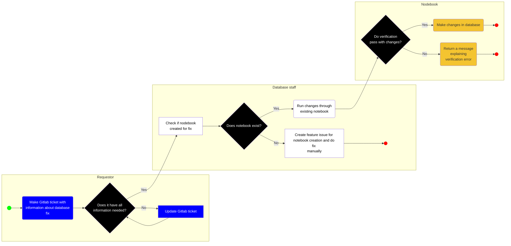

# Identifying Errors

During the process of loading data it is possible to uncover errors with previously-loaded datasets. OTN is constantly improving our QA/QC tools, which means we are identifying and correcting more and more historical errors.

Generally, there a few ways Node Managers will identify errors:
- By using the `Verification` cells in the Nodebooks
- When new QA/QC updates are released for the Nodebooks
- When a researcher identifies an error explicitly
- When a researcher submits data that does not match previously-loaded records

In the latter case, full comparison between the records is required, followed by a discussion with the researcher to identify if the previously-loaded records or the new records are correct. Often, the outcome is that the data in the DB needs correction.

# Scoping the Required Correction

Once an error has been identified, the correction needs to be scoped. This includes: which tables are affected by the error, which catalognumbers, etc. Please use the `DB Fix Issue` GitLab template.

Here is the template for reference:

~~~
# **DB Fix Issue**

__This issue title should include schema name and general fix description__
- eg "HFX receiver lat/long change"

## Related gitlab issue:
- eg #1234, [paste link to issue]

## Information needed for each record that needs fixing (repeat for each row that needs to change):
- [ ] unique identifier:
    - original value:
    - new value:

- [ ] NAME label issue `db fix`
- [ ] NAME tag OTNDC staff for assistance with request (@diniangela etc)
- [ ] OTN make database change
~~~
{: .language-plaintext .example}

Once fully scoped, you may assign the Issue to OTN Staff to complete the correction. If it is a simple process, they may provide instructions to the Node Manager to complete. **Do not** attempt to correct the issue yourself without consultation with OTN.

# Database Fix Notebooks

Currently, the OTN Database Team is working on a suite of notebooks for fixing common issues found in the database. These are the tools that the OTN Team will be using to correct the identified errors, if the tool to do so already exists.

These notebooks are beyond the scope of the current training but eventually Data Managers who wish to learn more will be able to take further training. In the meantime, if you see notes in the notebooks such as "Use the DB Fix notebook called XXXX to correct this error", please create a `DB Fix Issue` ticket and pass it off to OTN.


