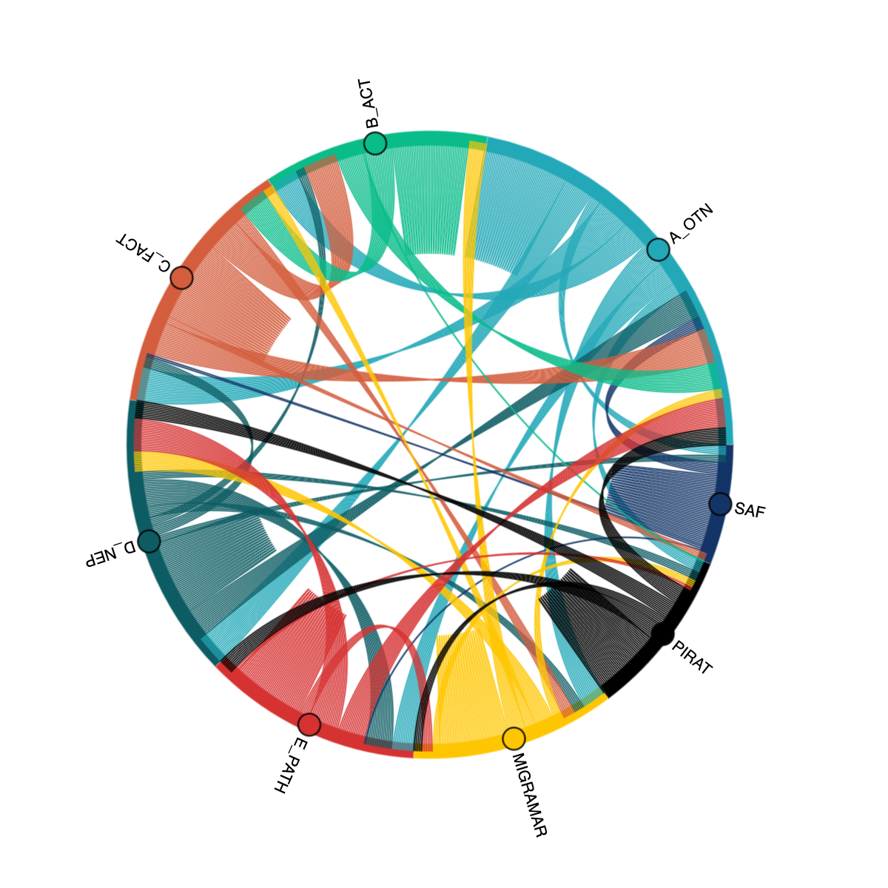

# The data sources:
## The `discovery` schema

The `discovery` schema of each node, as well as the OTN database's own discovery schema, contains summarized data products that are meant to be quick shortcuts to analysis and reporting of popular data types. Here you can downsize the number of columns that accompany tag or receiver deployments, or bin up detections into easier-to-visualize bites. Simplified versions of these data types can also help you adhere to your Data Sharing Agreement with your user base, removing or generalizing the data according to what the community demands. The content of these tables is written by the [discovery_process_reload.ipynb](https://gitlab.oceantrack.org/otn-partner-nodes/ipython-utilities/-/blob/master/discovery_process_reload.ipynb) notebook, and the aggregation of the core discovery tables to the OTN database for aggregate reporting is performed by the [discovery_process_pull_node_tables_to_mstr.ipynb](https://gitlab.oceantrack.org/otn-partner-nodes/ipython-utilities/-/blob/master/discovery_process_pull_node_tables_to_mstr.ipynb) notebook. OTN does this for the purpose of reporting to funders, and helping with discoverability of datasets by publishing project pages with receiver and tag release location data for each project. If there are data that you do not want to supply to OTN for publication, you do not have to run those parts of the discovery process. Those data summaries will not be created or harvested by OTN during the discovery process phase of the [Data Push](./14_The%20Push.md).

## The `geoserver` schema

The `geoserver` schema is similar to the `discovery` schema but all data tables here correspond to layers that can be expressed via the [OGC GeoServer](https://geoserver.org) data portal. This means they have pre-calculated the geometric and map projection data columns necessary for them to express themselves as geographic data points and paths. This data is often stored in a column called `the_geom`. 

If you re-generate these tables for your Node using the [populate_geoserver](https://gitlab.oceantrack.org/otn-partner-nodes/ipython-utilities/-/blob/master/geoserver%20-%20populate%20geoserver%20tables.ipynb) notebooks, they will then contain accurate data for your Node. Attaching a GeoServer instance to this database schema will allow you to express project, receiver deployment, and tag deployment information in many formats. [OTN's GeoServer](https://geoserver.oceantrack.org/) instance can aggregate and re-format the GeoServer data into human and machine-readable formats for creating public maps and data products. As an example: the OTN Members Portal uses GeoServer to visualize project data, and the [R package `otndo`](https://otndo.obrien.page) uses the existence of a GeoServer with station histories to produce data summaries for individual researchers about the places and times their tags were detected outside their own arrays.

## Installation
The installation steps for the Visuals and Reporting are similar to the installation steps for ipython-utilities:
1. Determine the folder in which you wish to keep the Visuals and Reporting notebooks.
1. Open your `terminal` or `command prompt` app. 
   * Type `cd` then `space`. 
   * You then need to get the filepath to the folder in which you wish to keep the Visuals and Reporting notebooks. You can either drag the folder into the `terminal` or `command prompt` app or hit `shift/option` while right clicking and select `copy as path` from the menu.
   * Then paste the filepath in the `terminal` or `command prompt` and hit `enter`
   * In summary, you should type `cd /path/to/desired/folder` before pressing enter.
1. Create and activate the "visbooks" python enviornment. The creation process will only need to happen once.
   * In your terminal, run the command `conda create -n visbooks python=3.9`
   * Activate the visbooks environment using `conda activate visbooks`
1. You are now able to run commands in that folder. Now run: `git clone https://gitlab.oceantrack.org/otn-partner-nodes/visuals-and-reporting.git`. This will get the latest version of the Visuals and Reporting notebooks from our GitLab
1. Navigate to the visuals-and-reporting subdirectory that was created by running `cd visuals-and-reporting`.
1. Now to install all required python packages by running the following: `mamba env update -n visbooks -f environment.yml`

**To open and use the Visuals and Reporting Notebooks:**
- **MAC/WINDOWS**: Open your terminal, and navigate to your visuals-and-reporting directory, using `cd /path/to/visuals-and-reporting`. Then, run the commands: 
   * `conda activate visbooks` to activate the visbooks python environment
   * `jupyter notebook` to open the Nodebooks in a browser window.
- **DO NOT CLOSE** your terminal/CMD instance that opens! This will need to remain open in the background in order for the Nodebooks to be operational.

Some troubleshooting tips can be found in the `ipython Nodebooks` installation instructions: [https://gitlab.oceantrack.org/otn-partner-nodes/ipython-utilities/-/wikis/New-Install-of-Ipython-Utilities](https://gitlab.oceantrack.org/otn-partner-nodes/ipython-utilities/-/wikis/New-Install-of-Ipython-Utilities)

# The `visuals-and-reporting` notebooks

Some products are built from things that nodes don't make fully public, but are useful to summarize for funders or stakeholders, or to produce simplified visualizations meant to promote your Network. The visuals-and-reporting notebooks repository is a collection of popular workflows for producing these sorts of products.

## Database and Network-wide reports

### Example: Active Tags and IUCN Status

This creates a summary report of Tag Life, Tags, Detections, Stations. Tailored for OTN's reporting requirements to CFI.

### Example: Generate Receiver Map

This creates a map to show receivers from Nodes. Tailored for OTN's reporting requirements and data policy.

## Project-level summaries
### Example: Receiver Project Report

 This notebook generates a summary report for receiver operators to describe what animals have been seen and when. Tailored for OTN's reporting requirements and data policy.

## Tag-oriented summaries

### Example: Private: Tag Check and Summarize

Scenario: You want to know whether any of the detections you just downloaded are part of your Database already. Use this notebook to search tags, tag specs, and existing detections that are unmatched to find matches to a set of tag IDs that you specify. This will not do the checking that actually loading and matching the detection data would do for you, so sharing this output is not recommended, but it gives a sense of the connectivity of a detection dataset to the Database.

### User-facing summaries: `otndo`

Mike O'Brien's summarization and visualization function can be run by any client and uses a detection extract as a data source. Referencing the OTN GeoServer, it will produce a list of collaborators and projects that have contributed to detctions in that supplied dataset, and provide a before/after timepoint to show the end user what detections have been added by the latest Data Push.

Examples at Mike's [otndo documentation page](https://otndo.obrien.page).

# Adding new notebooks to `visuals-and-reporting`

If you would like to see new features or workflows added to the visuals-and-reporting repository for all to use, you can issue a merge request against the repository, or work with OTN programmer staff to build and design data structures and workflows that fulfill your reporting needs. Use the existing `discovery` and `geoserver` data objects or you can also design new ones for your node.

### Example: Cross-node Detections chord plot

Using the `detection_pre_summary` Discovery table, we can see which detection events were mapped between different Nodes, and visualize these inter-Node interactions using a chord plot. Here we have created a few caveats to avoid representing false detections on the plot, only taking detection events with >1 detection, and excluding some of the more fantastic inter-ocean matches. 

