## General Description

During the process of loading data it is possible to uncover errors with previously-loaded datasets. OTN is constantly improving our QA/QC tools, which means we are identifying and correcting more and more historical errors.

Generally, there a few ways Node Managers will identify errors:
- By using the Verification cells in the Nodebooks
- When new QA/QC updates are released for the Nodebooks
- When a researcher identifies an error explicitly
- When a researcher submits data that does not match previously-loaded records

In the latter case, full comparison between the records is required, followed by a discussion with the researcher to identify if the previously-loaded records or the new records are correct. Often, the outcome is that the data in the DB needs correction.

These corrections can be done using the [Database Fix Notebooks](https://gitlab.oceantrack.org/otn-partner-nodes/database-fix-notebooks). These are the tools we have built so far to correct commonly identified errors.

This suite of notebooks, however, should only be used as a last option. If an error is identified by verification checks, human eyes and critical thinking must be used to check if the Database Fix Notebooks are required and, depending on the type of fix, researcher permission often needs to be obtained.

<pre class="mermaid">
flowchart LR
    A(( )) --> B(Make Gitlab ticket with  information about database  fix)
    style A fill:#00FF00,stroke:#00FF00,stroke-width:4px
    style B fill:#0000ff,color:#ffffff
    B --> C{Does it have all  information needed?}
    style C fill:#000000,color:#ffffff
    C -- No --> D[Update Gitlab ticket]
    style D fill:#0000ff,color:#ffffff
    D --> C

    C -- Yes --> E[Check if nodebook  created for fix]
    style E fill:#ffffff,color:#000000
    E --> F{Does notebook exist?}
    style F fill:#000000,color:#ffffff
    F -- No --> G[Create feature issue for  notebook creation and do fix  manually]
    style G fill:#ffffff,color:#000000
    G --> H(( ))
    style H fill:#FF0000,stroke:#FF0000
    F -- Yes --> I(Run changes through  existing notebook)
    style I fill:#ffffff,color:#000000

    subgraph Nodebook
    I --> J{Do verification  pass with changes?}
    style J fill:#000000,color:#ffffff
    J -- Yes --> K(Make changes in database)
    style K fill:#F4C430
    K --> L(( ))
    style L fill:#FF0000,stroke:#FF0000
    J -- No --> M(Return a message  explaining  verification error)
    style M fill:#F4C430
    M --> N(( ))
    style N fill:#FF0000,stroke:#FF0000
    end
</pre>


## Installation
The installation steps for the Database Fix Notebooks are similar to the installation steps for ipython-utilities:
1. Determine the folder in which you wish to keep the Database Fix Notebooks.
1. Open your `terminal` or `command prompt` app. 
   * Type `cd` then `space`. 
   * You then need to get the filepath to the folder in which you wish to keep the Database Fix Notebooks. You can either drag the folder into the `terminal` or `command prompt` app or hit `shift/option` while right clicking and select `copy as path` from the menu.
   * Then paste the filepath in the `terminal` or `command prompt` and hit `enter`
   * In summary, you should type `cd /path/to/desired/folder` before pressing enter.
1. Create and activate the "dbfixnotebook" python enviornment. The creation process will only need to happen once.
   * In your terminal, run the command `conda create -n dbfixnotebook python=3.9`
   * Activate the dbfixnotebook environment using `conda activate dbfixnotebook`
1. You are now able to run commands in that folder. Now run: `git clone https://gitlab.oceantrack.org/otn-partner-nodes/database-fix-notebooks.git`. This will get the latest version Database Fix Notebooks from our GitLab
1. Navigate to the database-fix-notebooks subdirectory that was created by running `cd database-fix-notebooks`.
1. Now to install all required python packages by running the following: `mamba env update -n dbfixnotebook -f environment.yml`

**To open and use the Database Fix Notebooks:**
- **MAC/WINDOWS**: Open your terminal, and navigate to your database-fix-notebooks directory, using `cd /path/to/database-fix-notebooks`. Then, run the commands: 
   * `conda activate dbfixnotebook` to activate the dbfixnotebook python environment
   * `jupyter notebook --config="nb_config.py" "0. Home.ipynb"` to open the Nodebooks in a browser window.
- **DO NOT CLOSE** your terminal/CMD instance that opens! This will need to remain open in the background in order for the Nodebooks to be operational.

Some troubleshooting tips can be found in the `ipython Nodebooks` installation instructions: [https://gitlab.oceantrack.org/otn-partner-nodes/ipython-utilities/-/wikis/New-Install-of-Ipython-Utilities](https://gitlab.oceantrack.org/otn-partner-nodes/ipython-utilities/-/wikis/New-Install-of-Ipython-Utilities)

## Gitlab KDBX integration
An exciting feature of the Database Fix Notebooks is that if you add a Gitlab token to your kdbx file, the notebook will automatically comment the output from the notebook directly into the specified Gitlab issue. Otherwise, you will have to copy and paste the displayed results manualyl into the comments (as directed by the notebook).

To integrate the Gitlab token into your kdbx file, please use the instructions found at the bottom of the [AUTH - Create and Update](https://gitlab.oceantrack.org/otn-partner-nodes/ipython-utilities/-/blob/master/AUTH%20-%20Create%20and%20Update.ipynb) notebook in ipython-utilities.

## Issue Creation

The **first** step when you have confirmed an incorrect dataqbase value is to create a new Gitlab Issue with the `DB Fix` Issue checklist template.

Here is the Issue checklist, for reference:

~~~
# **DB Fix Issue**

## Related gitlab issue:
- **[paste link to issue]**

## CSV of information needed for each record that needs fixing (look at `0. Home` notebook for column headers):
- **[link file here]**

## Task list
- [ ] NAME label issue `DB Fix`
- [ ] NAME create a CSV of changes 
- [ ] NAME assign to @diniangela to make the change
- [ ] Angela make database change
~~~
{: .language-plaintext .example}

There are a few helpful explanation notebooks inside this suite of Database Fix tools. You should always start by accessing both of these in order to identify next steps.
- [0. Home](https://gitlab.oceantrack.org/otn-partner-nodes/database-fix-notebooks/-/blob/master/0.%20Home.ipynb): This notebook will provide a brief explanation of what each notebook does, as well as helpful hints to show what is needed to run the notebook.
- [0. Which notebook should I use](https://gitlab.oceantrack.org/otn-partner-nodes/database-fix-notebooks/-/blob/master/0.%20Which%20notebook%20should%20I%20use.ipynb): This notebook has a form which will help node managers determine which Database Fix Notebook is appropriate for their change. It shows a list of the types of metadata we offer (project, tag, deployment, and detection) and, based on the selection, shows a list of columns from the raw metadata sheets. Based on the raw metadata column selection, it will display a result of which notebook to use.

## Spreadsheet Creation

Some of the Database Fix Notebooks require the user to provide a spreadsheet of the changes as input. This requirement will be specified in the top description of each notebook, or the description on `0. Home.ipynb`. 

The required columns will be shown in the description as well. Once input, if there are missing required columns, the notebook will display an error identifiying which columns are missing. 

The spreadsheet should be created and added to the created Gitlab issue, either in the description or in a comment.

## Examples
Once you know which notebook to use and have created the spreadsheet (if needed), you can open the correct Database Fix Notebook. This notebook will consist of a single cell to run.

The notebooks have similar formats so four examples will be demonstrated below.

### Example 1: Changing a receiver serial
Let's say for the first example, a researcher has emailed saying that they made a typo in the receiver metadata and that serial 87654321 should actually be 12345678 for receivers 'CODE-87654321-2020-03-10' and 'CODE-87654321-2024-09-09' in project CODE.

The first step is to create a Gitlab issue with the relevant information titled 'CODE Change receiver serial'.

The next step would be to figure out which notebook to use to make this change. Running the first cell in `0. Which notebook should I use` gives the following results:

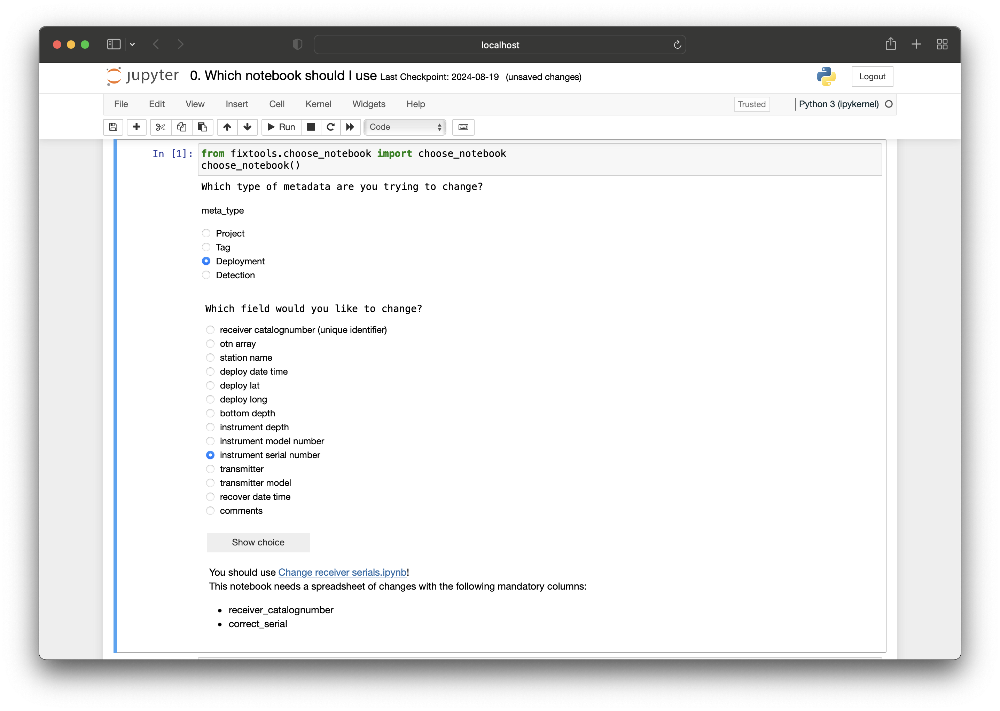

You can then click the link to go to the `Change receiver serials` notebook. In this notebook, there is a description telling you that the spreadsheet should have the columns 'receiver_catalognumber' and 'correct_serial' so you create the following spreadsheet:

receiver_catalognumber | correct_serial
-|-
CODE-87654321-2020-03-10 | 12345678
CODE-87654321-2024-09-09 | 12345678

Once this spreadsheet has been created, you can run the single cell in the notebook, which will prompt you for your authorization with a 'Select File' button:

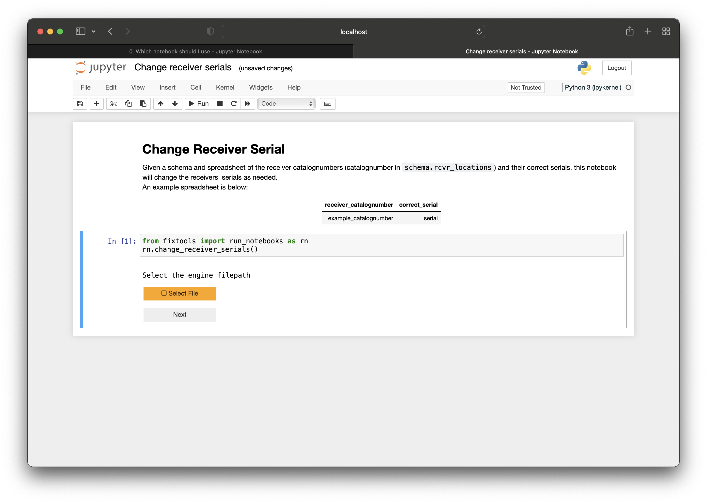

which will open your file explorer to select the file containing your authorization. 

Once you press the 'Next' button after selecting the authorization file and enter your password for kdbx, text fields will appear for you to fill in with relevant information:

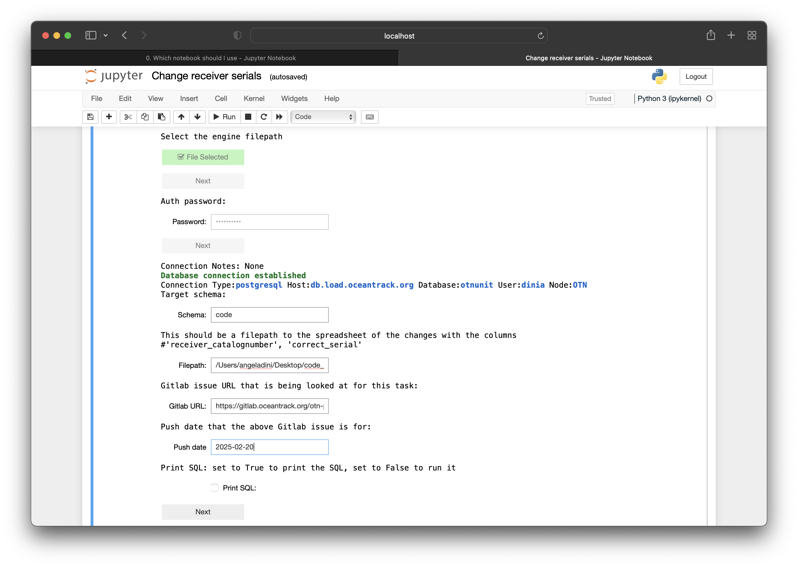

Once you press 'Next' after filling in the relevant information, the backend code will perform verifications on the changes to make sure, e.g. that no resulting overlapping receivers occur after the change. If this is the case, the change will not occur and an error message will be displayed showing why the change was not made. 

If the verifications pass, the notebook will display the updates it will be doing and display an 'Update' button for you to press once you have verified that the notebook is making the correct changes.

⭐ **IMPORTANT** ⭐ Please double check the update steps to ensure the notebook is performing accurately.

Once 'Update' is pressed, the notebook will display a success message describing the successful change.

If you have a gitlab token authorization associated with your kdbx, as mentioned above, the notebook will automatically comment the updates and success message in the created Gitlab ticket. Otherwise, it will tell you to copy and paste the update list and success message.

### Example 2: Changing tag end date
Let's say for the second example, a researcher has emailed saying that they had forgotten to add the harvest date '2024-09-09 10:00:00' to tag 'A69-1303-12345' on animal 'CODE-Jane', which was released on '2024-01-01 13:00:00', which should be used instead of the estimated tag life '365 days'.

The first step is to create a Gitlab issue with the relevant information titled 'CODE Change tag end date with harvest date' or something with relevant information.

The next step would be to figure out which notebook to use to make this change. Running the first cell in `0. Which notebook should I use` gives the following results:

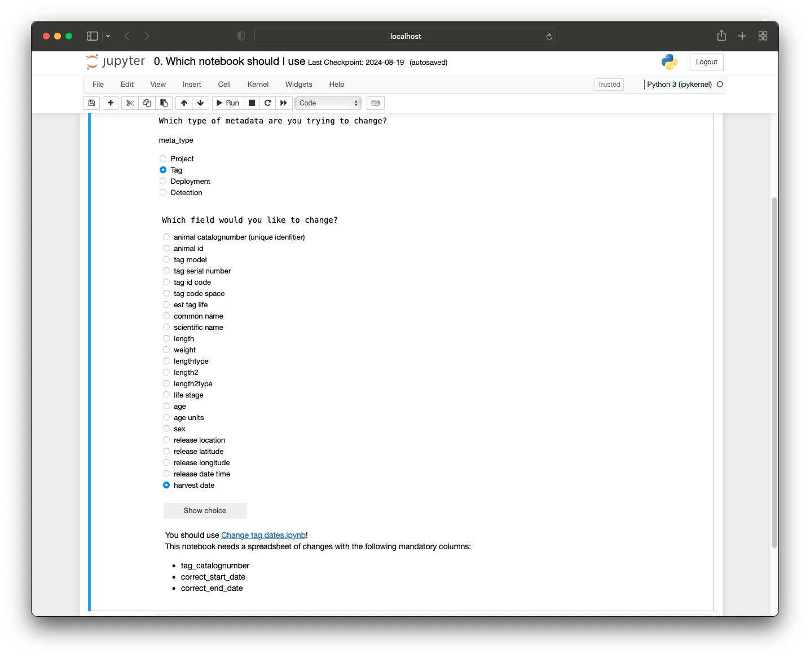

You can then click the link to go to the `Change tag dates` notebook. In this notebook, there is a description telling you that the spreadsheet should have the columns 'tag_catalognumber', 'correct_start_date', and 'correct_end_date' so you create the following spreadsheet:

tag_catalognumber | correct_start_date | correct_end_date
-|-|-
A69-1303-12345 | 2024-01-01 13:00:00 | 2024-09-09 10:00:00

Once this spreadsheet has been created, you can run the single cell in the notebook, which will prompt you for your authorization with a 'Select File' button:

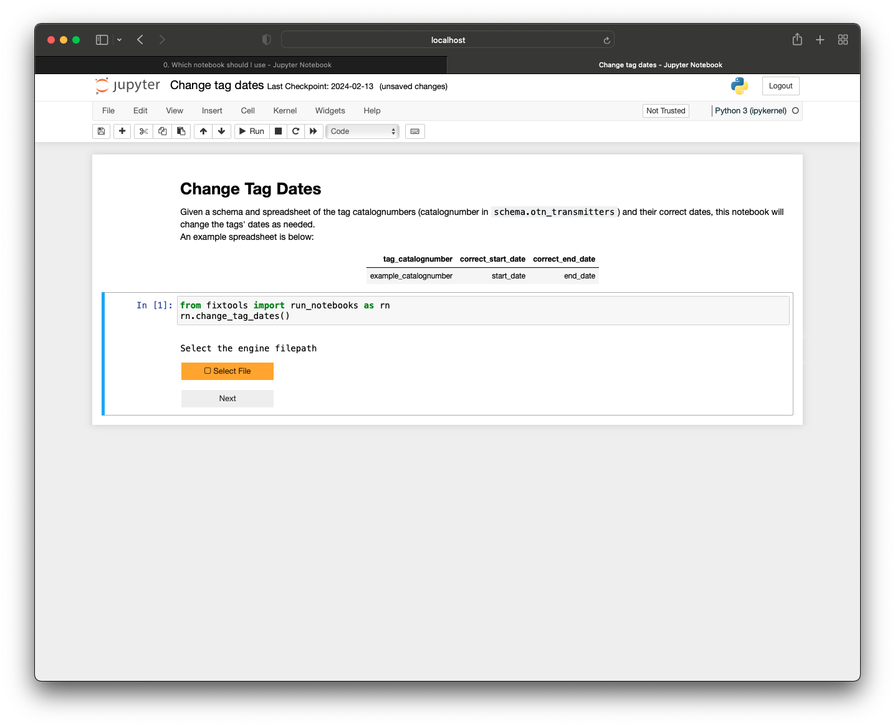

which will open your file explorer to select the file containing your authorization. 

Once you press the 'Next' button after selecting the authorization file and enter your password for kdbx, text fields will appear for you to fill in with relevant information:

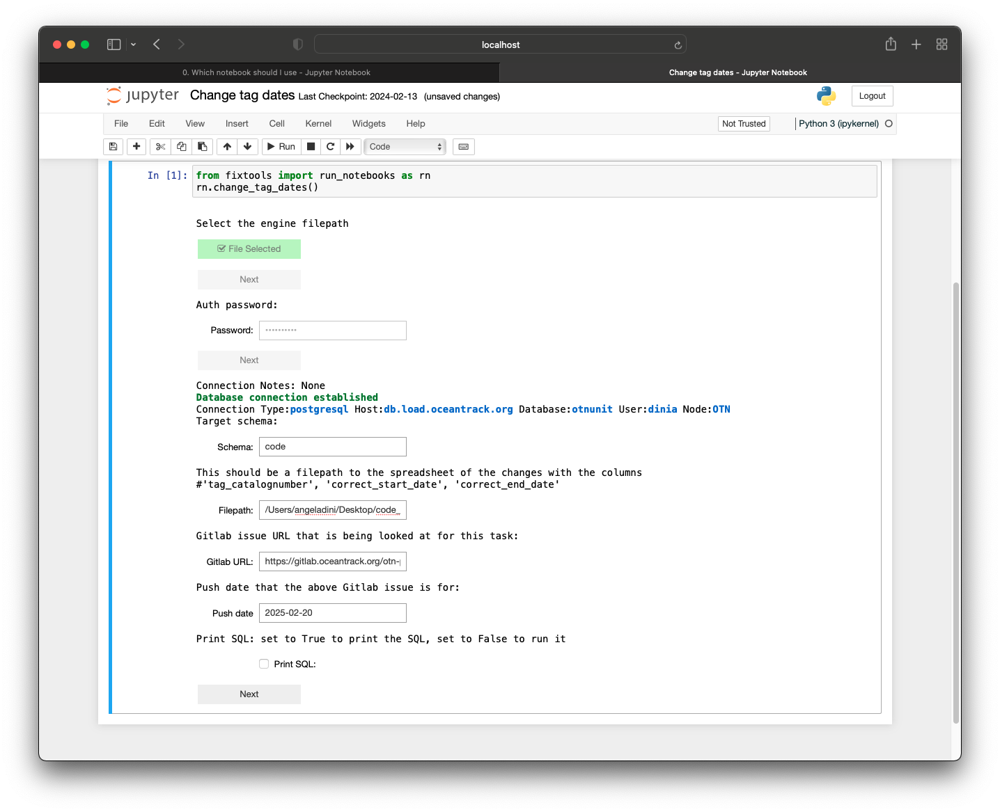

Once you press 'Next' after filling in the relevant information, the backend code will perform verifications on the changes to make sure, e.g. that no resulting overlapping tags occur after the change. If this is the case, the change will not occur and an error message will be displayed showing why the change was not made. 

If the verifications pass, the notebook will display the updates it will be doing and display an 'Update' button for you to press once you have verified that the notebook is making the correct changes.

⭐ **IMPORTANT** ⭐ Please double check the update steps to ensure the notebook is performing accurately.

Once 'Update' is pressed, the notebook will display a success message describing the successful change.

If you have a gitlab token authorization associated with your kdbx, as mentioned above, the notebook will automatically comment the updates and success message in the created Gitlab ticket. Otherwise, it will tell you to copy and paste the update list and success message.

### Example 3: Fixing the_geom
Let's say for the third example, you are verifying tag metadata for project 'NSBS' and an error comes up from ipython-utilities saying that the_geom is incorrect and the instructions direct you to the 'fix the_geom' Database Fix Notebook.

The first step is to create a Gitlab issue with the relevant information titled 'NSBS fix the_geom'.

You can then open the `Fix the_geom` notebook as the ipython-utilities nodebook will direct you. In this notebook, there is a description that does not have a spreadsheet so no spreadsheet is needed.

You can run the single cell in the notebook, which will prompt you for your authorization with a 'Select File' button:

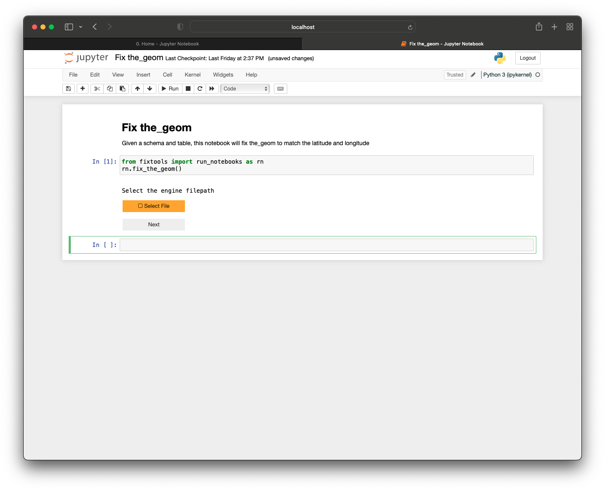

which will open your file explorer to select the file containing your authorization. 

Once you press the 'Next' button after selecting the authorization file and enter your password for kdbx, text fields will appear for you to fill in with relevant information:

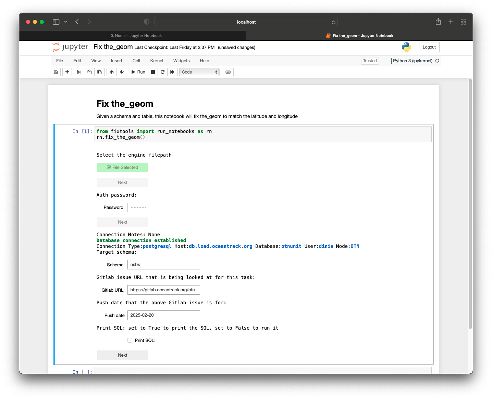

Once you press 'Next' after filling in the relevant information, more user input will be shown for you to pick the relevant table. Since this was for nsbs.otn_transmitters, you can choose 'otn_transmitters' from the drop-down:

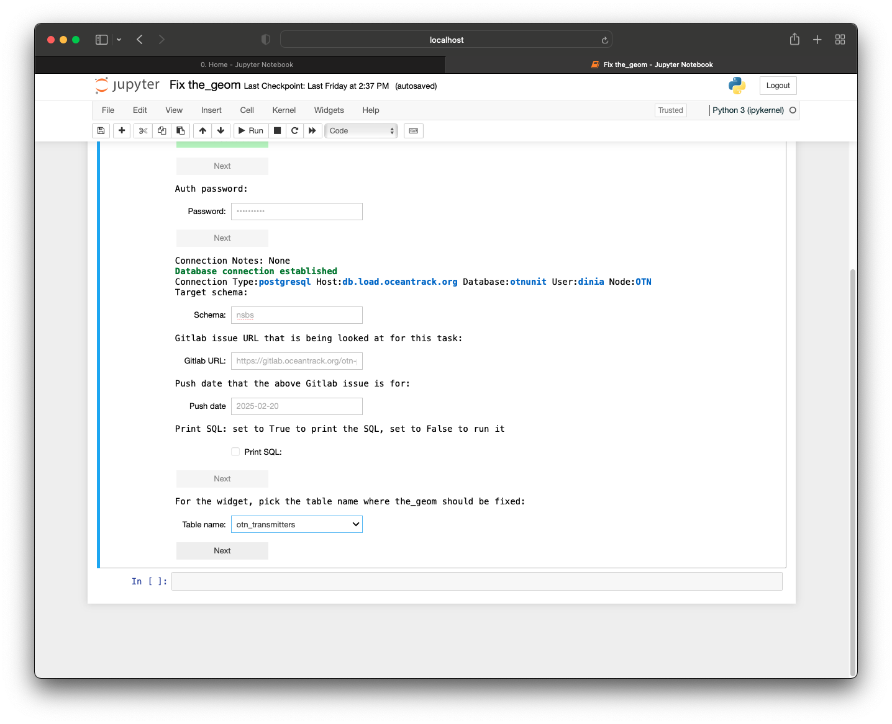

Once you press 'Next' after filling in the relevant information, the backend code will perform verifications on the changes to make sure no errors will result from the change. If this is the case, the change will not occur and an error message will be displayed showing why the change was not made. 

If the verifications pass, the notebook will display the updates it will be doing and display an 'Update' button for you to press once you have verified that the notebook is making the correct changes.

⭐ **IMPORTANT** ⭐ Please double check the update steps to ensure the notebook is performing accurately.

Once 'Update' is pressed, the notebook will display a success message describing the successful change.

If you have a gitlab token authorization associated with your kdbx, as mentioned above, the notebook will automatically comment the updates and success message in the created Gitlab ticket. Otherwise, it will tell you to copy and paste the update list and success message.

### Example 4: Fixing duplicate downloads
Let's say for the fourth example, you are verifying event data and an error pops up from ipython-utilites saying that there are duplicate downloads and the instructions direct you to the 'fix duplicate downloads' Database Fix Notebook.

The first step would be to create a Gitlab issue with the collection code and linking the detections Gitlab issue that you were working on when this error popped up.

After this, you would open up the 'Fix duplicate downloads' notebook in database-fix-notebooks, notice there's no spreadsheet needed, and run the single cell.

This prompts you for your engine with a 'Select File' button:

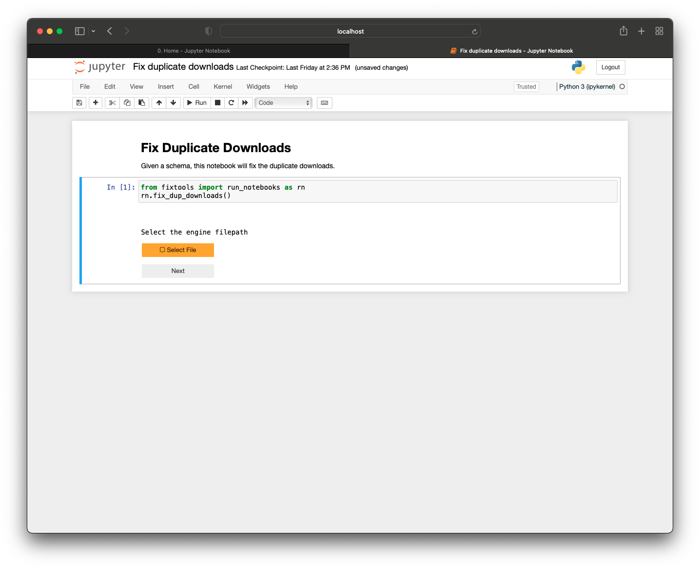

Once you click this, your file explorer opens up and you can search for your kdbx (with the Gitlab token). Once you have selected this, the dialog box closes and a 'Next' button appears. Pressing next will make text fields appear for you to fill in with the relevant information. Once you press 'Next' after filling in the relevant information, you will be shown information about the duplicate downloads, some guidelines, and the option to select which download(s) to delete.

This will appear in two formats: a selectable table and a drop-down.

The selectable table will appear when there are less than ten duplicate download groups:

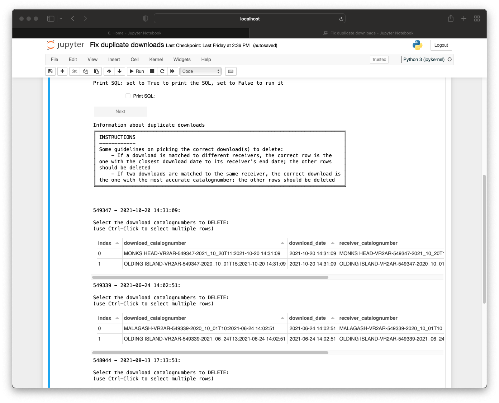

The drop-down will appear if there are ten or more duplicate download groups:

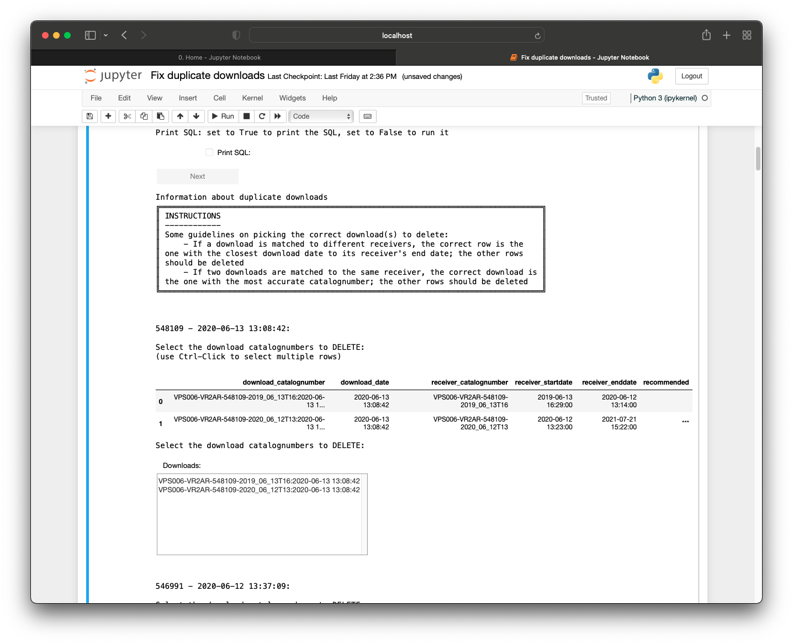

The logic of both options will work the same but differ in the way to select the download(s) to delete. For the selectable table, you can click or Control-click on the rows on the actual table. For the drop-down, you can click or Control-click on the catalognumber(s) in the drop-down. 

⭐ **IMPORTANT** ⭐ Make sure the catalognumber(s) in the drop-down you select matches the catalognumber(s) in the table.

For each duplicate download group, you can check which download(s) are incorrect and should be deleted. You can do this using the guidance in the instructions in the notebook. 
- If the downloads are matched to different receivers, the correct download matching is the one with the closest download date to its receiver's end date and the other rows should be deleted. 
- If they are matched to the same receiver, the correct download is the one with the most accurate catalognumber. This could be of the format `{receiver_catalognumber}-{download_date}`. The other rows should be deleted. 

In the displayed table, there is a '***' in the 'recommended' column which shows which rows the notebook recommends to delete but sometimes it can be inaccurate so we recommend human eyes on it to double check that it is the one(s) you intend to delete.

For example, if the download table shows:

download_catalognumber | download_date | receiver_catalognumber | receiver_startdate | receiver_enddate | recommended
-|-|-|-|-|-
CODE-VR2W-123456-2019_06_13T16:2020-06-13 13:10:00 | 2020-06-13 13:10:00 | CODE-VR2W-123456-2019_06_13T16 | 2019-06-13 16:30:00 | 2020-06-12 13:15:00 | 
CODE-VR2W-123456-2020_06_12T13:2020-06-13 13:10:00 | 2020-06-13 13:10:00 | CODE-VR2W-123456-2020_06_12T13 | 2020-06-12 13:20:00 | 2021-07-21 15:20:00 | ***

The correct download to delete would be the second row, because in the first one, the download date (2020-06-13 13:10:00) is closer to the receiver end date (2020-06-12 13:15:00) than the receiver end date in the second row (2021-07-21 15:20:00). Therefore, the download catalognumber `CODE-VR2W-123456-2020_06_12T13:2020-06-13 13:10:00` should be selected as the one to delete.

If the download table shows:

download_catalognumber | download_date | receiver_catalognumber | receiver_startdate | receiver_enddate | recommended
-|-|-|-|-|-
Station-123456-download | 2024-09-09 10:10:00 | CODE-VR2W-123456-2019_06_13T16 | 2019-06-13 16:30:00 | 2020-06-12 13:15:00 | ***
CODE-VR2W-123456-2019_06_13T16:2024-09-09 10:10:00 | 2024-09-09 10:10:00 | CODE-VR2W-123456-2019_06_13T16 | 2019-06-13 16:30:00 | 2020-06-12 13:15:00 | 

The first row should be deleted since the downloads are matched to the same receiver deployment but the download catalognumber is not in the expected format (`{receiver_catalognumber}-{download_date}`).

Once the proper downloads to delete are selected by the user, the notebook will display the updates it will be doing and display an 'Update' button for you to press once you have verified that the notebook is making the correct changes.

⭐ **IMPORTANT** ⭐ Please double check the update steps to ensure the notebook is performing accurately.

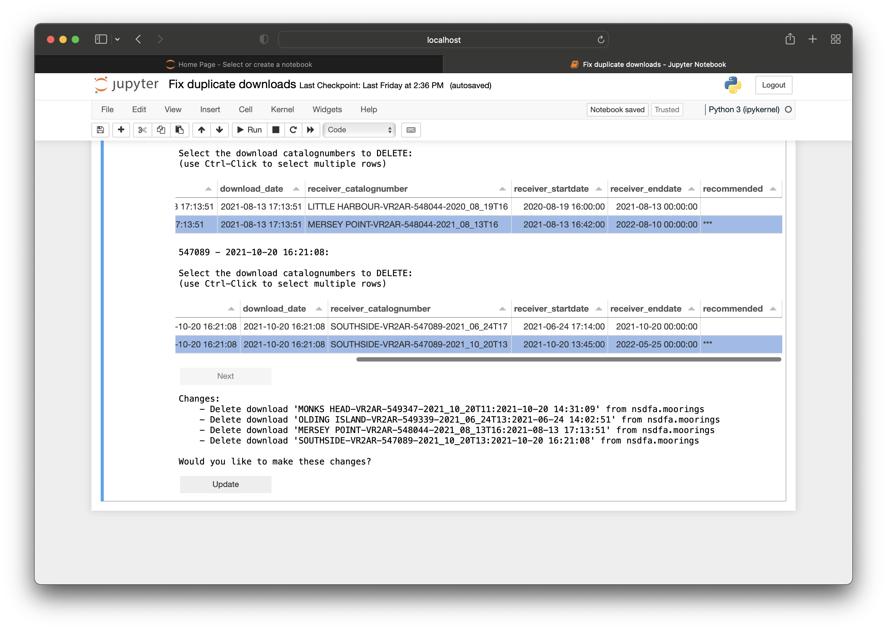

Once 'Update' is pressed, the notebook will display a success message describing the successful change.

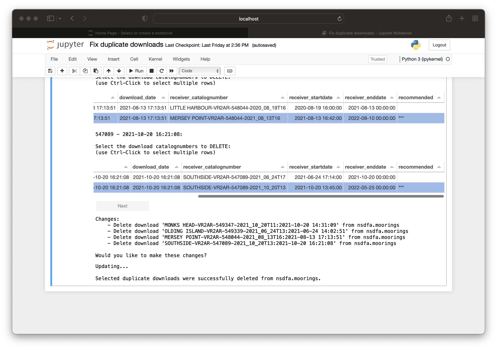

## General Information - Cross-Node Executions

If your .kdbx file includes a GitLab Access Token, as mentioned above, the Nodebook will automatically comment all updates and success messages in the created Gitlab ticket. Otherwise, you must copy and paste this information into the Issue manually.

For Nodebooks that require updates to the databases of other nodes:
1. If you have a GitLab Access Token: the Nodebook will provide the SQL needed to update other nodes and will automatically add a 'Cross-node executions' label to the Gitlab Issue.
2. If you **do not** have a GitLab Access Token: the Nodebook will provide the SQL needed to update other nodes. Please add a 'Cross-node executions' label onto the Issue manually. 

A text box to enter a super-user authorization to automatically run the SQL on the other node will be displayed:

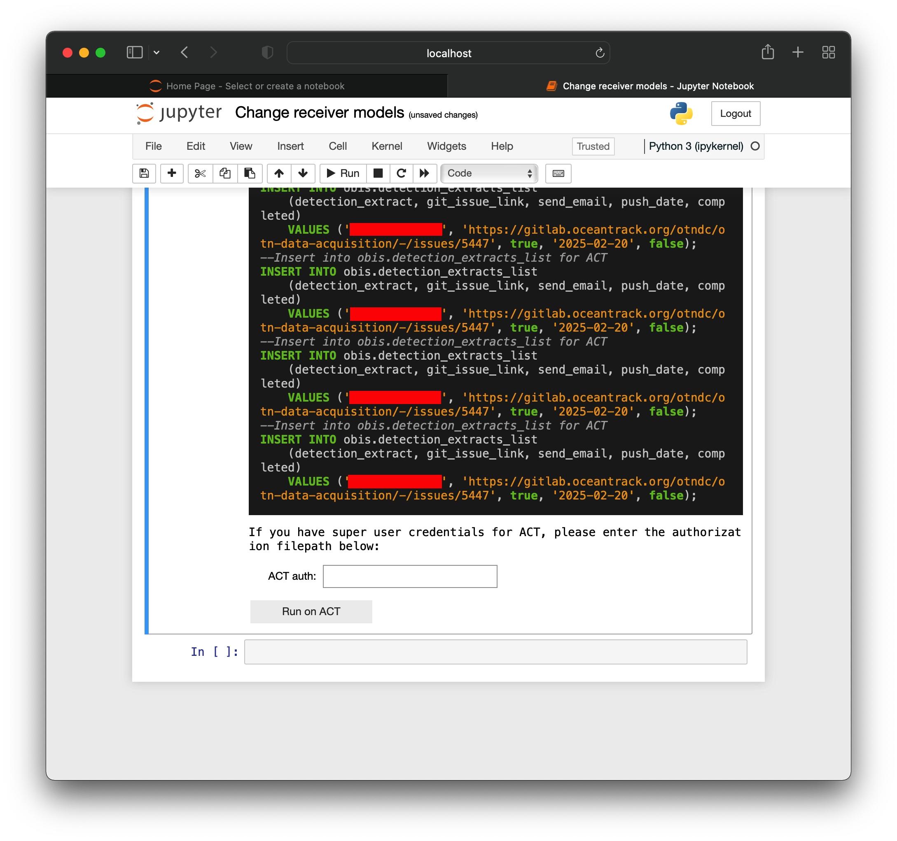

If you have a super-user authorization for the other Node (ie; you are the Data Manager for multiple Nodes, or are OTN staff):
1. You may enter the filepath of the super-user authorization in the above text box and will receive a success message, which will run the SQL on the other Node.
2. Please remove the 'Cross-node executions' label from the Issue once completed

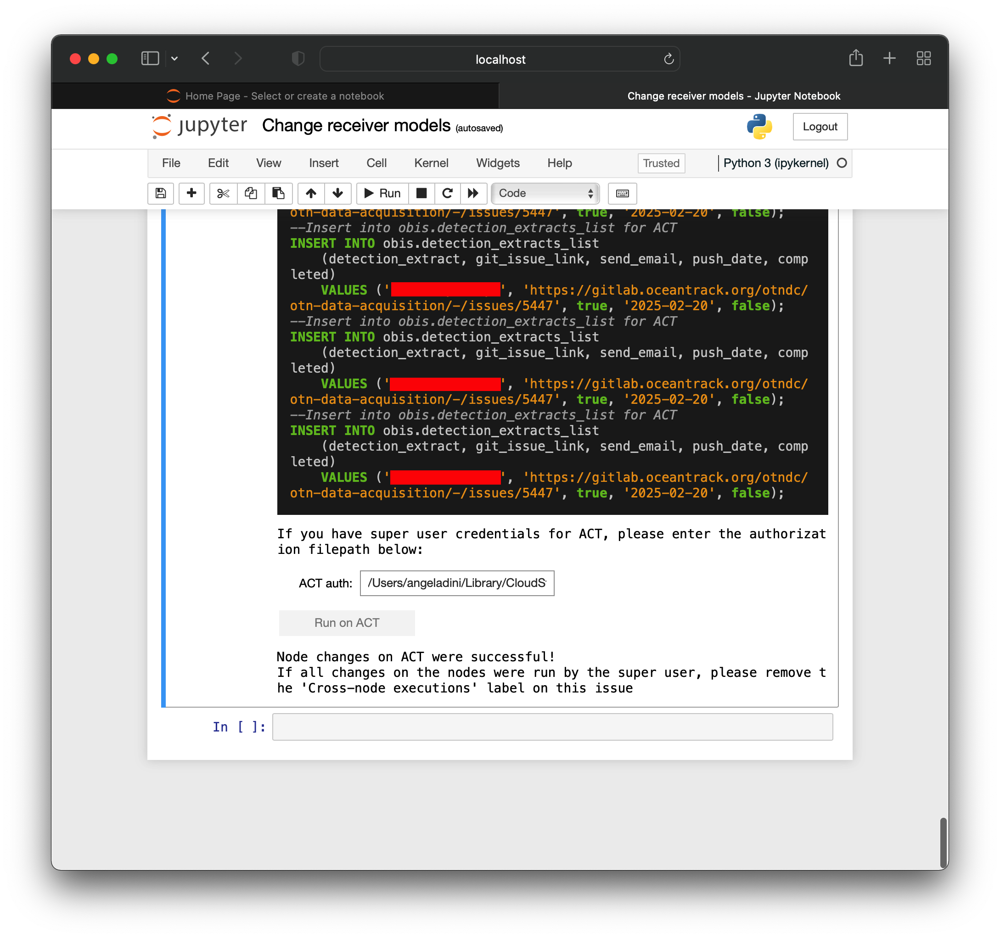

If you **do not** have the super-user authorizations for the other Node :
1. Please inform the associated Node Manager that you have SQL for them to run and send them the SQL.
2. After they have run the SQL, please add a comment to the issue saying they have run the SQL
3. Remove the 'Cross-node executions' label.