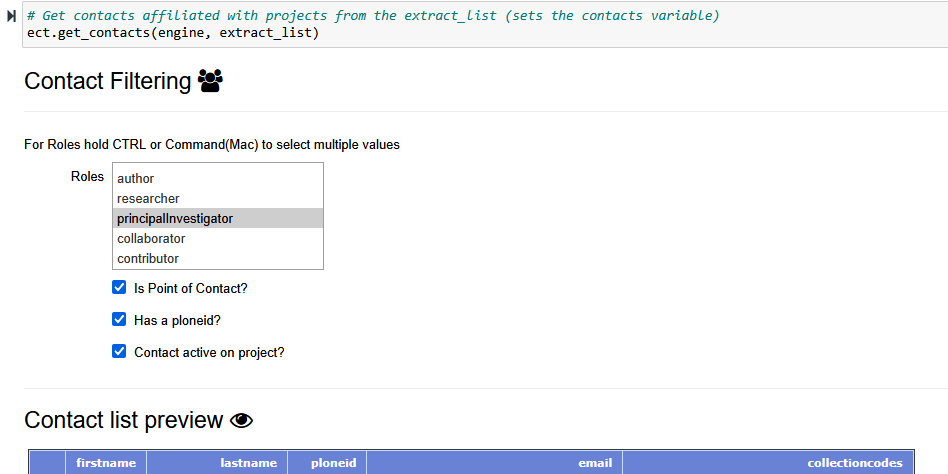

## What is a Data Push?

A Data Push is when the OTN data system is re-verified and any new relevant information is sent to researchers. New data stops being brought in so that what's in the system can be reliably verified. This way any issues found can be fixed and the data can be in the best form based on the information available at that moment. Once verification is done, detections are matched across nodes and detection extracts are sent out to researchers. This is also the time when summary schemas like `discovery`, `erddap`, and `geoserver` are updated with the newly verified data.

## What is the Push Schedule?

Push events happen **three** times a year. They start on the third Thursday of the "push months" which are February, June, and October. This date is the cut-off date for all data-loading; no records can be loaded after this. Please aim to have all tickets ready for verification **1 week** before this date.

With the increased number of Nodes joining the Pushes, we are announcing the schedule for the next year. Please prepare in advance and mark your calendars.

Push schedule through 2026:
- February 19, 2026
- June 18, 2026
- October 15, 2026

## Pre-Push Schedule

In order to accommodate the increasing number of Nodes and meet Push deadlines, we have also prepared a shared pre-Push timeline for all nodes: 

The pre-Push timeline updates are as follows:
- 20 days before the Push will be the submission deadline for data contributors and researchers
- 7 days before the Push, there will be no more OTN helpers available for support (since we will be more focused on verification and Push organization) so please plan accordingly and reach out to the OTNDC team earlier for help with bigger messier data needs
- On the Push date (listed above), the OTN data team will be moving any still-open issues being tracked by the nodes' ticketing systems to the next milestone, and the node will be "locked" or "hands-off" temporarily while we work on the between-networks part of the Push (including verification, cross-matching, inheritance, and building discovery tables). After these X days, each node will be unlocked and data loading can resume.

## Node Manager Roles During a Push

Node Managers have two main jobs during a Push:
1. The first job is to get the Node's data loaded in time for the cut-off date. Data will be submitted by researchers on a continuous basis, but will likely increase just before a cut-off date. We recommend loading data as it arrives, to prevent a large backlog.
1. The second job for Node Managers is to create and send out Detection Extracts when they are ready to be made. This will be done using the `detections - create detection extracts` Nodebook.

Once the cut-off date has passed Node Managers are "off duty"! When it's time for Detection Extracts to be created and disseminated that task will be assigned to the Node Managers, but this does **not** signify the end of the Push. There are several more "behind the scenes" steps required.

Please refrain from interacting with the Node Database until OTN staff have announced the Push has ended and data may be loaded again. 

We have created an OTNDC Bot that announces updates through OTN's node Slack channels, and will announce each node's Push status. This means all node managers will be notified when the Push begins and ends in a clear manner. This Bot also sends status reports about Gitlab tickets during non-Push time, to help Node Managers track and stay on top of their ticket queue.

## Push Reports

Once a push is completed, statistics are gathered about the overall push as well as metrics about each node. This process creates a snapshot of what each node looked like at the time of that push. The statistics tracked include metrics such as the number of issues in the push, the number of projects a node is managing, the total number of detections, and the size of the database.

Using this data, a push report is generated for each node. These reports provide a summary of the push, including graphs and figures that illustrate how each node is growing over time. In addition to sharing these reports, we try to schedule a check-in meeting with nodes. These meetings are not only a chance for OTN to get information to the nodes but also for you to relay any information to us.

We want node managers to gain as much value as possible from the check-in meetings and reports, so we welcome feedback on the format, content, or any additional details you’d like to see included. Our goal is to ensure every node has the insights they need to succeed.

If you have feedback or specific requests, we’re happy to address them during your check-in. Additionally, if something comes to mind outside of these meetings, please don’t hesitate to reach out to the OTNDC team. We’re always available to discuss and scope your needs with you further.

[Copy of the OTN February 2024 Push Report](../Resources/OTN_PUSH_FEBRUARY_2024_report_2024-05-02.html)

## Detection Extracts

[Detection Extracts](https://members.oceantrack.org/data/otn-detection-extract-documentation-matched-to-animals) are the main output of the Push. They contain all the new detection matches for each project. There are multiple types of detection extracts OTN creates:
- 'qualified' which contain detections collected by an array but matched to animals of other projects
- 'unqualified' which contain the unmatched or mystery detections collected by an array
- 'sentinel' which contain the detections matched to test or transceiver tags collected by an array
- 'tracker' which contains detections that have been mapped to animals tagged by a project that can originate from any receiver in the entire Network
- 'external partners' which is a report with suggested matches to the mystery-tag layers provided by non-Node partner networks. Summary detection information, including a count of the number of potential matches per project is provided. These matches are meant as a starting point for gaining information from non-Node telemetry networks. Researchers will have to contact those networks directly for more detailed information, and to register.
- 'sentinel-tagger' which contain the detections matched to test or transceiver tags deployed by a project, and detected by other projects

Detection Extract files are formatted for direct ingestion by analysis packages such as [*glatos*](https://github.com/ocean-tracking-network/glatos) and [*resonate*](https://gitlab.oceantrack.org/otndc/resonate).  

# Detections - Create Detection Extracts Nodebook

During the Push process, any new detection matches that are made are noted in the `obis.detection_extracts_list` table of your Node. These entries will have several pieces of useful information:
- `detection_extract`: this contains the project code, year, and type of extract that needs to be created.
    * ex: `ABC,2022,t` will suggest that project ABC needs the extract `matched to animals 2022` (tracker format) created.
- `git_issue_link`: the issue in which these detection matches were impacted
- `push_date`: the date of the Push when this extract will have to be made

Using these fields, the `detections-create detection extracts` Nodebook can determine which extracts need to be created for each push.

**As of December 2024, please ensure you are on the `main` branch of ipython utilities before running this Nodebook**

To switch branches in Git, please follow the instructions on this page [https://gitlab.oceantrack.org/otn-partner-nodes/ipython-utilities/-/wikis/updating-notebooks-after-bugfixes-and-new-features#changing-branches-of-ipython-utilities](https://gitlab.oceantrack.org/otn-partner-nodes/ipython-utilities/-/wikis/updating-notebooks-after-bugfixes-and-new-features#changing-branches-of-ipython-utilities)

### Imports cell

This section will be common for most Nodebooks: it is a cell at the top of the notebook where you will import any required packages and functions to use throughout the notebook. It must be run first, every time.

There are **no** values here which need to be edited.

### User Inputs Database Connection

1. `outputdir = 'C:/Users/path/to/detection extracts/folder/'`
	* Within the quotes, please paste a filepath to the folder in which you'd like to save all the Detection Extracts.
1. `engine = get_engine()`
	* Within the open brackets you need to open quotations and paste the path to your database `.kdbx` file which contains your login credentials.
	* On MacOS computers, you can usually find and copy the path to your database `.kdbx` file by right-clicking on the file and holding down the "option" key. On Windows, we recommend using the installed software Path Copy Copy, so you can copy a unix-style path by right-clicking.
	* The path should look like `engine = get_engine(‘C:/Users/username/Desktop/Auth files/database_conn_string.kdbx’)`.

Once you have added your information, you can run the cell. Successful login is indicated with the following output:

~~~
Auth password:········
Connection Notes: None
Database connection established
Connection Type:postgresql Host:db.your.org Database:your_db User:node_admin Node: Node
Testing dblink connections:
	saf-on-fact: DBLink established on user@fact.secoora.org:5002 - Node: FACT
	saf-on-migramar: DBLink established on user@db.load.oceantrack.org:5432 - Node: MIGRAMAR
	saf-on-nep: DBLink established on user@db.load.oceantrack.org:5432 - Node: NEP
	saf-on-otn: DBLink established on user@db.load.oceantrack.org:5432 - Node: OTN
	saf-on-act: DBLink established on user@matos.asascience.com:5432 - Node: ACT
	saf-on-pirat: DBLink established on user@161.35.98.36:5432 - Node: PIRAT
	saf-on-path: DBLink established on user@fishdb.wfcb.ucdavis.edu:5432 - Node: PATH
~~~
{: .language-bash}

You may note that there are multiple DB links required here: this is so that you will be able to include detection matches from all the Nodes. If your `.kdbx` file doesn't include any of your DB link accounts, reach out to OTN to help set it up for you. 

### Detection Extract Selection

There are two options for selecting which Detection Extracts to create:

1. The manual entry cell. Here you can paste a list of extracts in this format (one per line):
    * project code (capitals), year, type
2. The cell to query the `obis.detection_extracts_list` table. This is the preferred method.
    * enter the current Push date like `push_date = 'YYYY-MM-DD'`

Once you have a list of the Detection Extracts to create, you can move on. The next cell will create a list of all the extracts that were just created, which you can use for your own records. It will save in your `ipython-utilities` folder.

### Create Detection Extracts

This cell will begin creating the identified detection extracts, one by one. You will be able to see a summary of the matched projects for each extract. Please wait for them all to complete - indicated by a $${\color{green}green}$$ checkmark and a summary of the time it took to complete the extract.

**The following section is relevant to Nodes who use Plone as their document management system**

> ### Uploading Extracts to Plone
>
> First the Nodebook will print a list of all the extracts that need to be uploaded. It should match the list of those just created.
>
> Next, you will need to connect to Plone using a `.auth` file. The format will be like this: `plone_auth_path = r'C:/path/to/Plone.auth'`. Success will be indicated with this message:
>
> ~~~
> Plone authorization was successful.
> Connected to 'https://members.oceantrack.org' as 'USER'
> ~~~
> {: .language-plaintext .example}
>
> Now the Nodebook will upload all the Detection Extracts into their relevant folders on Plone.
>
> Please wait for them all to complete - indicated by a $${\color{green}green}$$ checkmark and a summary of the time it took to complete the extract.
>

### Emailing Researchers - Using Contacts Table

This section of the notebook relies on the `obis.detection_extracts_list` table, the current Push date, and the project and contact relations currently in each Node to create a single email per project PI and Point of Contact advising on all the updated data files from the current data push for their projects. This step should be done once all detection extracts are created and posted to the project repositories. This step should only be completed once, as repeating it may result in unecessary emails being sent to researchers

The first step of this section is to connect to the node database, if this has not already been done in the Nodebook.

Next the push date needs to be inputted, this needs to match the push date in the `obis.detection_extracts_list` table.

The next cell is run without edits, collecting the detection extracts for this push and displaying them. 

The following cell is for gathering the contacts for those projects on the extract list.

You will then be able to print out your current email template. If necessary, you can edit the template by changing the `det_extracts_emailSpecial_perPI.j2 ` template, or the one specific to your node, in the `templates` subfolder of `ipython-utilities`, and changing the filepath to be `email_template = 'templates/det_extracts_emailSpecial_perPI.j2'`, then re-running.

Next you need to supply a `.auth` file for an email account. The format will be like this: `email_auth_path = r'C:/path/to/email.auth'`. Success will be indicated with this message:
~~~
Email auth is set:
 user= otndc@dal.ca
 host= smtp.office365.com
 cc= otndc@dal.ca
 port= XXX
~~~
{: .language-plaintext .example}

The next cell will allow for changes to the email _subject_, the _from_ field, and the email delay before a retry. This is also where a test email can be displayed. Change `send_email = False` to `send_email = True` in order to actually send the emails you have constructed. 

The last cell of the section sends the emails that you have constructed.

 --------------------------------------
**The following section is relevant to Nodes who use Plone as their document management system**

> ### Emailing Researchers - Plone (This method will be considered obsolete once the database contact method is fully adopted)
>
> Using the Plone users system, its possible to identify which researchers require an email notification.
> First you need to supply a `.auth` file for an email account. The format will be like this: `email_auth_path = r'C:/path/to/email.auth'`. Success will be indicated with this message:
> ~~~
> Email auth is set:
>  user= otndc@dal.ca
>  host= smtp.office365.com
>  cc= otndc@dal.ca
>  port= XXX
> ~~~
> {: .language-plaintext .example}
> Upon successful login, you will be able to print out your current email template. If it is not adequate, you can edit the template by changing the `det_extracts_emailSpecial.j2` template in the `templates` subfolder of `ipython-utilities`, and changing the filepath to be `email_template = 'templates/det_extracts_emailSpecial.j2'`, then re-running.
>
> Finally, this stage will send the emails. Ensure that `date = 'YYYY-MM-DD'` for the date you **uploaded** the extracts to Plone. This is how the Nodebook will determine which links to include in the email template.
> First: set `send_mail = False`. Run the cell, select the projects of interest and `Simulate Sending Emails`.
> If you are pleased with the output, you can then change `send_mail = True` and re-run. Choose `Send Emails` and they will be sent.
 --------------------------------------

### Emailing Researchers - Manual

If you are not using the Plone system for sending emails, you can use the `manual` email tool.

You will first enter the collectioncode which has the new Detection Extract file requiring notification: `cntct_schema = 'schema'`. Please edit to include the project code, in lowercase, between the quotation marks.

An interactive menu will then appear, listing all the contacts associated with the project. You can select each of those you'd like to email.

The following cell will print out the resulting contact list.

Next, you will be able to review the email template. Required input includes:
- `email_auth_path = '/path/to/email.auth'`: please paste the filepath to your email `.auth` between the quotes.
- `template = './emailtools/templates/email_researcher.html'` : you can select the template you'd like to use. If the ones provided are not adequate, you can edit the template by changing the `email_researcher.html` template by navigating from the `ipython-utilities` main folder to `emailtools` then into the `templates` folder. Save your edited file and re-run

If the email preview is acceptable, you may run the final cell in this section which will send the emails.

### Update Extract Table

Once all extracts are made, uploaded to your file management system and emails have been sent to researchers, the final step is to ensure we mark in the `obis.detection_extracts_list` table that we have completed these tasks.

Please enter `current_push_date = 'yyyy-mm-dd'` : the date of the Push when these extracts have been made.

Then, an interactive dataframe will appear. This dataframe will allow you to check off the extracts as `completed` based on those you were able to successfully create.

Now you're done with Detection Extracts until next Push!



