#### below topics can be on a separate lesson.

- "How do I get access to collaborating researchers' NRT data?"
- "How to match satellite tags to metadata in my Node"
- "Satellite data providers, programs, PTTs and UUIDs"


objectives:
- "Understand how to collect, process and quality-control near-real-time animal location data"
- "Understand the differences between the major satellite tags models and vendors"
- "Understand the purpose of ArgosQC in the data pipeline, and what its configuration parameters can do"

keypoints:
- "using ArgosQC to collect and process satellite position data in near-real-time"
---

ArgosQC for near-real-time data is an essential automated process that uses state-space models (calling the underneath aniMotum R package) to filter noisy Argos satellite location data from vendors like SMRU and Wildlife Computers. Its effectiveness relies on configuring species-specific movement parameters and interpreting diagnostic outputs to produce reliable animal movement tracks for ecological research.

## NRT data and NRT data sources
1. Near Real-Time data are transmitted by satellite-linked electronic tags, when animals are at the ocean surface, via the Argos satellite constellation. 

2. Currently, the ArgosQC R package can access & download NRT data from two animal tag manufacturers - SMRU (Sea Mammal Research Unit, St Andrews, UK) and Wildlife Computers. Typically, NRT data are downloaded & QC'd once every 24 hours until tag deployments have ended (e.g., due to tag battery failure, or animal recapture). SMRU tag data are made available on a [server with a Web Application Firewall](https://www.smru.st-andrews.ac.uk/protected/technical.html), which requires a user ID and password (provided to the tag owner) to access the tag data files (stored in a `.mdb` file). Once a node manager has access to a tag owner's user ID and password, SMRU tag `.mdb` files can be downloaded via ArgosQC. Wildlife Computers tag data are accessed via a [Data Portal](https://my.wildlifecomputers.com/), which requires both a user account (with user ID and password) to access the Portal AND explicit consent by tag owner(s) to share their tag data (set up by the tag owner on the Data Portal). Details on accessing tag data via the Wildlife Computers Portal are [here](https://static.wildlifecomputers.com/Portal-and-Tag-Agent-User-Guide-2.pdf). Once a user account is set up by the node manager and explicit data sharing is set up by the tag owner, data can be downloaded by ArgosQC via the Wildlife Computers API.

## Quality Control for NRT data
1. With the Argos satellite system, tag location is measured by tag transmissions received by polar-orbiting Argos-Kinéis satellites as they pass overhead, and relayed to a base in France. The Doppler shift in tag transmission frequency is used to triangulate position of the tag. These calculations are conducted in real-time by the French organization Collecte Localisation Satellites (CLS). This positioning technology is less precise than GPS and requires a statistical quality control process (provided by the ArgosQC R package) to obtain more reliable locations and estimates of their uncertainty. 

2. At a minimum, satellite tags transmit their location but, depending on their programming and on-board sensor capabilities, may also transmit summaries of behavioural data such as dive profiles or diving and surfacing activity summaries, and physical observations of water temperature, salinity and/or fluorimetry at depth (CTD/FTD profiles) as animals dive through the water column. Tag owners can obtain records of their tag(s) locations through time from CLS, but CLS also provides the location data and all tag transmission messages to the tag manufacturers in near real-time. The tag manufacturers decompress and organize these messages (typically) into distinct tag data files (e.g., one file per sensor data stream or behavioural activity) and make them available to the tag owners via an API, data portal, or secure Web-Accessible Folder (WAF).

3. Typically, the behavioural and physical observations data files either have crudely interpolated locations or no locations associated with each record. The ArgosQC R package uses a statistically robust interpolation to append a location and its uncertainty to each record, based on their observation datetime, in these data files. This provides more accurate locations for each tag-transmitted observation and eliminates the need for subsequent users of the data to geolocate every tag-transmitted observation.


## ArgosQC workflow and features
1. ArgosQC workflows are intended to be run automatically via a scheduler and require minimal supervision. Separate workflows are provided for SMRU and Wildlife Computers tags. Both require the node manager to set up a JSON configuration file that specifies all required project information and QC parameters. In general, both workflows do the following:
- Downloads specified tag data from the tag manufacturer
- Acquires any available deployment metadata from the tag Manufacturer & builds an operational deployment metadata file, or ingests a specified metadata file (CSV).
- Prepares tag location data for state-space model (SSM) fitting
- Fits the SSM in 2 passes to each tag location dataset. SSM fitting to multiple tag datasets is conducted in parallel across a number of available processors.
- Reroutes any SSM-estimated locations that occur on land back into the ocean.
- Interpolates & appends SSM locations to each record in each tag data file.
- Generates diagnostic plots of the SSM fits to tag location data & a map of the SSM estimated tracks.
- Combines all QC-annotated tag data files across individual tags & writes these aggregated files, plus SSM summary output & annotated deployment metadata, to CSV files as the final QC output.

More specific details on the workflows are provided in the ArgosQC vignettes: [SMRU](https://ianjonsen.github.io/ArgosQC/articles/SMRU_workflow.html) and [Wildlife Computers](https://ianjonsen.github.io/ArgosQC/articles/WC_workflow.html). 


## Configuring ArgosQC
A JSON configuration file provides all required information to fully specify an ArgosQC workflow. The config files are slightly different for SMRU vs Wildlife Computers tags, but both have the same 4-block structure, within which different QC parameters are specified:

- `setup`
- `harvest`
- `model`
- `meta`

The `setup` block specifies the National Observing Program (e.g., `atn`, `otn`, `imos`) overseeing data assembly & the directory paths for downloading or accessing tag data files, accessing metadata & output directories. The `harvest` block specifies data harvesting parameters such as user access to the tag manufacturer's data portal. The `model` block specifies model- and data-specific parameters required for SSM fitting. The `meta` block specifies species and deployment location information, but is only required when no metadata CSV file is specified in the `setup` block. The ArgosQC vignettes provide details on the block parameters specific to [SMRU](https://ianjonsen.github.io/ArgosQC/articles/SMRU_config_file.html) and [Wildlife Computers](https://ianjonsen.github.io/ArgosQC/articles/WC_config_file.html) config files.

The JSON file for NRT QC of Wildlife Computers (WC) tags looks like this:

```
{"setup": 
	{
	"program":"otn",
	"data.dir":"grse/data",
	"meta.file":null,
	"maps.dir":"grse/maps",
	"diag.dir":"grse/diag",
	"output.dir":"grse/output",
	"return.R":false
	},
"harvest": 
	{
	"download":true,
	"owner.id":"663d756e3cd05b1b7a0ff568",
	"wc.akey":"VVeerW+G6YUe7olzlrOr6q5o2Nkjx5PTEwuwQrsMzTb=",
	"wc.skey":"7k9MupziDacYNur/3IPMDjn7wum6oQk5eV2LBk02vLp=",
	"tag.list":"grse_tags.csv",
	"dropIDs":null
	},
"model": 
	{
	"model":"rw",
	"vmax":3,
	"time.step":6,
	"proj":null,
	"reroute":true,
	"dist":20,
	"barrier":null,
	"buffer":0.25,
	"centroids":true,
	"cut":false,
	"min.gap":72,
	"QCmode":"nrt",
	"pred.int":6
	},
"meta":
	{
	"common_name":"grey seal",
	"species":"Halichoerus grypus",
	"release_site":"Sable Island",
	"state_country":"Canada"
	}
}]
```

In the `setup` block the parameters are: 

- `program` - The National Observing Program overseeing the data QC (here it's `otn`)
- `data.dir` - writing downloaded data (or accessing previously downloaded data)
- `meta.file` - gives path & deployment metadata CSV filename (if exists, otherwise `null`)
- `maps.dir` - gives the path to write the map of QC'd tracks
- `diag.dir` - gives the path to write the QC diagnostic plots (fits of SSM-estimated longitudes and latitudes overlaid on the raw Argos data)
- `output.dir` - gives the path to write QC output CSV files
- `return.R` - a logical indicating whether the intermediate results of the QC should be written to the R console as a list of R objects. This is only useful for troubleshooting or Delayed-Mode QC's and should always be set to `false` for NRT QC workflows.

In the `harvest` block the parameters are:

- `download` - a logical indicating whether the tag data files are to be downloaded from the WC Portal. If false, then the workflow looks for existing tag data in the `data.dir`.
- `owner.id` - an alphanumeric ID identifying the tag owner in the WC Data Portal (see next section for details on how to obtain). 
- `wc.akey` - an alphanumeric access key set up by the node manager for accessing the WC Portal API (see next section for details on how to obtain). 
- `wc.skey` - an alphanumeric secret key set up by the node manager for accessing the WC Portal API (see next section for details on how to obtain). 
- `tag.list` - a CSV file listing the WC tags to be included in the QC workflow. By default, ArgoQC downloads all the tag datasets associated with the specified WC `owner.id`. The `tag.list` parameter provides a means to filter out tags listed on the Portal that are not to be included in the NRT QC. There are a variety of reasons why some tag datasets should not be included in a NRT QC workflow. For example, the tags are listed but have not yet been deployed; they have recently been deployed but not transmitted enough data; they were QC'd previously and are no longer actively transmitting data; or they are proving to be problematic - for a variety of reasons, e.g., faulty sensor(s) - during the QC workflow. Typically, tags need to transmit data for a minimum of 4-5 days before the NRT QC will be viable as too few location data will result in SSM convergence failures. The `tag.list` file has a single column with name `uuid`, where the `uuid` values are the UUID's assigned by WC to each tag dataset:
  
  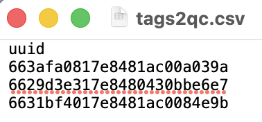{width=200}
  
  (see next section for details on how to obtain the UUID's from the WC Portal).
  
- `dropIDs` - is redundant and can be left set to `null` for all workflows.

In the `model` block the parameters are:

- `model` - the state-space model to be used to QC the location data. Can be either `rw` (a random walk model) or `crw` (a correlated random walk model). The `rw` model is the safest choice for most NRT QC workflows. The `crw` model can yield more accurate location estimates but only with high quality Argos data (i.e., observed locations at a consistent frequency of at least 5-10 locations/day with no prolonged, > ~2 days, data gaps).
- `vmax` - the maximum expected sustanined travel rate (in m/s) of the animals. For seals, turtles, penguins, whales, sharks and other large fish a reasonable value is  3-5 m/s, for flying sea birds it should set higher (e.g., 10 - 15 m/s).
- `time.step` - the regular time interval (in decimal hours) that the SSM estimates locations. Typically, this should fall in the range of 3 - 6 hours, but depends on the frequency of Argos locations. Shorter time.steps will generally increase processing time, longer will result in QC'd tracks that are too coarse to capture essential movement details (this can be assessed on a test QC run by viewing the QC-generated maps & diagnostic plots).
- `proj` - An optional proj4string (with units in km) giving the projection that should be used for the Argos data when fitting the SSM - the QC'd data will also have this projection. If left `null` then ArgosQC guesses at the most appropriate projection based on the geographic region of the majority of the Argos locations. Typically, a projection only needs to be specified when the Argos locations in a polar region, e.g., beyond +/- 50$^\circ$ latitude. In these cases, a polar stereographic projection is usually optimal.
- `reroute` - A logical indicating whether locations on land are to be rerouted off of land. This is usually warranted for most marine animals, however may be problematic for tagged animals (i.e., some seals & penguins) that frequently haulout on land for prolonged periods in the middle of tag deployments, and for seabirds that frequently fly over or return to land.
- `dist` - the distance (in km) to buffer around SSM locations when rerouting off of land. Larger buffer distances include more coastline, which can improve rerouting in some circumstances but will increase processing time considerably. This shouldn't usually need to be changed from 20 km.
- `barrier` - an optional ESRI shapefile for the land barrier used in rerouting. In rare cases where animal movements are highly localised and constrained to nearshore regions, a higher resolution land polygon dataset for the specific region may be more suitable than the default global land polygon dataset.
- `buffer` - the distance (in km) to move rerouted locations away from the closest land. 
- `centroids` - a logical indicating whether Delaunay triangle centroids are to be included in the rerouting algorithm. Including can result in more plausible rerouting solutions but can also increase processing time.
- `cut` - A logical indicating whether SSM-estimated tracks should be cut in regions where there are long periods with no Argos data. Sufficiently long data gaps will result in long straight-line interpolations by the SSM `rw` model and unrealistic loopeding artefacts by the SSM `crw` model. Typically, this is not used in NRT QC workflows.
- `min.gap` - the minimum length of data gap (in hours) to consider for cutting out SSM-estimated locations. Ignored if `cut` is set to `false`.
- `QCmode` - set to `nrt` for NRT QC workflows.
- `pred.int` - the prediction interval (in hours) to use when interpolating SSM-estimated locations to tag-transmitted behavioural & physical observation records. This must be both less than or equal to the `time.step` value and also be a multiple of the `time.step` value (e.g., `time.step` = 3, `pred.int` could be 3, 6, 9 or 12 h). 

In the `meta` block the parameters are:

- `common_name` - the common name of the tagged species
- `species_name` - the Latin name of the tagged species
- `release_site` - the locality name closest to where the tag was deployed (e.g., "Sable Island")
- `state_country` - the country or state (e.g., "Canada" or "French Overseas Territory")

The `meta` block is only required when no metadata file is supplied in the `setup` block. In this case, ArgosQC obtains available tag deployment metadata from the tag manufacturer, restructures it, and appends the attributes listed in the `meta` block.

## How to set up an ArgosQC `config` file for a NRT QC workflow 
###    Wildlife Computers tags
Setting up a `config` file for the first time requires a number of steps. The node manager must first create a new JSON, e.g., by using the above example as a template and then:

1.  Update the `setup` block, ensuring the directory and file paths point to the correct locations. Note, all sub-directories and files must be contained within a single working directory. ArgosQC will create the sub-directories inside of this working directory, if they do not exist. We recommend that tags deployed on multiple species, even if associated with the same `owner.id`, be split into separate QC workflows (i.e., have different config files).

2.  Ensure they have access to the WC Portal and its API by first registering for a WC Portal account: 
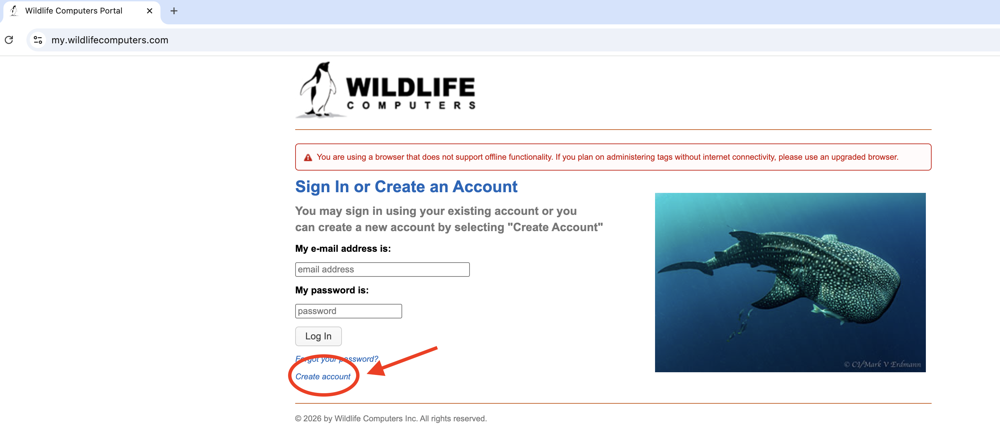{width=400}

3.  Login to the WC Portal account (a) select "Account Settings" (b), select "Web Services Security" (c.1) & add an access and secret key pair (c.2) to securely download data via the WC Portal API:
  a.  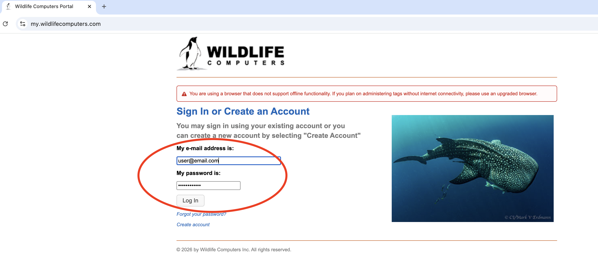{width=400}
  b.  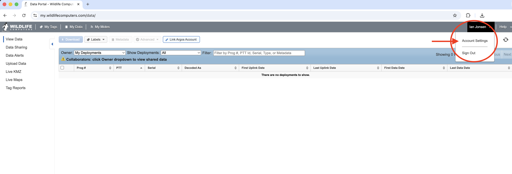{width=400}
  c.  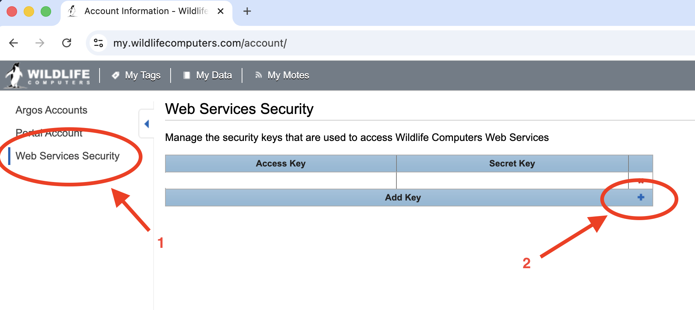{width=400}

Steps 2 and 3 only need to be done once.

4.  Ensure the data owner(s) have explicitly set up data sharing with the node manager within the WC Portal. The data owner(s) will need the email address the node manager used for their WC Portal user account. Each time a data owner has new tags registered in the WC Portal, those tags will need to be explicitly shared with the node manager. This [document (p 19)](https://static.wildlifecomputers.com/Portal-and-Tag-Agent-User-Guide-2.pdf) provides details on how data owners can set up data sharing within the WC Portal.

5.  Set `harvest:download` to `true` if the data are to be downloaded from the WC Portal.

6.  Once data sharing has been setup, the node manager must find the data owner(s) WC Portal ID(s). This can be done within R using the ArgosQC utility function `wc_get_collab_ids`:
    
    ```
    ArgosQC:::wc_get_collab_ids(a.key = "...", s.key = "...")
    ```
    
    Where the `a.key` and `s.key` values are obtained from the WC Portal (step 3c, above). Executing this function with R returns a data.frame of all data owners' (collaborators) ID's and email addresses who have set up data sharing with the node manager:
    
    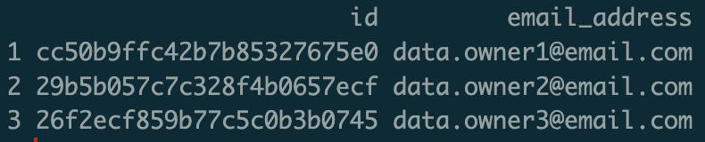{width=300}
    
    Choose the appropriate `owner.id` and copy it into the ArgosQC config file. Only one `owner.id` can be used per config file:
    
    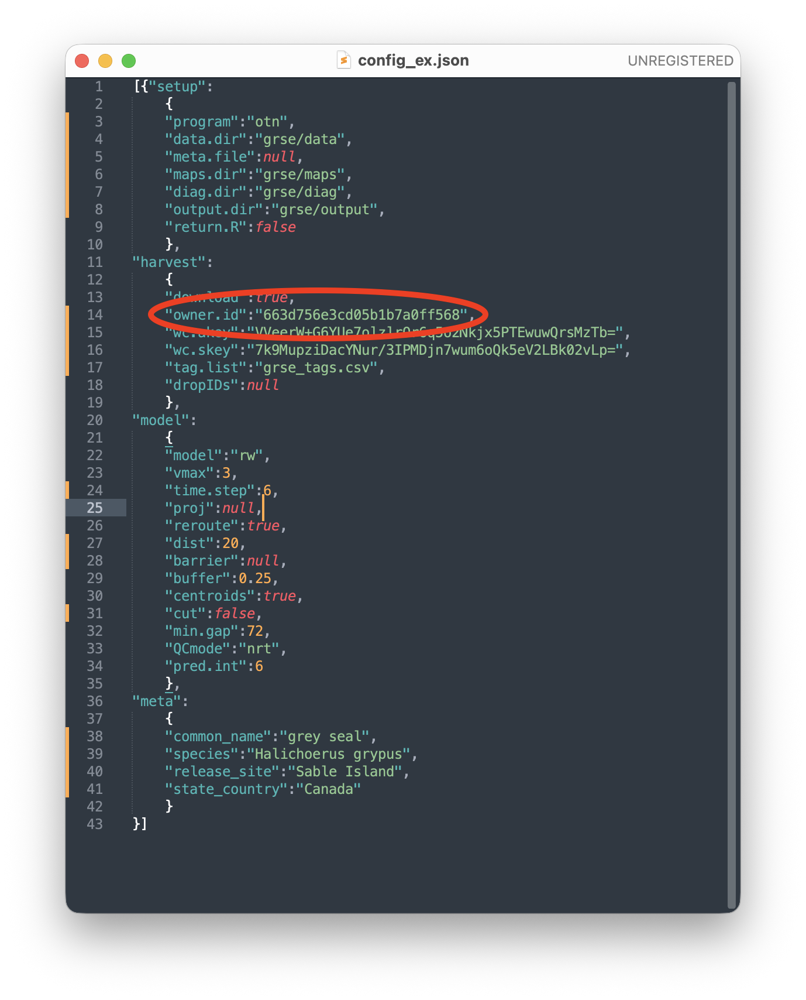{width=400}
    
7.  Copy and paste the WC access and secret keys that were generated in step 3 into `harvest:wc.akey` and `harvest:wc.skey`, respectively:

    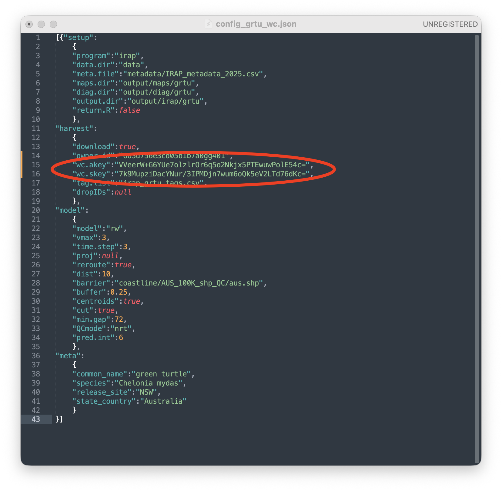{width=400}
    
8.  Get the WC dataset UUID's from the Portal to populate the `harvest:tag.list` file, using the ArgosQC function `wc_get_uuids`:
    ```
    ArgosQC:::wc_get_uuids(a.key = "...", s.key = "...", owner.id = "...")
    ```
    
    Where `a.key` and `s.key` are the node manager's keys, and `owner.id` is a single id obtained from step 6. Executing this function in R returns a data.frame of all the owner's datasets on the WC Portal; one per record:
    
    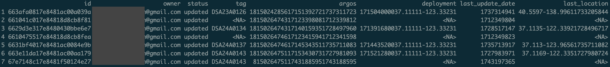{width=800}
    
    The key variables in this data.frame are:
      - `id` - the dataset uuid
      - `owner` - the owner's email address (to confirm that the correct data owner is listed)
      - `tag` - the WC tag serial number
      
    Other variables listed are not fully parsed into human-readable form.
    
9.  To conduct a QC workflow on a subset of the listed tag datasets, copy their corresponding `id`s into a CSV file with a single variable names `uuid`:
    
    {width=200}
    
    Move this CSV file into the QC working directory and copy the file name into `harvest:tag.list`:
    
    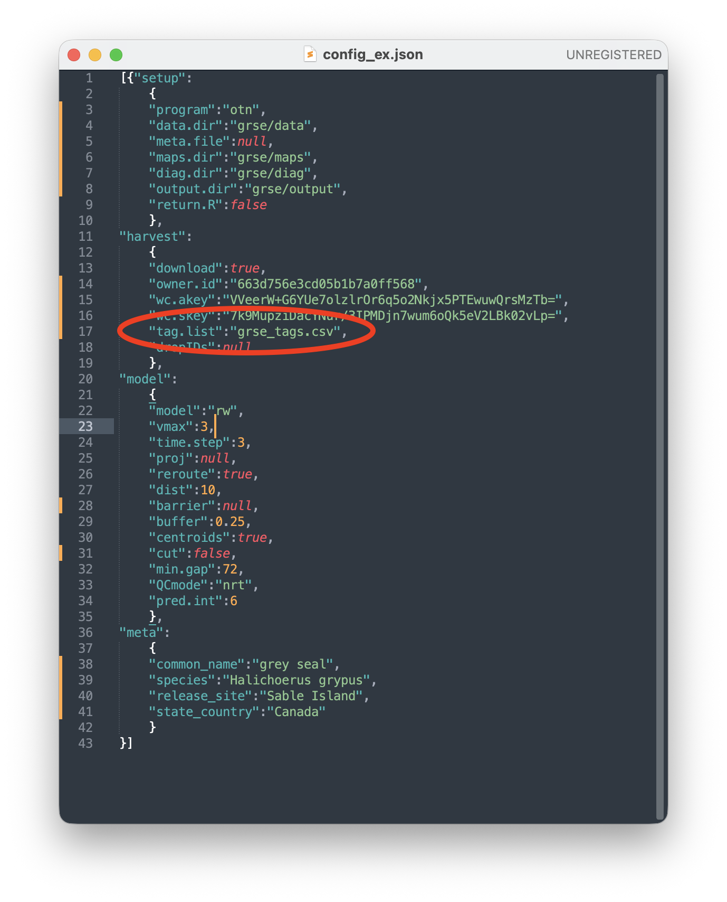{width=400}
    
    This approach is required, for example, when the owner's tags have been deployed on multiple species. In this case, separate QC workflows need to be run for each species. The WC Portal typically does not contain information on the species tags were deployed on, so the node manager will require some minimum deployment metadata from the tag owner to identify which tags (e.g., by tag serial number &/or deployment date) were deployed on which species. If all the owner's tags were deployed on a single species in a common geographic locations then they can likely be QC'd in a single workflow. To conduct a QC workflow on all the owner's tag datasets, `harvest:tag.list` should be set to `null`.
    
10. The `model` section of the config file provides parameters and information to conduct the QC, including: fitting the state-space model (SSM) to the tag location data; rerouting locations off of land; interpolating SSM locations to the times of each record in the various tag data files. A good starting place for parameter values is provided in the example config file:

    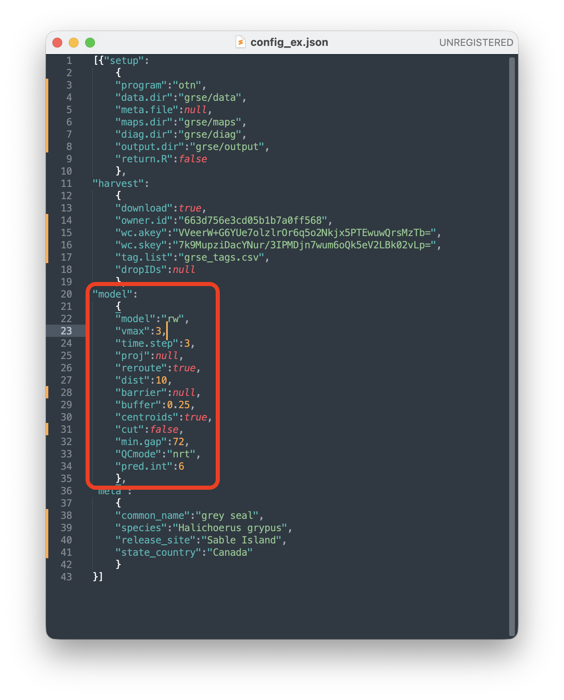{width=400}

    See the `Configuring ArgosQC` section (above) for an explanation of the typical parameter values. Generally, the config parameters only need to be set once per species but arriving at reasonable parameter values usually requires at least one QC test run. The node manager should examine the QC-generated map of SSM-estimated locations & diagnostic plots to ensure the QC results are reasonable before operationalizing the workflow. Below are some examples of the maps & diagnostic plots with varying `time.step` parameter values.

    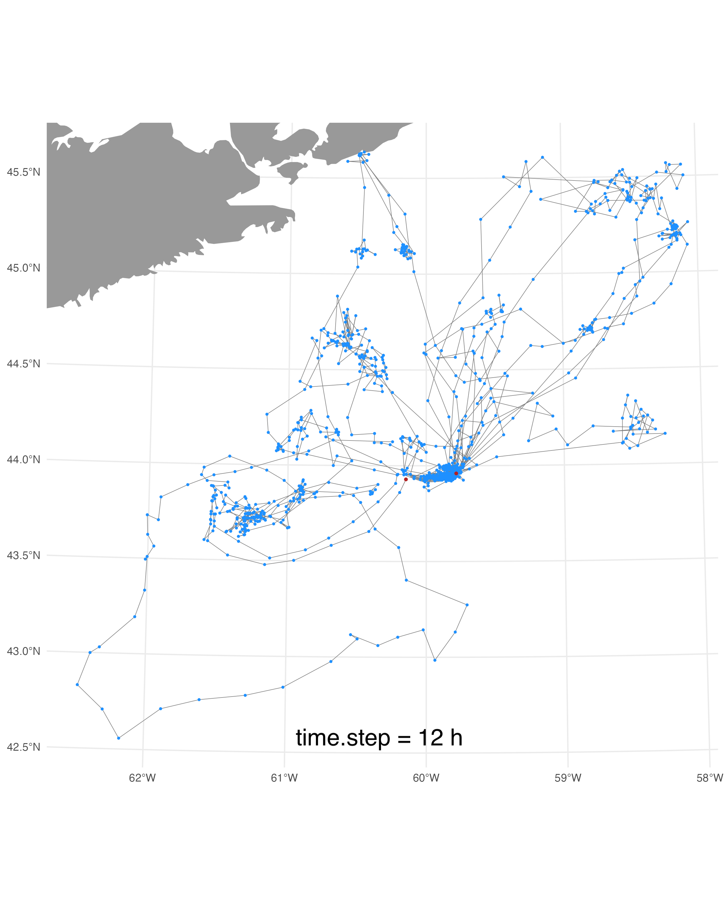{width=400} 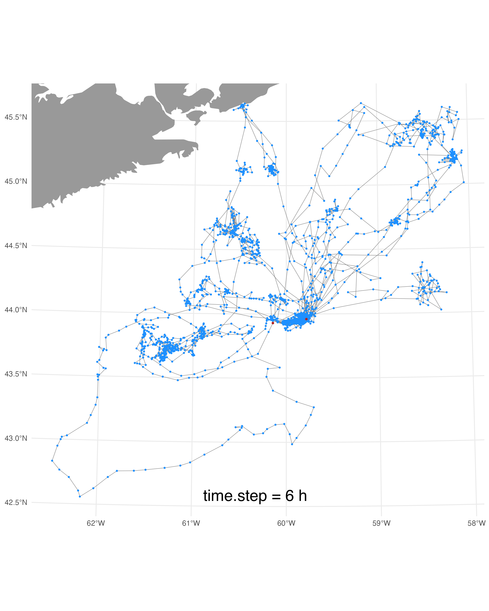{width=400} 
    {width=400} 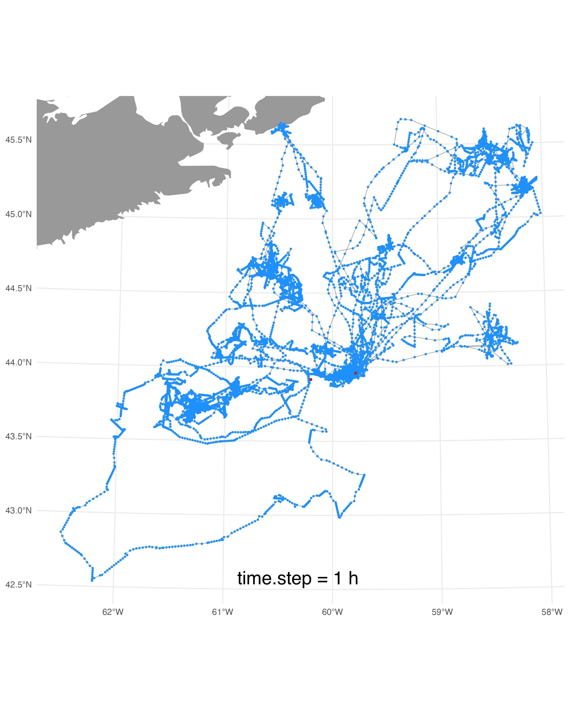{width=400}
    
    Notice how the 12-h `time.step` results in jagged tracks that lack the movement detail of the tracks QC'd at shorter `time.step`'s. This is an indication that the 12-h `time.step` is a bit too coarse given the temporal resolution of the Argos locations. Conversely, the 1-h `time.step` results in some very obviously straight lines along which the SSM-estimated locations fall. This is an indication that the `time.step` is too fine relative to the frequency of the data and the SSM is interpolating too much between the Argos locations. If you look carefully, you can also see a hint of these straightlines in the 3-h `time.step` tracks, suggesting that the 6-h `time.step` may be the better choice for these data. In practice, either the 3- or the 6-h `time.step` will work almost equally for the NRT QC of these data. If a lot of tags (e.g., > 20) are being processed in one QC workflow then it will be a bit more efficient to choose the 6-h `time.step`.
    
    A check of the model fit diagnostic plots (just latitudes for the 2 grey seal tracks shown below) indicdates the model is fitting the Argos data reasonably well because the SSM-estimated latitudes (red points) generally smooth through the Argos latitudes (blue points). Bad fits would be characterized with numerous red points outside of the blue points (ie. above or below) - this case would suggest a slightly coarser `time.step` may be needed. Note, these diagnostic model fit plots do usually not change with differing `time.step`'s.
    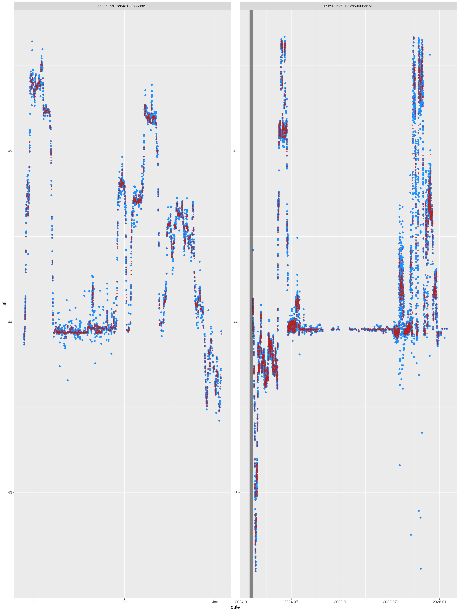
    
    A final note on re-routing locations off of land. The example config file has the rerouting parameter `model:reroute` set to `true`, but a significant number of the seals' locations occur on Sable Island because the seals return to land periodically during the tag deployments (see above maps - Sable Island is roughly at the map centre where there is a large concentration of locations). A model run with re-routing turned on results in some re-routing artefacts (denoted by red arrows):
    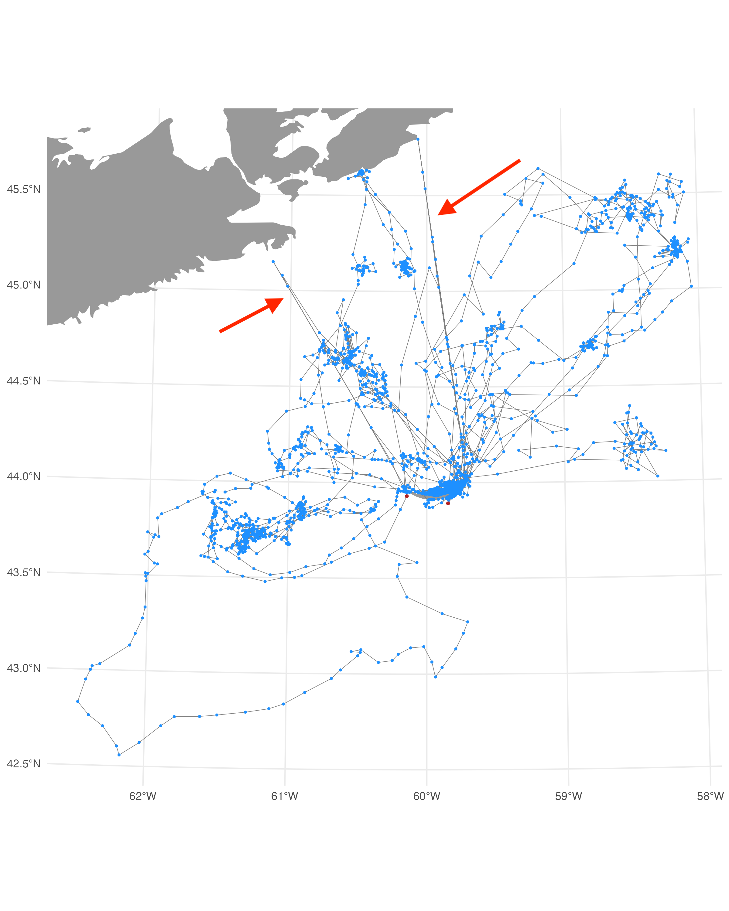{width=600}
    
    For this reason, `model:reroute` was set to `false` and we accept that some small portion of locations may erroneously fall on land. A better solution for this issue would be to generate a custom land polygon shapefile of the Nova Scotia mainland without a polygon for Sable Island. The is custom shapefile could then be added to the config file by providing the filename and path to the `model:barrier` parameter and setting `model:reroute` back to `true`. Other re-routing config parameters - `dist`, `buffer`, `centroids` - need not be changed from the provided defaults.
    

11. The `meta` section of the config file is only required if no metadata file is provided in the `setup` block. When no metadata file is provided, ArgosQC uses the fields in the `meta` block plus partial deployment metadata downloaded from the WC Portal. ArgosQC assembles these metadata attributes and writes a deployment metadata CSV file as one of the QC outputs. This file, if sufficiently complete, can be used as an input to subsequent QC runs by supplying the CSV file in the `setup` block. When both a metadata file & completed `meta` config block are provided, the attributes from the metadata file will supersede those in the `meta` block.


## ArgosQC Key Features
https://github.com/ianjonsen/ArgosQC


1. Comprehensive Automated Workflow: ArgosQC now provides a fully automated, end-to-end process. It handles everything from accessing and organizing complex multi-file data structures from vendors (SMRU and Wildlife Computers), to fitting state-space models (SSMs) and finally writing out appended, quality-controlled data.

2. Simplified Execution with New Functions: The process can be run easily with manufacturer-specific functions like smru_qc() and wc_qc(). These functions use a simple configuration file (e.g., test_conf.json) to manage project settings, making the QC process repeatable and easier to manage.

3. Enhanced Data Integration: A key new feature is the ability to collate tag data with associated deployment metadata. The output is then enriched by appending SSM-estimated locations to every tag-measured event record (like CTD profiles, dives, haulouts, and raw Argos/GPS locations) into a single, comprehensive .csv file.

4. Refined Data Filtering: Recent updates (February 2026) include a practical fix to remove erroneous locations originating from the manufacturer's headquarters (e.g., SMRU HQ), a common issue in raw data streams.

5. Improved Data Handling: Recent commits have focused on robustness, including fixes for Wildlife Computers (WC) UUID parsing issues (January 2026) and the implementation of checks to ensure data integrity.

6. Expanded Documentation and Vignettes: The package now features detailed vignettes that guide users through the config file structures and specific workflows for both SMRU and Wildlife Computers data, making it easier to get started and customize the process.


## Feature Request and Bug Report

As an open-source tool under active development, user feedback is essential for improving ArgosQC. If you encounter problems or have ideas for new features, you are encouraged to contribute through the following channels:

Report Bugs via GitHub Issues: If you find a bug (e.g., a workflow error, data parsing problem, or unexpected crash), please submit a report through the repository's Issues tab. When reporting, include:

A clear and descriptive title.

A step-by-step description of how to reproduce the issue.

Your session information (output of sessionInfo() in R) and the version of ArgosQC you are using.

Any relevant error messages or log outputs.

Suggest Enhancements: For new feature requests or ideas to improve existing workflows (like support for additional tag vendors or new diagnostic plots), you can also use the Issues tab. Please tag your issue with an "enhancement" label if possible, and clearly explain the proposed feature and its potential use case.

Review Current Priorities: Before submitting, it is helpful to review the Issues page to see if the bug or feature has already been reported or is currently being addressed.

Code Contributions: If you are interested in fixing a bug or adding a feature yourself, please consult the repository's Contributing guidelines (linked on the main page). The standard practice is to fork the repository, create a branch for your changes, and submit a Pull Request for review by the maintainer.


